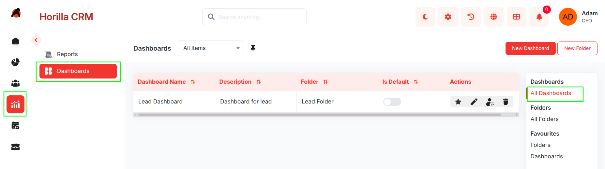
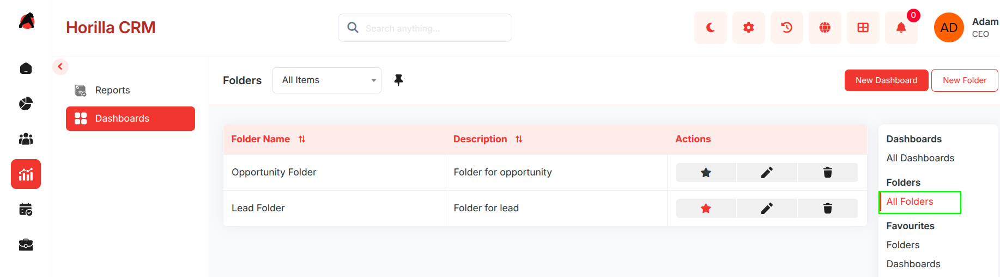
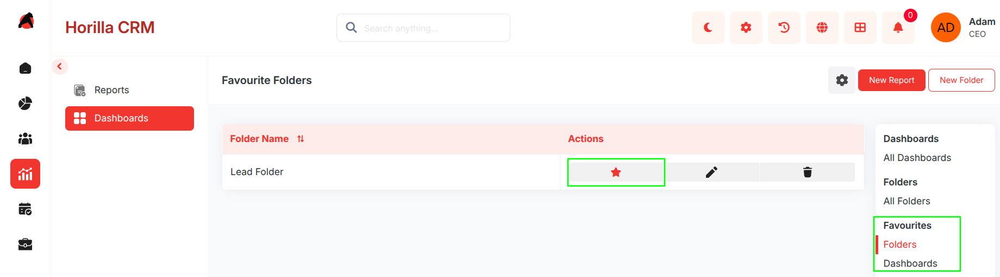
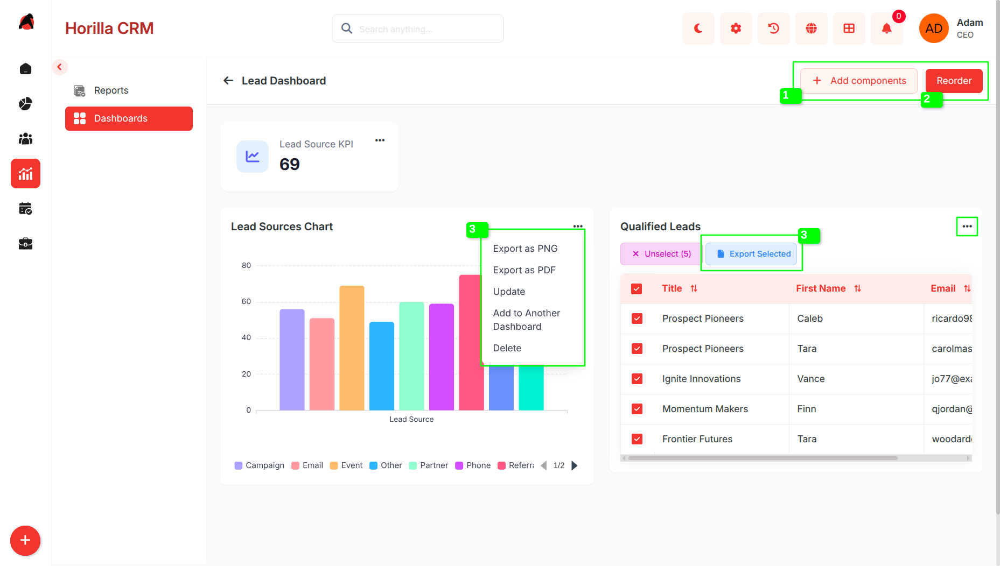
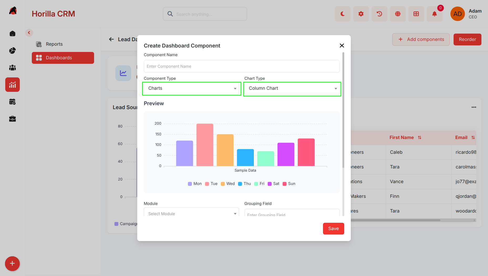
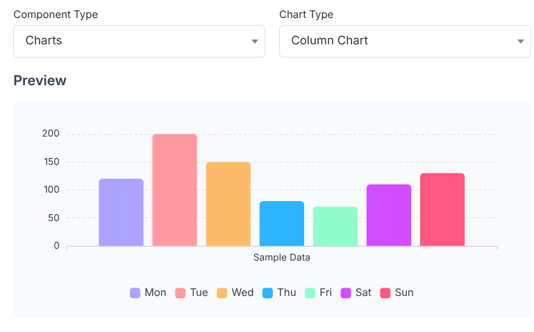
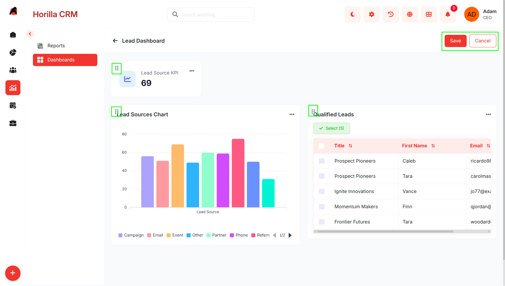
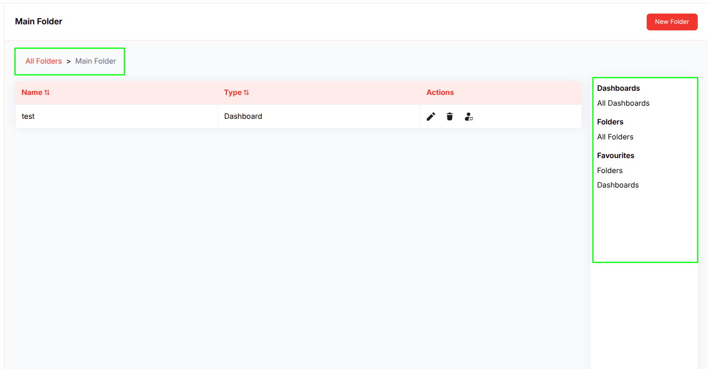
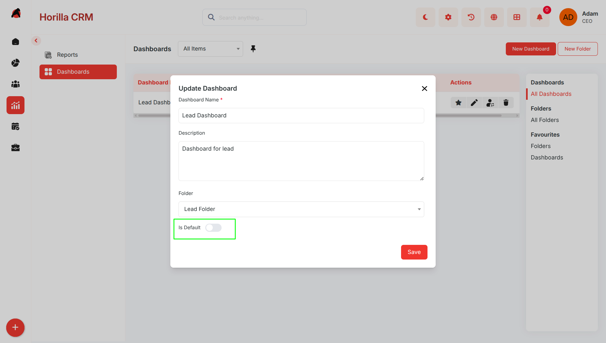
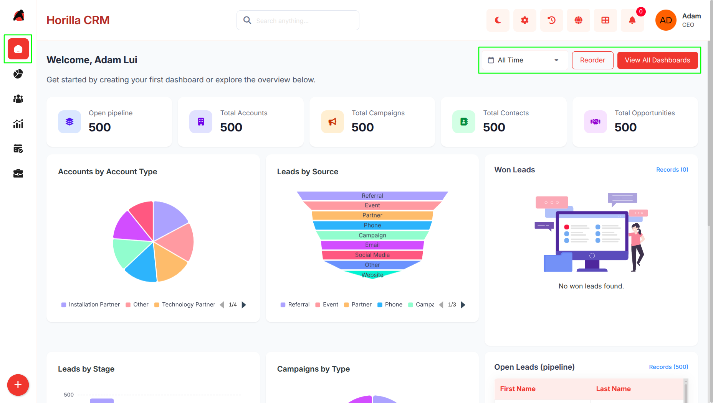

# **Dashboard & Home – Functional Guide**

## **Introduction**

The Twixio CRM Dashboard & Home Page Module provides a powerful, user-friendly interface for visualizing and analyzing key business metrics and CRM performance indicators. Designed for CRM administrators, business analysts, and end-users, this module integrates seamlessly with other Twixio CRM components to deliver real-time insights. Users can create customizable dashboards, organize them hierarchically, and configure personalized home pages to streamline access to critical data. With intuitive navigation, flexible component management, date range filtering, and robust export options, the module empowers users to monitor and optimize business performance efficiently.

## **Key Features and Functionalities**

### **1.1 Dashboard Management**

**Purpose**: Enable users to create, organize, and manage multiple analytical dashboards for tailored business insights.

* **Create Multiple Dashboards**: Users can create unlimited dashboards to track various business needs (e.g., sales performance, customer support metrics).  
* **Dashboard Naming & Description**: Assign descriptive names (e.g., "Q1 Sales Overview") and detailed descriptions for easy identification.  
* **Default Dashboard Selection**: Set any dashboard as the default home page for quick access upon login.  
* **Dashboard Owner Assignment**: Assign dashboards to specific users or teams for ownership and access control (e.g., view-only or edit permissions).  
* **Navigation to Dashboard Detail**: Clicking a dashboard name navigates to its detailed view, displaying all configured components.

### **1.2 Folder Organization System**

**Purpose**: Provide a hierarchical structure for organizing dashboards and improving navigation.

* **Create Multiple Folders**: Organize dashboards into logical folders (e.g., "Sales Dashboards," "Marketing Analytics").  
* **Folder Naming & Description**: Assign clear names and descriptions to folders for easy reference.  
* **Nested Folder Support**: Folders can contain dashboards and sub-folders, enabling hierarchical organization (e.g., Main Folder \> Sales \> Q1 Reports).  
* **Folder Detail View**: Clicking a folder name displays its contents, including dashboards and sub-folders.  
* **Dashboard-Folder Assignment**: Move dashboards between folders or assign them to a folder during creation.

### **1.3 Favorites Management**

**Purpose**: Allow quick access to frequently used dashboards and folders .

* **Favorite Any Dashboard**: Mark any dashboard/folders as a favorite, regardless of its folder location.  
* **Quick Favorite Access**: Favorited ones appear in a dedicated "Favorites" section in the sidebar.  
* **Visual Favorite Indicators**: Star icons highlight favorite dashboards/folders in listings for easy identification.  

### **1.4 Dashboard Detail View & Interaction**

**Purpose**: Provide a comprehensive, interactive view of dashboards and their components.

* **Interactive Dashboard Display**: View all configured components in an organized, responsive layout.  
  1. **Add Components Button**: Easily add new widgets via a dedicated button.  
  2. **Reorder Functionality**: Reorganize dashboard layout using drag-and-drop controls.  
  3. **Component-Specific Actions**:  
     * **Export Options**: Export  chart components as PNG or PDF for reporting.  
     * **Export** **Table** Components as CSV,Excel,PDF  
     * **Update Components**: Modify existing component configurations (e.g., update filters or metrics).  
     * **Delete Components**: Remove unwanted widgets from the dashboard.  
     * **Copy to Other Dashboards**: Duplicate components to other dashboards for reuse.

### **1.5 Dashboard Components & Widgets**

**Purpose**: Provide flexible data visualization through diverse component types to display CRM data effectively.

* **Available Component Types**:  
  * **Charts**: Visualize data with bar, line, pie, or other chart types (e.g., a line chart showing monthly lead growth).  
  * **Table Data**: Display CRM data in tabular format (e.g., a table listing top customers by revenue).  
  * **KPI Widgets**: Highlight **key performance indicators**, such as total sales or customer satisfaction scores.  
* **Component Configuration**:  
  * **Component Name:** Assign clear and descriptive names for each dashboard component (e.g., “Lead Conversion Rate”).  
  * **Module Selection:** Choose the data source module such as Leads, Customers, or Sales.  
  * **Component Type:** Select the display format including Chart, Table Data, or KPI.  
  * **Metric Field Selection:** Configure how data should be calculated:  
    * Count – Count the total number of records.  
    * Sum – Calculate the total value of a numeric field.  
    * Average – Calculate the average value.  
    * Min – Display the minimum value.  
    * Max – Display the maximum value.  
  * **Grouping Field (X-Axis):** Group data using a categorical field such as Lead Source or Assigned User.  
  * **Secondary Grouping:** Add an additional grouping level to create multi-series or stacked charts.  
  * **Y-Axis Metric:** Configure a secondary metric for dual-axis chart visualization.  
  * **Table Columns:** Select the fields to display as columns in table components.  
  * **KPI Icon:** Upload a custom icon for visually identifying KPI widgets.  
  * **Condition-Based Filtering**: Apply filters with multiple conditions (e.g., "Show sales data for Q1 2025 where revenue \> $10,000").

### **1.6 Component Preview & Management**

**Purpose**: Enable users to preview and manage dashboard components efficiently.

* **Real-time Preview**: Preview component appearance before adding it to a dashboard.

* **Component Reordering**: Drag-and-drop to reorder all dashboard components for customized layouts.  
* **Separate KPI Reordering**: Independently reorder KPI widgets for prioritized display.  
* **Persistent Reordering:** All reorder changes are saved per user per dashboard and restored on next visit.  
* **Layout Reset:** Reset the saved layout for a specific dashboard, reverting to the system default order. 

### **1.7 Navigation & Folder Hierarchy**

**Purpose**: Ensure intuitive navigation through the dashboard organizational structure.

* **Breadcrumb Navigation**: Displays the current path (e.g., All Folders \> Sales \> Q1 Dashboards) for easy orientation.  
* **Sidebar Navigation**: Includes sections for:  
  * All Dashboards  
  * All Folders  
  * Favorites (Folders & Dashboards)  
* **Hierarchical Folder View**: Folders can contain dashboards and sub-folders for flexible organization.  
* **Quick Navigation Actions**: Direct links to create dashboards, manage folders, or access favorites.

**1.8 Report & Chart View Integration**

* **Add Report as Component:**   
  * From the Reports module detail view, any saved report that includes a chart can be added directly to a dashboard as a component.   
  * When adding, the chart type, grouping field, and secondary grouping are automatically mapped from the report's existing configuration — no manual reconfiguration needed.   
  * This lets users surface report-level insights directly inside a dashboard without rebuilding the chart from scratch.  
* **Add Chart View as Component:**   
  * Every CRM module (e.g., Leads, Customers, Deals) includes a Chart View — a visual chart representation of that module's data.   
  * From within that module's chart view, users can pin it to any dashboard as a persistent component.  
  * The module and grouping configuration are captured at the time of saving, so the chart continues to render live data within the dashboard context.

### **1.9 Home Page Configuration**

**Purpose**: Deliver personalized home page experiences based on user preferences.

* **Default Dashboard Home Page:** Setting a dashboard as default makes it the user's home page upon login. The dashboard renders directly within the home page view, including all components and the date range filter.  
    

* **System Default Home Page:** If no dashboard is set as default, users see the standard system home page, which contains a dynamically generated set of KPI, chart, and table widgets based on configured CRM modules.

* **Default Home Layout Ordering:** On the system default home page, KPI widgets and charts/tables can each be independently reordered. The custom layout is saved per user and restored on subsequent visits.  
* **Reset Default Home Layout:** Users can reset the default home page layout back to the system-generated order at any time.  
* **Dynamic Home Page Loading:** The home page content updates automatically based on the user's default dashboard selection — switching the default dashboard immediately changes the home page on next login.  
* **User-Specific Configuration:** Each user independently manages their own default dashboard and home layout without affecting other users.  
* **Date Range Filtering:**  Allow users to analyze dashboard data across specific time windows.  
  * Preset Ranges: One-click filters for Last 7 Days, Last 30 Days, Last 60 Days, and Last 90 Days.  
  * Custom Date Range: Define a specific start and end date using a date picker.  
  * All Data: Remove date filtering to display all historical records.  
  * Dashboard-Wide Application: The selected date range applies simultaneously to all chart, table, and KPI components on the dashboard.  
  * Automatic Date Field Detection: The system automatically identifies the date field on each module's model to apply the filter correctly.

## **Benefits**

* **Centralized Business Intelligence**: Unified access to CRM analytics and metrics in one interface.  
* **Flexible Organization**: Hierarchical folder system supports diverse organizational needs.  
* **Personalized Experience**: Custom home pages and favorites enhance user efficiency.  
* **Real-time Data Visualization**: Dynamic components deliver up-to-date insights.  
* **14 Chart Types:** Comprehensive visualization options cover every analytical need from trend analysis to flow diagrams.  
* **Scalable Dashboard Management**: Supports unlimited dashboards and folders for growing businesses.  
* **Enhanced Productivity**: Favorites and quick navigation reduce time spent locating key dashboards.  
* **Advanced Analytics:** Metric aggregation (sum, average, min, max), secondary grouping, and multi-condition filtering enable deep analysis.  
* **Report Integration:** Seamlessly convert existing Twixio Reports into dashboard components.  
* **User-Friendly Interface:** Intuitive navigation and management lower the learning curve.  
* **Data Export Capabilities:** PNG, PDF, CSV, and Excel exports facilitate reporting and external analysis.  
* **Collaborative Dashboard Sharing:** Ownership, folder assignments, and copy-to-dashboard enable team collaboration.
