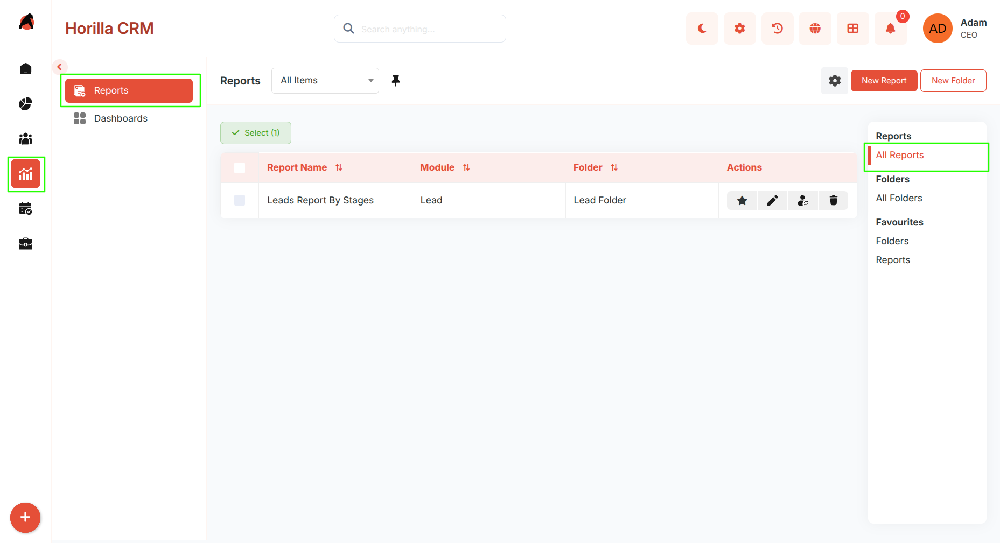
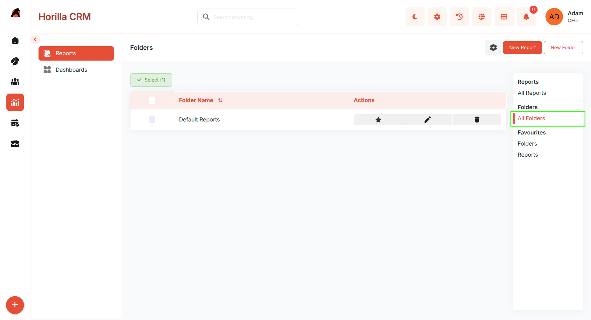
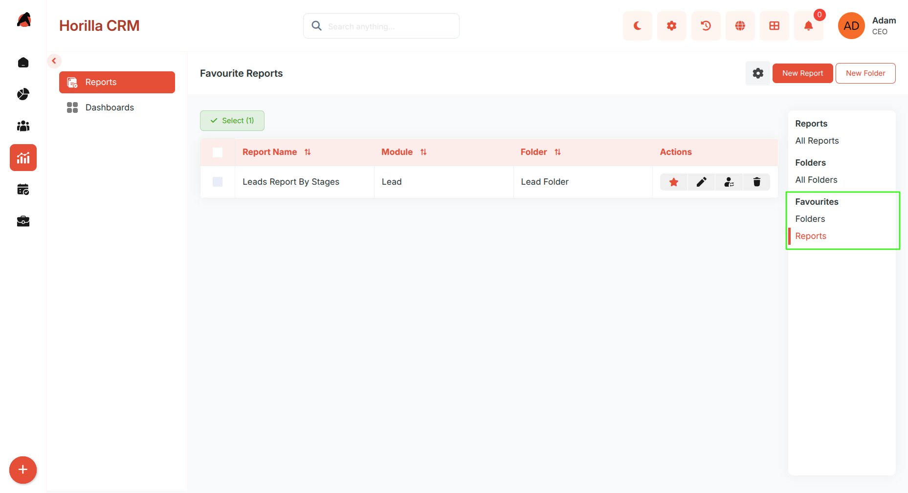
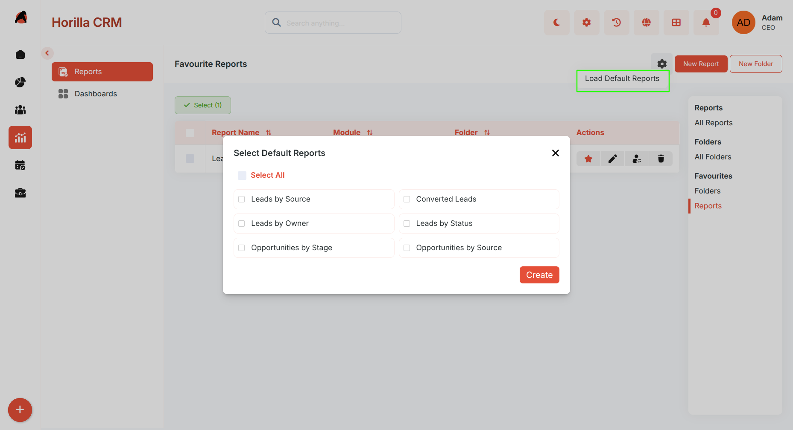
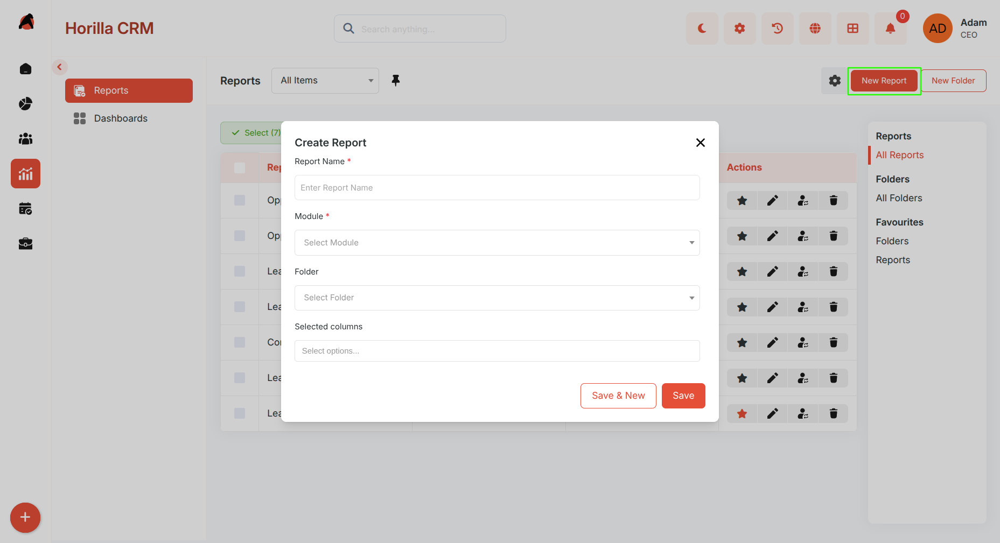
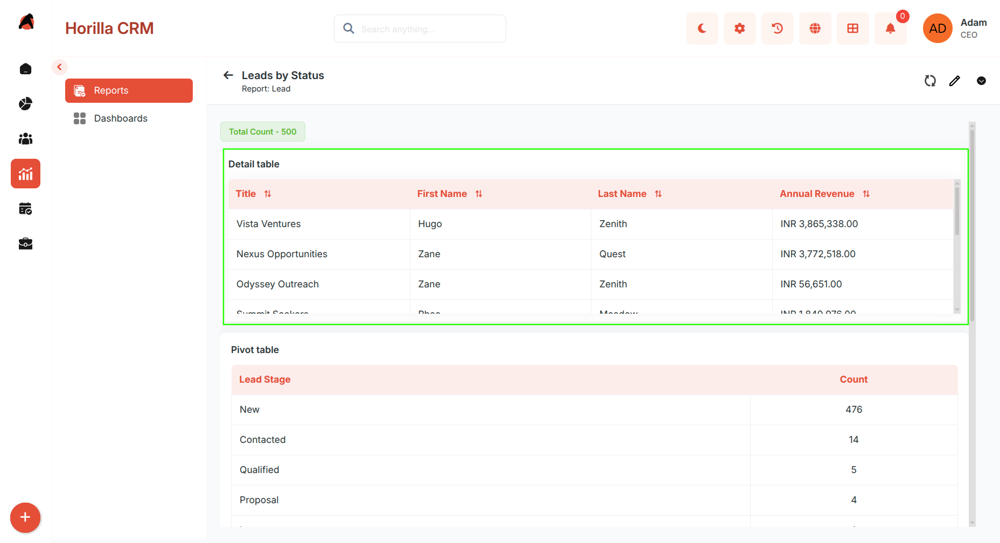
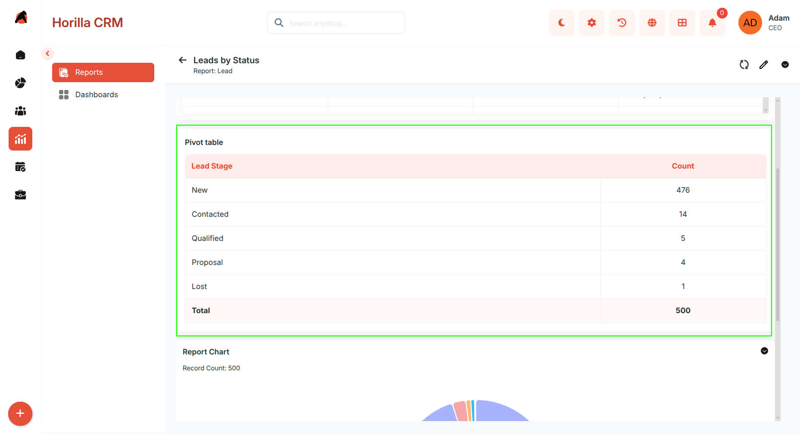
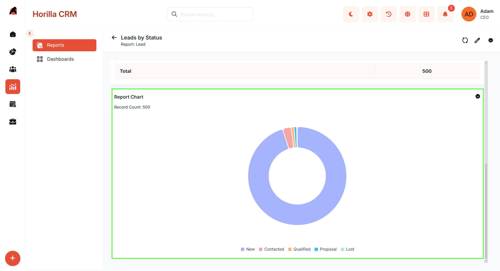
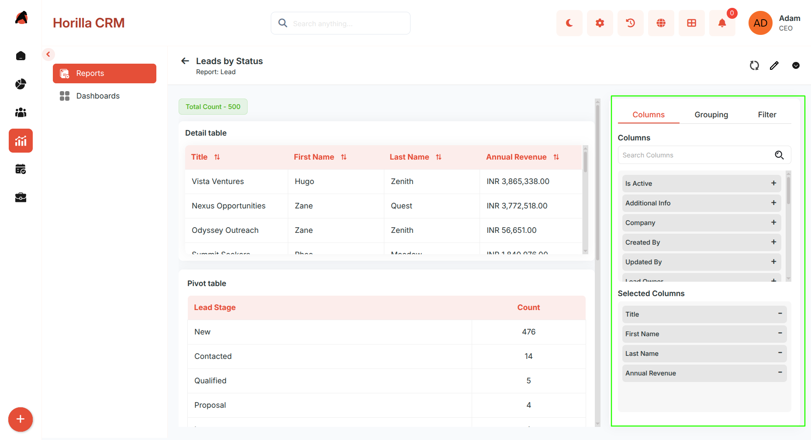
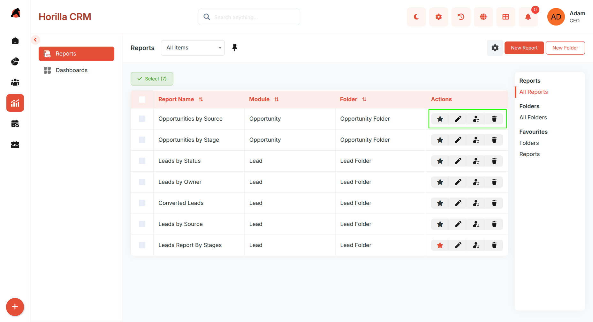

# **Reports – Functional Guide**

## **Introduction**

The Twixio CRM Reports Module provides a structured and intuitive way to generate, organize, and analyze CRM data. Designed for sales teams, managers, and administrators, the module enables users to create detailed reports, group them into folders, and leverage pivot tables and charts for advanced insights. With customizable columns, filters, grouping options, and aggregate functions, users can extract meaningful patterns from CRM records and visualize data through interactive reports.

## **Key Features and Functionalities**

#### **1\. Report List View**

**Purpose:** View, manage, and organize all reports across CRM modules.

* View all reports in a consolidated list.  
* Mark reports as **Favorites** for quick access.  
* Delete reports no longer needed.

#### **2\. Folder Organization**

**Purpose:** Provide a structured way to organize reports for easy access.

* Create multiple folders to group related reports (e.g., Leads Reports, Opportunity Reports).  
* Edit folder names or delete folders when no longer needed.  
* Move folders between parent folders for deeper organization.  
* Mark folders as **Favorites** for quick sidebar access.

#### **3\. Favorites Management**

**Purpose:** Provide quick access to frequently used reports and folders.

* Mark any report or folder as a favorite using the **star icon**.  
* Favorited items appear in the **Favorites** section in the sidebar.

#### **4\. Default Reports**

**Purpose:** Quickly load pre-built reports provided by installed CRM modules without building from scratch.

* Click **Load Default Reports** to open a modal listing all available default reports across installed modules.  
* Select the reports you want and click **Create** to generate them instantly.  
* Default reports come pre-configured with relevant columns, groupings, and filters for their module.

#### **5\. Creating a Report**

**Purpose:** Build new custom reports from any CRM module.

* Click the **New Report** button.  
* Fill in **Name**, **Module**, **Folder**, and **Columns**, then save.

#### **6\. Report Detail View**

**Purpose:** Provide detailed insights and interactive data exploration.

* **Detail Table** — Displays record-level data with selected columns. Supports aggregate functions (Sum, Count, Average, Min, Max) per column.  

 

* **Pivot Table** — Summarizes data by grouping rows and columns with aggregated values. Clicking a pivot value filters the detail table to show only the related records.

* **Report Chart:**  
  * Visualizes report data as Pie, Bar, Line, or other chart types.  
  * Chart type and the field used for the chart axis are configurable directly from the detail view.  
  * Updates dynamically based on active filters and groupings.  
  * Interactive legend for category breakdown.  
  * Shows total record count.  
  * Export chart as PNG or PDF.

#### **7\. Report Edit View**

**Purpose:** Modify report configuration after creation.

The edit view contains three tabs:

1. **Columns** — Add, remove, or reorder columns in the detail table. Toggle aggregate functions per column.  
2. **Grouping** — Add or remove fields for pivot table row and column grouping (maximum 3 fields).  
3. **Filter** — Define filter conditions with field, operator, value, and AND/OR logic.

Save or discard changes as needed.

#### **8\. Report Actions & Export**

**Purpose:** Share and manage reports outside the CRM.

* **Delete** — Remove outdated or unnecessary reports.  
* **Favorite** — Mark important reports for quick sidebar access.  
* **Move Report** — Transfer a report to a different folder.  
* **Move Folder** — Transfer a folder to a different parent folder.  
* **Edit Report Name** — Rename a report for clarity.

