# **Google Calendar Integration — Functional Guide**

1. ## **Introduction**

   Twixio CRM's Google Calendar Integration enables seamless synchronization of CRM Activities and Unavailability blocks with a user’s Google Calendar in real time. This integration uses **OAuth 2.0 authentication** and **Google push notifications** to ensure fast, secure, and reliable data sync.

2. ## **Admin: Enable the Integration**

   **Steps:**  
1. Navigate to **Settings → Integrations → Google Integration**  

  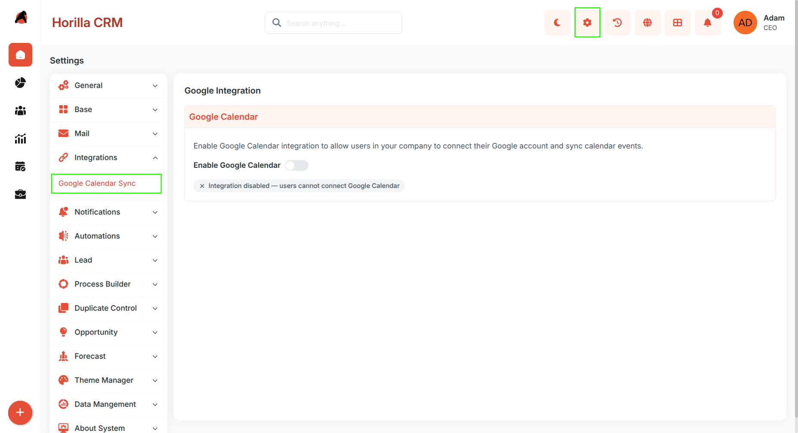

2. Toggle **Enable Google Calendar Integration** to **On** 
 
   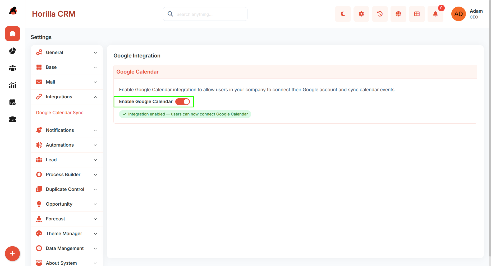  
   

   ### **Important Note:**

* Disabling this setting will immediately revoke all user connections across the organization.

3. ## **Google Cloud Console Setup (One-Time per User)**

   ### **Steps:**

1. Open **Google Cloud Console**  

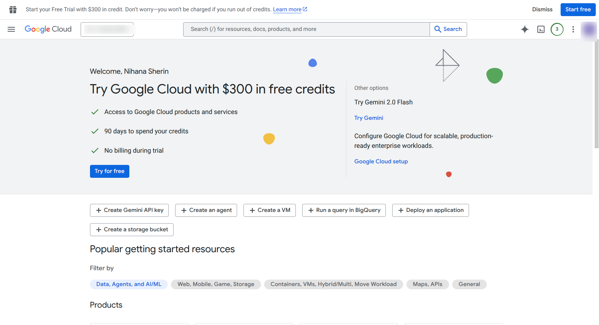
     
2. Create or select a project — Click the project dropdown at the top → "New Project" (or choose an existing one).  

  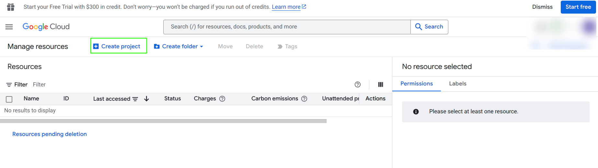 

3. Enable the required APIs — Navigate to "APIs & Services" → "Library". Search for and enable:  
   1. Google Calendar API  
   2. Tasks API

   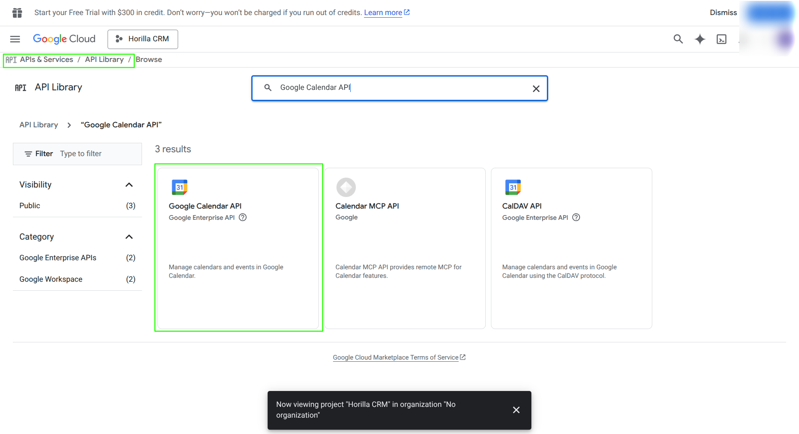

4. Configure the OAuth consent screen   
   1. Go to "APIs & Services" → "OAuth consent screen". 

   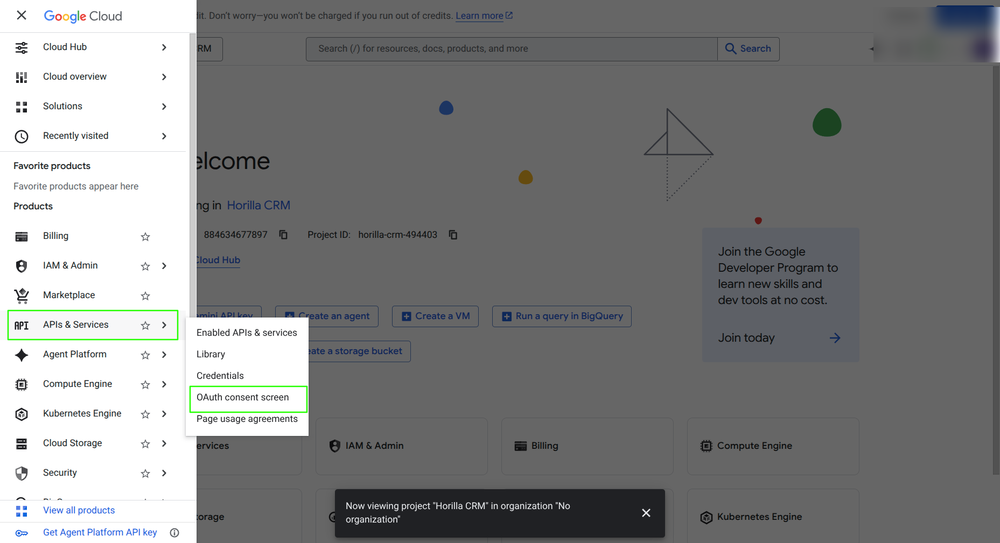

   2. Choose "External" (or "Internal" for Google Workspace), fill in App name, support email, and developer contact. Save.

   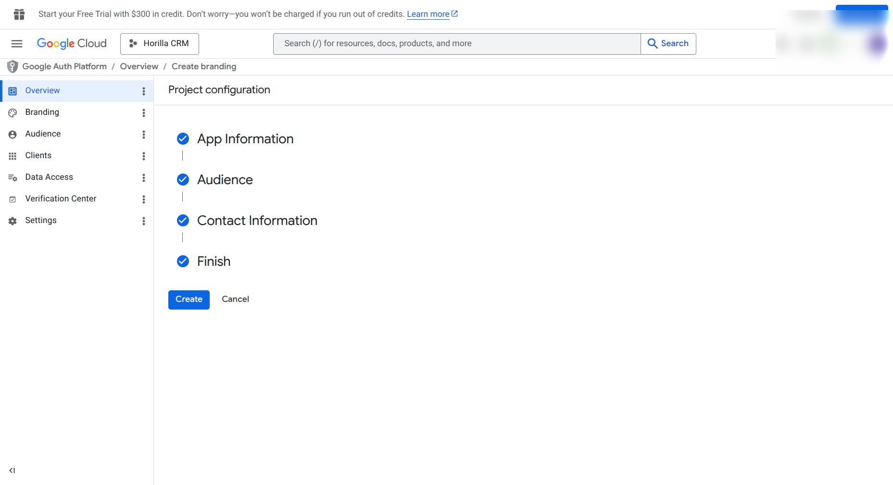

5. Create OAuth 2.0 credentials —   
   1. Go to "APIs & Services" → "Credentials" → "+ Create Credentials" → "OAuth client ID". 

   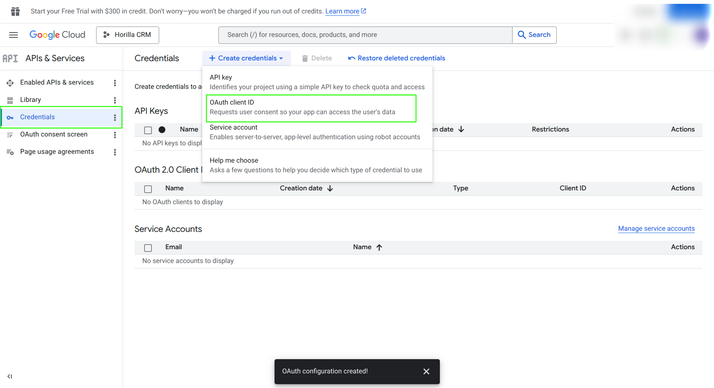

   2. Select Application type: Web application. Under "Authorized redirect URIs".

   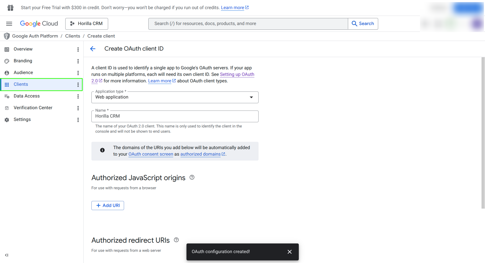

   3. Configure Redirect URI:Add the callback URL from Twixio eg:https://yourdomain.com/calendar/google-calendar/callback/

   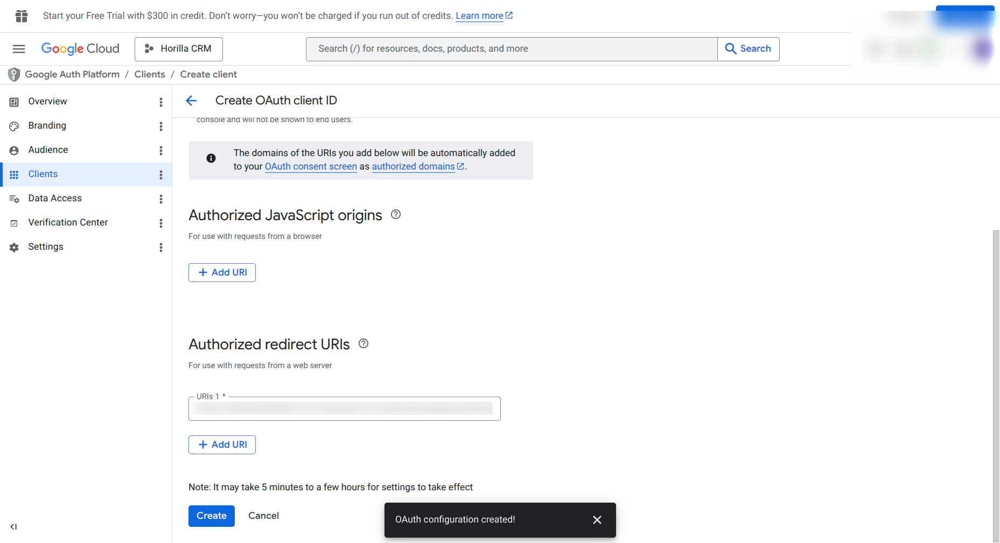

      

   ### **Final Steps:**

* Download the generated `client_secret_*.json` file  
  
  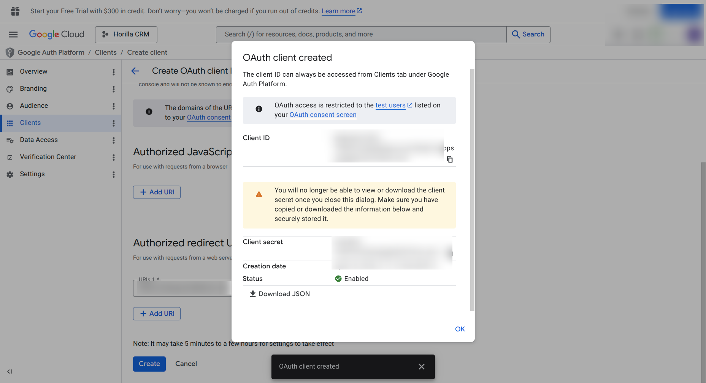

4. ## **User: Connect Google Calendar**

   **Path:** My Settings → Google Calendar

   ### **Step 1 — Upload Credentials**

   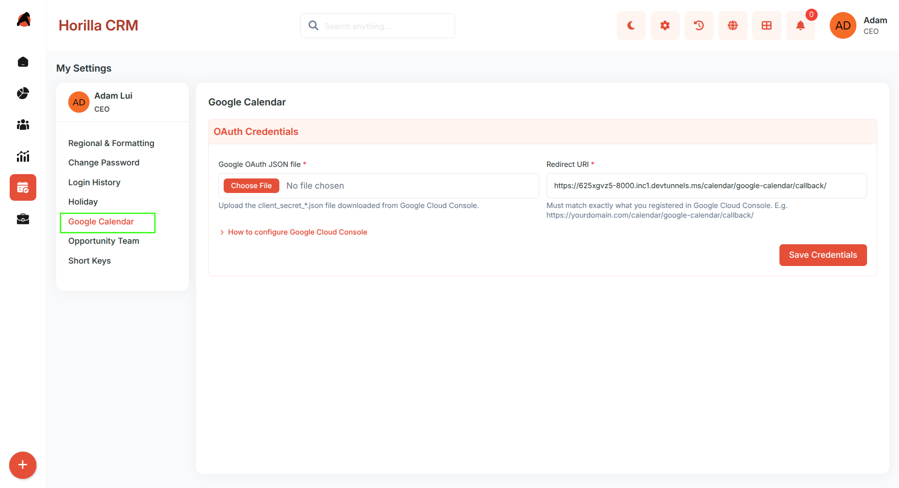  

1. Navigate to **My Settings → Google Calendar**  
2. Upload the `client_secret_*.json` file  
3. Ensure the Redirect URI matches the one configured in Google Cloud  
4. Click **Save Credentials**

   ### **Step 2 — Authorize**

   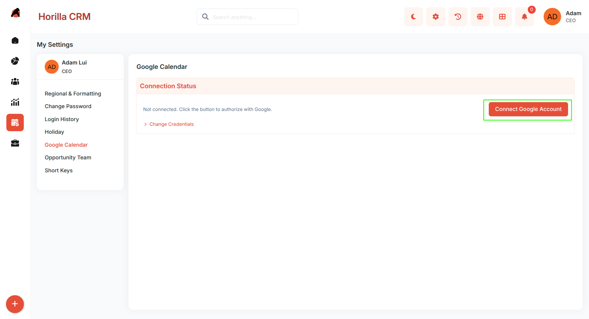

1. Click **Connect Google Account**  
2. Complete Google OAuth consent  
3. Grant permissions:  
   * Calendar  
   * Tasks  
   * Email  
4. After successful authentication, you will be redirected back  
5. A confirmation message will display the connected email

   ### **Step 3 — Set Sync Direction**

   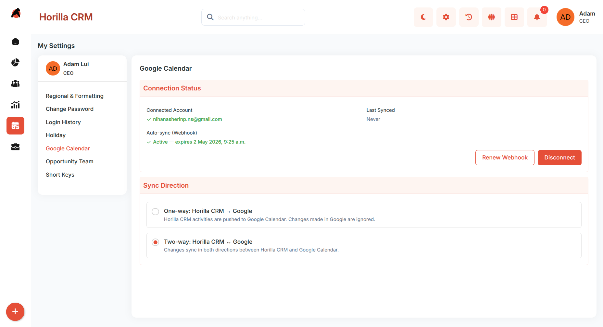

   Choose one sync mode:  
* **One-way: App → Google Calendar**  
   Twixio pushes data to Google Calendar only. Changes made in Google Calendar will not reflect back in Twixio.  
* **Two-way: App ↔ Google Calendar (default)**  
   Data syncs in both directions. Changes made in either Twixio or Google Calendar will automatically update in the other system.

  ### **What Gets Synced**

* **Activity — Task** → Google Tasks (default list)  
* **Activity — Event / Meeting** → Google Calendar event  
* **Unavailability block** → Google Calendar event  
* In two-way sync:  
  * Google Calendar changes (new, update, delete) sync back to Twixio  
  * Excludes Twixio-created events and Google system events (like birthdays)

  ### **Real-Time Push Notifications**

* Enabled automatically with HTTPS  
* Sync happens within seconds  
* **Watch Active** shows webhook is working  
* Auto-renews on page load and after notifications  
* Can manually click **Register Webhook**  
* Not supported on HTTP or localhost (use HTTPS or tunnel)

5. ## **Disconnect**

   ### **Steps:**

1. Go to **My Settings → Google Calendar**  
2. Click **Disconnect** 

   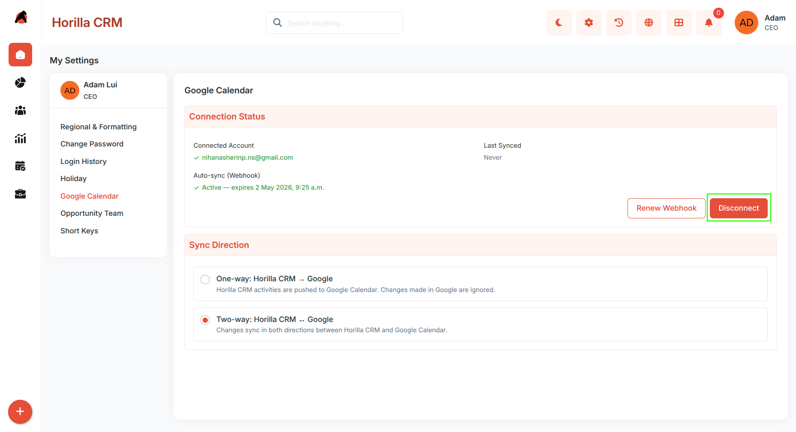

   ### **Result:**

* Stops push notification channel  
* Clears OAuth tokens  
* Resets sync state  
* Keeps uploaded credentials file for quick reconnection

## **Additional Recommendations**

* Use two-way sync only when needed; for better control and to avoid unintended overwrites, one-way sync is often safer.  
* Avoid manually creating duplicate events in both systems—let the integration handle synchronization to maintain consistency.  
* Keep the `client_secret_*.json` file secure and do not share it; regenerate credentials if there is any risk of exposure.  
* Always use HTTPS in production and check the “Watch Active” status regularly to ensure real-time sync is functioning properly.

