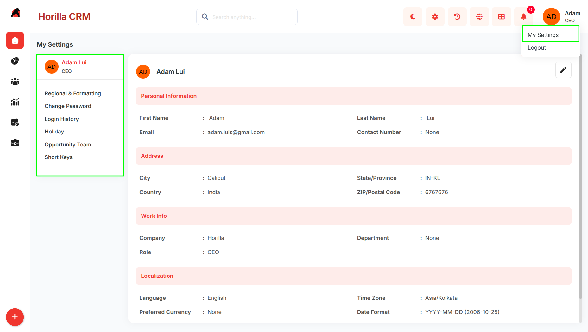

# **My Settings**

# **Introduction**

The Twixio CRM My Settings Section provides users with comprehensive control over their personal profiles, system preferences, and account security. This section integrates multiple modules that enable users to manage personal information, configure regional and localization settings, monitor login activities, manage holidays, organize opportunity teams, manage keyboard shortcuts, and securely update their password. By centralizing user-specific configurations, the My Settings Section ensures that each user can customize their CRM experience while maintaining organizational standards and security protocols.

## **Key Features and Functionalities**

### **2.1 My SettingsOverview**

**Purpose:** Provide a centralized hub for all user-specific settings and configurations.

**Access:** My Settings section in the sidebar with sub-sections:

* User Profile  
* Regional & Formatting  
* Change Password  
* Login History  
* Holiday  
* Opportunity Team  
* Short Keys

**Key Features:**

* Single navigation point for all personal settings and preferences  
* User-specific configurations that do not affect other users  
* Immediate application of changes without requiring logout  
* Secure management of personal and professional information  
* Session and login activity monitoring  
* Holiday management for personal and company-wide schedules  
* Team organization for sales opportunities  
* Custom keyboard shortcut management  
* Global shortcut key reference popup (hold Alt to display)

### **2.2 User Profile Settings**

**Purpose:** Enable users to maintain accurate personal and professional information within the CRM system.

**Access:** My Settings → User Profile (default view)

**Key Features:**

* Edit personal information: First Name, Last Name, Email Address, Contact Number  
* Manage address details: City, State/Province, Country, ZIP/Postal Code  
* Update work information: Company, Department, Role  
* Configure localization preferences: Language, Time Zone, Preferred Currency, Date Format, Time Format  
* Email validation ensures proper format and uniqueness  
* Real-time validation prevents invalid data entry  
* Inline editing with Save/Cancel functionality  
* Format preview examples for date and time selections

### **2.3 Regional & Formatting**

**Purpose:** Configure how dates, times, currencies, and numbers display across the system based on regional preferences.

**Access:** My Settings → Regional & Formatting

**Key Features:**

* Date-time format configuration with predefined options (e.g., YYYY-MM-DD HH:MM:SS)  
* Separate date format selection for date-only fields  
* Time format options: 12-hour AM/PM or 24-hour display  
* Language selection for interface localization  
* Time zone configuration (GMT, PST, etc.) with automatic time conversion  
* Currency selection (INR, USD, EUR, etc.) for all financial fields  
* Number formatting options: No Grouping (1000000) or Grouped (1,000,000)  
* Changes apply instantly across all CRM modules  
* Settings persist across browser sessions

**2.4 Change Password**

**Purpose**: Allow users to securely update their account password from within the My Settings section.

**Access:** My Settings → Change Password

**Key Features:**

* Displays a Password Management panel showing the date of the last password update (e.g., "Last Updated 2026-04-28")  
* Change Password button opens a modal dialog with three fields:  
  * **Current Password** — verifies identity before allowing the change  
  * **New Password** — accepts the desired new password  
  * **Confirm New Password** — ensures the new password is entered correctly  
* Toggle visibility icons on each password field for show/hide support  
* Validation prevents submission if the current password is incorrect or the new passwords do not match  
* Password update is applied immediately upon successful submission

### **2.5 Login History**

**Purpose:** Provide users with visibility into their login activities for security monitoring and accountability.

**Access:** My Settings → Login History

**Key Features:**

* View all login sessions with session details  
* Display information: Browser, OS, Login Timestamp, IP Address, Active/Inactive Status, Login/Logout events  
* Green/Red indicators for active and inactive sessions  
* Chronological display of all login and logout events  
* Export functionality: Export sessions to CSV, Excel, or PDF  
* Multi-select checkboxes for bulk export operations  
* Session transparency and accountability tracking

### **2.6 Holiday Management**

**Purpose:** Manage both company-wide and user-specific holidays for scheduling and planning.

**Access:** My Settings → Holiday

**Key Features:**

* View company holidays applicable to the entire organization  
* Manage user-specific holidays for personal scheduling  
* Track holiday dates and names  
* Plan around company schedules and personal days  
* Integrate holiday information with activity and meeting scheduling  
* Support for both recurring and one-time holidays

### **2.7 Opportunity Team**

**Purpose:** Create and manage collaborative sales teams for handling opportunities with defined roles and access levels.

**Access:** My Settings → Opportunity Team

**Key Features:**

* Create independent opportunity teams with descriptive names and descriptions  
* Each user manages only teams they have created  
* Add team members with specific roles (Account Manager, Sales Representative, etc.)  
* Assign access levels: Read/Write or Read-Only permissions  
* View team member details: Name, Role, Access Level  
* Edit team member roles or permissions  
* Remove team members as needed  
* Empty state guidance for new users  
* Bulk member addition during team setup

**2.8 Short Keys**

**Purpose:** Allow users to create, view, edit, and delete custom keyboard shortcuts for quick navigation to CRM pages.

**Access:** My Settings → Short Keys

**Key Features:**

* Tabular view displaying all configured shortcuts with Page, Key, and Actions columns  
* Each shortcut maps a CRM page (e.g., Forecast, Opportunities, Campaigns, Leads, Contacts, Accounts, Branches, Users) to an ALT \+ \[Key\] combination  
* New button opens a form to create a new shortcut by selecting a page and assigning a key  
* Edit (pencil icon) action allows modifying an existing shortcut's page or key assignment  
* Delete (trash icon) action removes a shortcut permanently  
* Search bar filters the shortcut list by page name or key  
* Select All checkbox supports bulk selection of shortcuts  
* Select (N) count badge displays the number of currently selected items  
* Changes take effect immediately without requiring a page reload

**2.9 Available Shortcut Keys Popup**

**Purpose:** Provide users with an at-a-glance reference of all active keyboard shortcuts from anywhere in the CRM.

**Access:** Hold the Alt key for a moment on any CRM page

**Key Features:**

* A popup modal appears listing all currently configured shortcuts  
* Each entry shows the ALT \+ badge alongside the assigned key and the target page name (e.g., ALT \+ R → Reports, ALT \+ D → Dashboards, ALT \+ Y → Activities, ALT \+ I → Calendar, ALT \+ H → Home, ALT \+ P → Profile, ALT \+ G → Regional & Formatting)  
* The list reflects both system-default shortcuts and any custom shortcuts the user has configured in Short Keys  
* Modal is dismissed by releasing Alt or clicking the × button  
* Provides an accessible discovery experience so users do not need to memorize shortcuts
