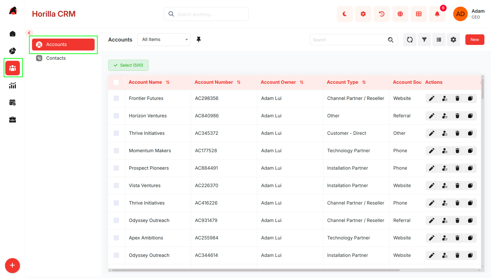
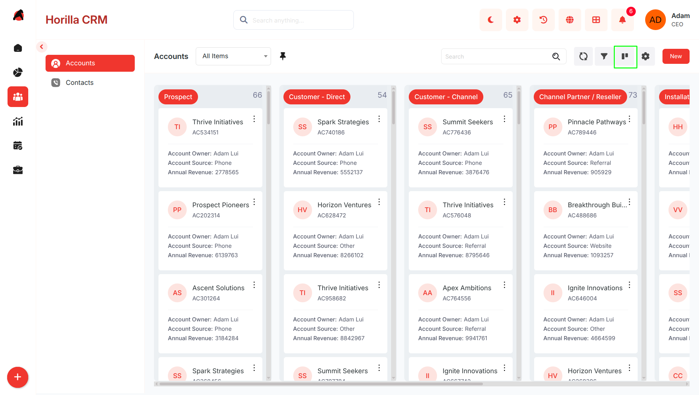
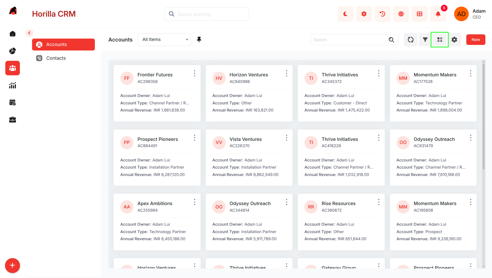
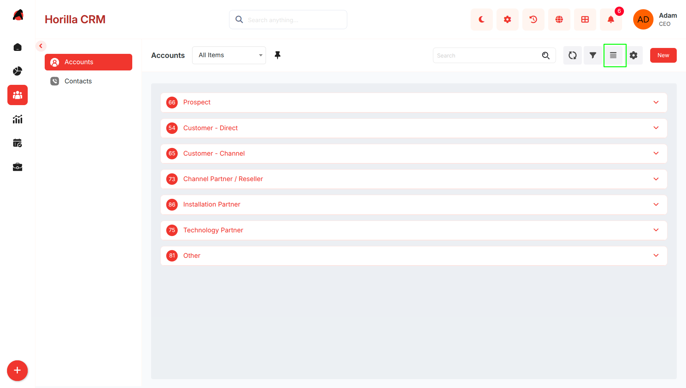
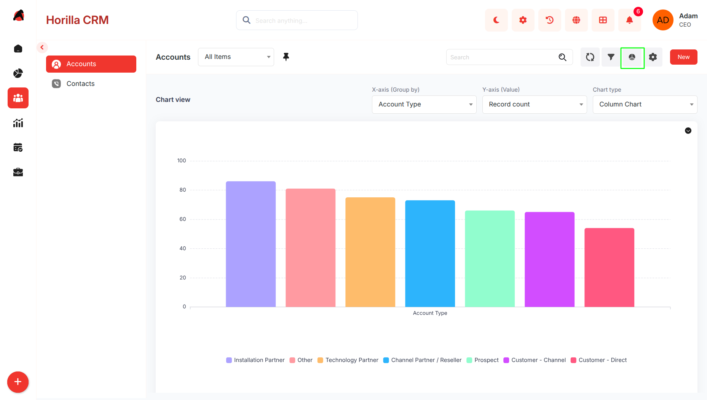
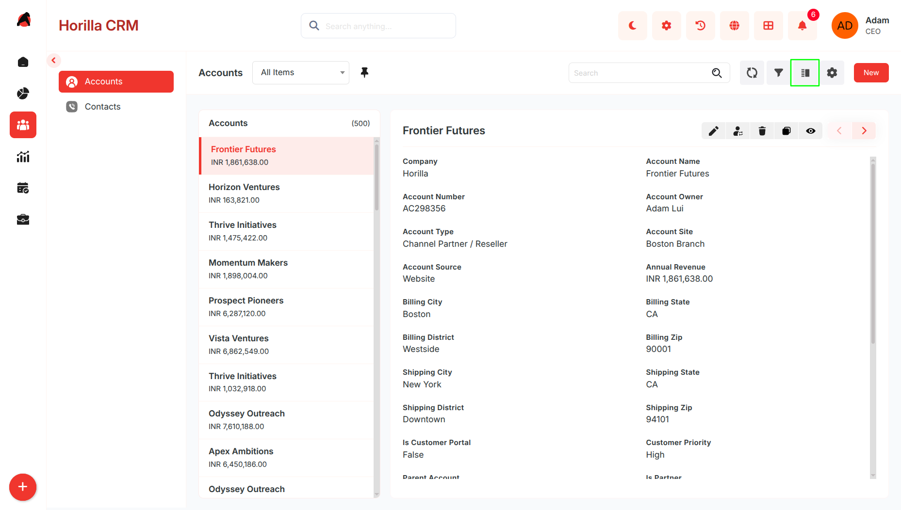
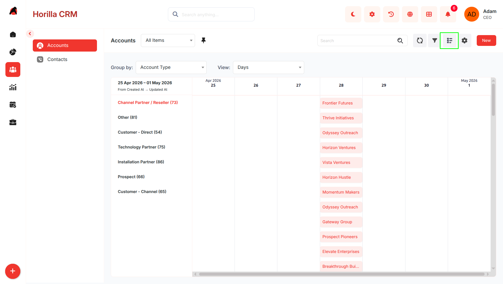
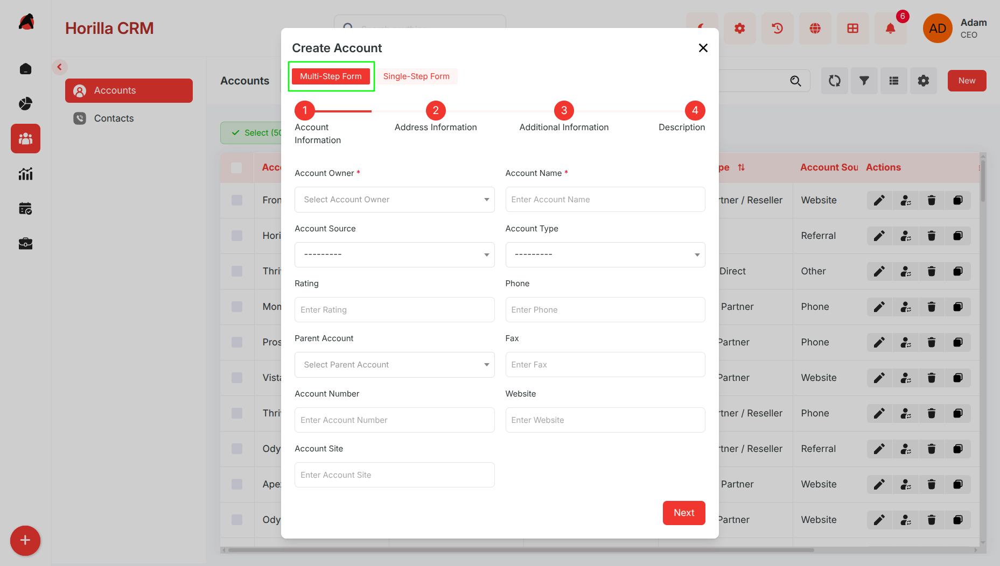
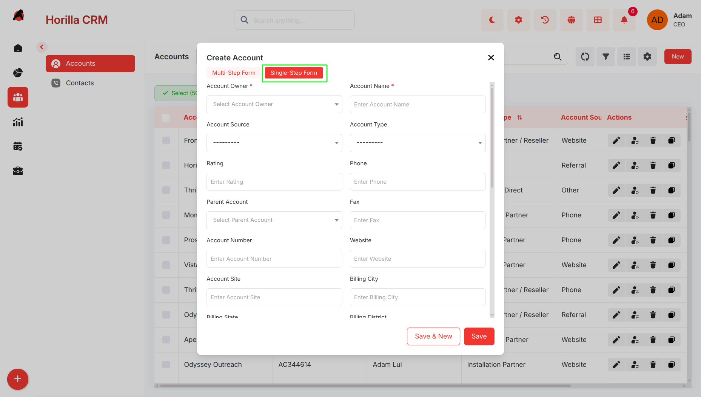
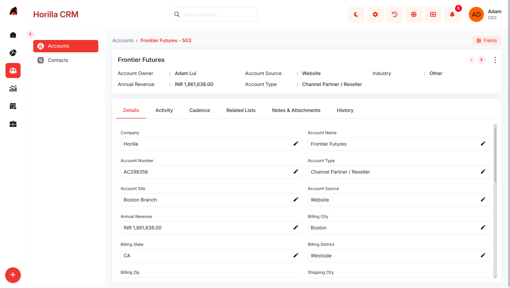

# **Accounts – Functional Guide**

## **Introduction**

The Twixio CRM Accounts Module serves as a centralized workspace for managing organizations, companies, and business entities associated with customers, prospects, and partners. It helps businesses organize account information, monitor relationships, track activities, and maintain a complete history of interactions. With multiple data views, structured forms, and integrated related records, the Accounts Module improves account management efficiency and strengthens customer relationship tracking across the CRM ecosystem.

## **Key Features and Functionalities**

### **1.1 Accounts Overview**

* **Purpose:** Showcase all accounts in a consolidated list format for straightforward management and visibility.  
* Users can access the list by selecting the "Accounts" option under the "Sales" menu in the sidebar.  
* Provides search and filtering tools to quickly pinpoint specific accounts using criteria such as company name or industry.  
* The layout includes adjustable columns and tailored filters to boost usability and productivity.  
* Supports bulk handling of accounts in the list view by selecting multiple entries with checkboxes, offering actions like Edit, Export, and Mass Delete.

### **1.2  Kanban View**

* **Purpose:** Deliver a visual layout of accounts grouped by their current relationship status.  

* Switch to **Kanban View** using the view toggle on the Accounts page.  
* Accounts are grouped by relationship stages or configured categories.  
* Kanban settings can be customized based on business requirements.  
* Drag-and-drop functionality allows quick movement between stages.  
* Helps monitor account progress and relationship status visually.

## **1.3 Card View**

**Purpose:** Present accounts in a compact, easy-to-scan format.

* Switch to **Card View** from the toolbar.  
* Each card displays:  
  * Company Name  
  * Industry  
  * Phone Number  
  * Website  
  * Annual Revenue  
* Supports the same search and filter options as List View.  
* Useful for quick browsing and account identification.

## **1.4 Group By View**

**Purpose:** Organize accounts into categorized groups for better analysis.

* Switch to **Group By View** from the toolbar.  
* Group accounts by:  
  * Industry  
  * Account Owner  
  * Account Type  
  * Country  
* View accounts in collapsible grouped sections.  
* Helps identify industry concentration and ownership distribution.

## **1.5 Chart View**

**Purpose:** Visualize account data for reporting and analysis.

* Switch to **Chart View** from the toolbar.  
* Displays graphical representations of:  
  * Industry distribution  
  * Account ownership  
  * Revenue segmentation  
* Helps analyze account trends and business distribution.  
* Useful for management reporting and strategic planning.  
    
  

## **1.6 Split View**

**Purpose:** Improve efficiency by viewing account lists and details simultaneously.

* Activate **Split View** from the toolbar.  
* Layout includes:  
  * Left panel: Account list  
  * Right panel: Account details  
* Clicking an account loads details instantly without page navigation.  
* Helps users quickly review and update account information.

## **1.7 Timeline View**

**Purpose:** Display accounts in chronological order for activity tracking.

* Switch to **Timeline View** from the toolbar.  
* Organizes accounts based on:  
  * Creation date  
  * Last updated date  
* Group rows by:  
  * Industry  
  * Account Owner  
* Columns displayed:  
  * Company Name  
  * Industry  
  * Website  
  * Phone Number  
  * Account Owner  
* Helps identify account growth trends and activity periods.

## **1.8 Creating a New Account**

**Purpose:** Enable the addition of new accounts using structured forms.

* Click **“New”** on the Accounts page to open the account creation form.  
* The form supports two modes:  
  * Multi-Step Form  
  * Single-Step Form  
* Users can switch between modes at any time.

### **Multi-Step Form**

**Purpose:** Guided and organized account creation process.

### **Step 1 – Basic Information**

* Account Owner  
* Company Name  
* Industry  
* Annual Revenue  
* Website  
* Phone Number

### **Step 2 – Address Information**

* City  
* State  
* Country  
* Postal Code (Zip)

### **Step 3 – Additional Information**

* Parent Account  
* Description / Notes  
* Contact Details  
* Additional Business Information

### **Single-Step Form**

**Purpose:** Faster account creation when all information is readily available.

### **Features**

* Displays all account fields on a single page.  
* No step-by-step navigation required.  
* Faster data entry process.

### **Usage**

* Use the toggle option in the form header to switch to **Single-Step Mode**.  
* Click **Save** to create the account record.

### **1.4 Account Detailed Information**

**Purpose:** Provide a comprehensive overview and control options for individual accounts.

* Open an account by clicking the account name from the Accounts list.  
* Displays account details such as company name, industry, website, phone number, annual revenue, parent account, and address information.  
* Tabs available for Details, Activity, Related Lists, and History.  
* Fields can be updated directly from the detailed view using inline edit icons.  
* Allows complete visibility into account relationships, activities, and business interactions.

