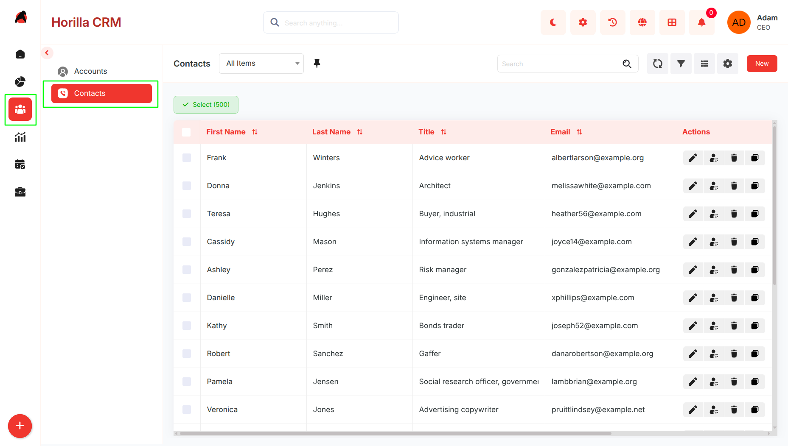
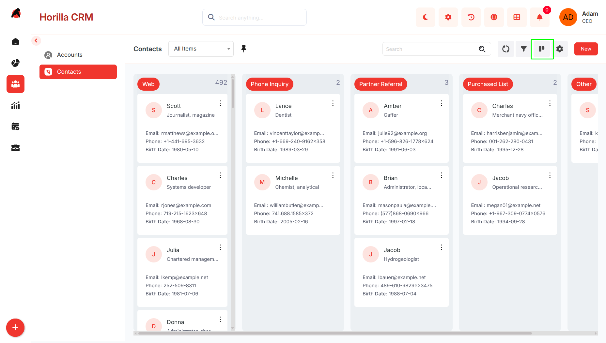
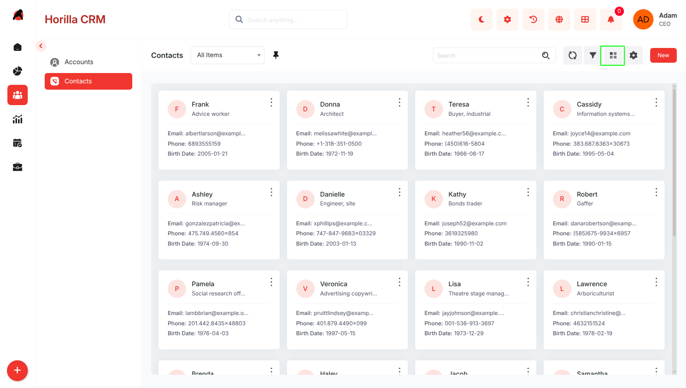
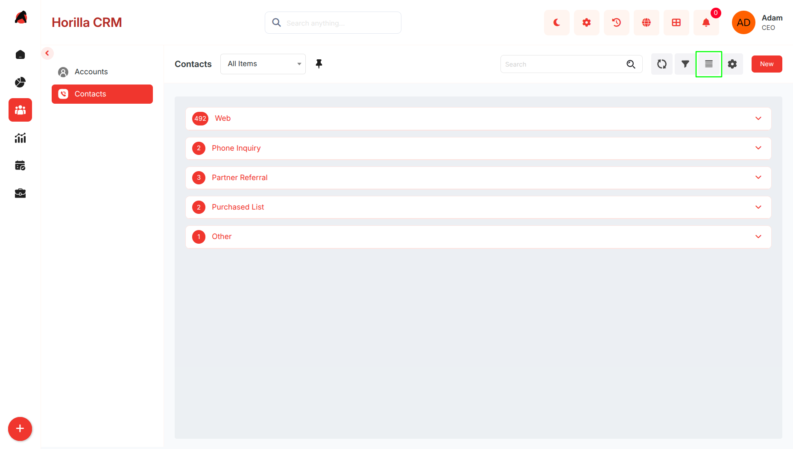
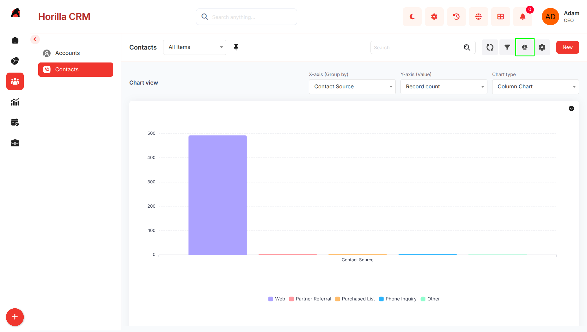
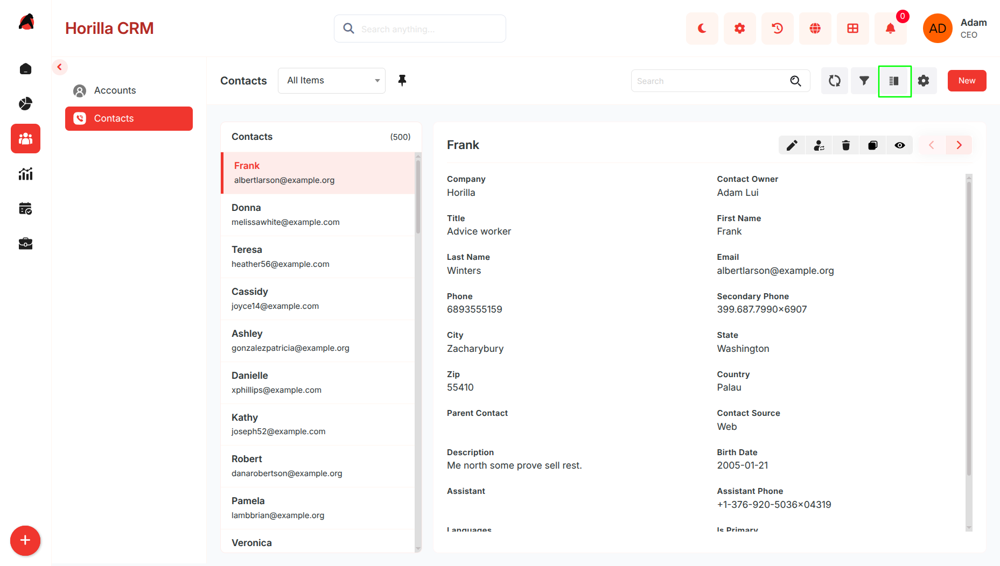
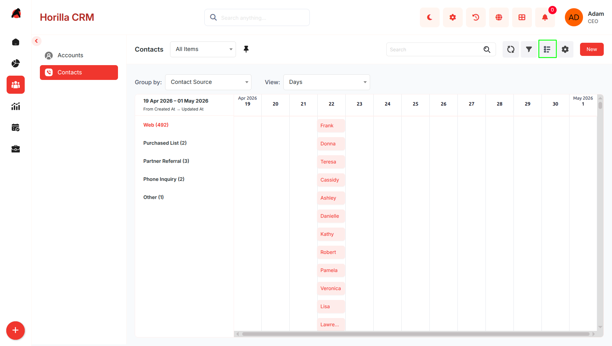
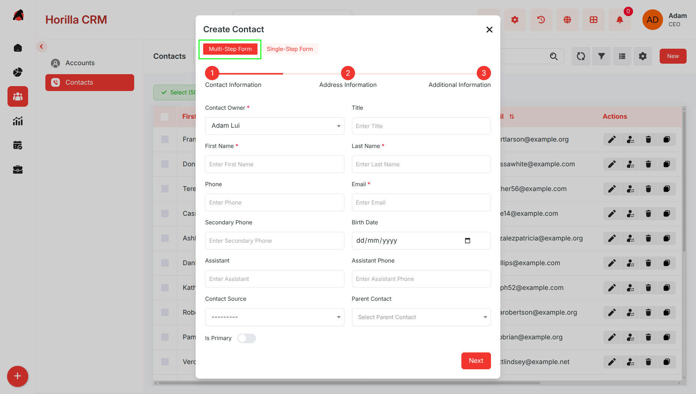
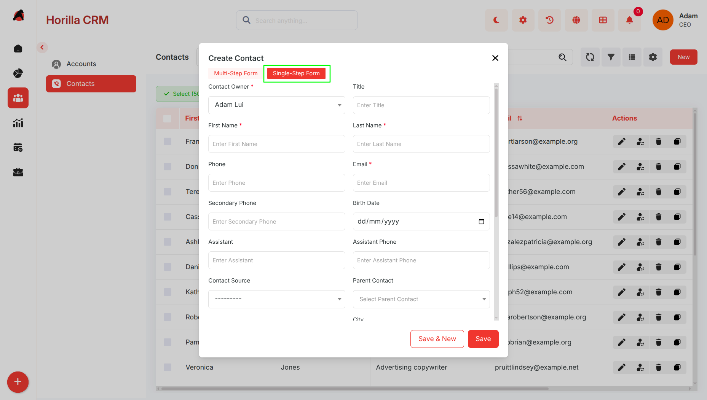
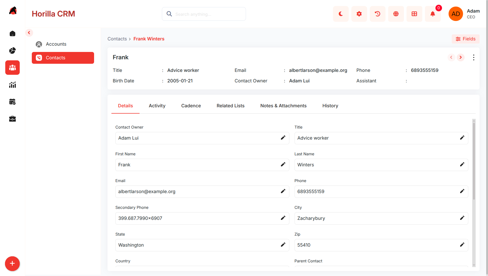

# **Contacts – Functional Guide**

## **Introduction**

The **Twixio CRM Contacts Module** serves as a central repository for managing individual contact information. It enables businesses to capture, organize, and maintain complete records of customers, prospects, and related individuals. With structured forms and detailed views, the module ensures all relevant information such as personal details, addresses, and additional notes are easily accessible. By integrating with other CRM modules such as **Leads** and **Opportunities**, the Contacts Module enhances customer relationship management, supports communication tracking, and helps build stronger client interactions.

## **Key Features and Functionalities**

### **2.1 Contacts Overview**

* **Purpose:** Display all contacts in a centralized list view for quick access and management.  
* Navigate to the **“People”** section in the sidebar and select **“Contacts.”**  
* Includes search, sorting, and filtering to find contacts by name, job title, or email.  
* Bulk management is supported via checkboxes, with actions such as Update, Export, and Delete.  

  

### **2.2 Kanban View**

* **Purpose:** Visualize and group contacts based on their source.

  

* Categorization can be adjusted using **Kanban settings**.  
* Contacts are automatically grouped by **Contact Source** (e.g., Web, Referral, Social Media, Event, etc.).  
* Switch to **Kanban View** using the view toggle on the Contacts page.  
* Cards display essential details such as **Name, Job Title, Email, and Phone**.  
* Drag-and-drop functionality allows repositioning or reassigning contacts to different sources.  
* Helps in identifying which sources contribute the most valuable contacts.

### **2.3 Card View**

* Purpose: Present contacts in a compact, easy-to-scan format  

    

* Switch to Card View from the toolbar  
* Each card displays:  
  * Name  
  * Job Title  
  * Email  
  * Phone  
  * Birth Date  
* Supports the same search and filter options as List View

### **2.4 Group By View**

* Purpose: Organize contacts into categorized groups for better analysis  

    

* Switch to Group By View from the toolbar  
* Group contacts by:  
  * Contact Source  
  * Job Title  
  * Language  
* View contacts in collapsible sections for easier comparison  
* Helps identify trends and concentrations across contact sources

### **2.5 Chart View**

* Purpose: Visualize contact data for insights and reporting  

   
  
* Switch to Chart View from the toolbar  
* Displays graphical representations of:  
  * Contact source distribution  
  * Contact ownership  
* Useful for analyzing contact origins and identifying sourcing gaps

### **2.6 Split View**

* Purpose: Improve efficiency by viewing contact list and details simultaneously  

   
 

* Activate Split View from the toolbar  
* Layout:  
  * Left panel: Contact list (Name, Email)  
  * Right panel: Contact details  
* Clicking a contact loads details instantly without page navigation

### **2.7 Timeline View**

* Purpose: Display contacts in chronological order for activity tracking  

  

* Switch to Timeline View from the toolbar  
* Organizes contacts based on:  
  * Creation date  
  * Last updated date  
* Group rows by Contact Source  
* Columns displayed:  
  * Name  
  * Last Name  
  * Job Title  
  * Email  
  * Contact Source  
* Helps identify activity trends and high acquisition periods

### **2.8 Creating a New Contacts**

* **Purpose:** Enable the addition of new contacts with structured step-by-step forms.  
* Click **“New”** on the Contacts page to open a multi-step creation wizard.  
* The form supports two modes:  
  * Multi-Step Form  
  * Single-Step Form  
* Users can switch between modes at any time

  ### **Multi-Step Form**

* Purpose: Guided and structured data entry across multiple steps 

  

**Step 1 – Contact Information**

* Contact Owner  
* Job Title  
* First Name / Last Name  
* Phone Numbers  
* Email  
* Assistant Details  
* Parent Contact  
* Contact Source  
* Currency

**Step 2 – Address Information**

* City  
* State  
* Country  
* Postal Code (Zip)

**Step 3 – Additional Information**

* Language  
* Descriptive Notes

**Navigation**

* Use **Next** and **Previous** to move between steps  
* Click **Save** to create the contact record

  ### **Single-Step Form**

* Purpose: Quick data entry when all information is available  

  

**Features**

* Displays all contact fields on a single page  
* No step-by-step navigation required  
* Faster data entry

**Usage**

* Use the toggle option in the form header to switch to Single-Step mode  
* Click **Save** to create the contact record  
*   
* **Step 1 – Contact Information:** Enter owner, job title, first/last name, phone numbers, email, assistant details, parent contact, source, and currency.  
* **Step 2 – Address Information:** Enter city, state, country, and postal code (Zip).  
* **Step 3 – Additional Information:** Choose language and add descriptive notes if required.  
* Navigate using **Next** / **Previous.**  
* Click **Save** to create the contact record.

### **2.9 Contacts Detailed Information**

* **Purpose:** Provide a complete and editable view of contact details.  
* Open a contact by clicking their name in the Contacts list.  
* Displays personal details (job title, phone, email, birth date, assistant, etc.) and address information.  
* Tabs available for **Details, Activity, Related Lists, and History.**  
* Fields can be updated directly from the detailed view using inline edit icons.  
* Allows full visibility into interactions and relationship history with the individual

  
