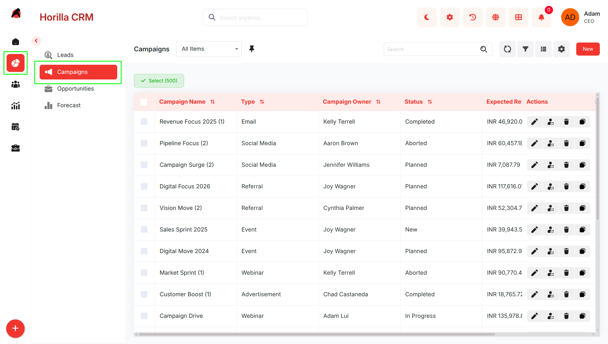
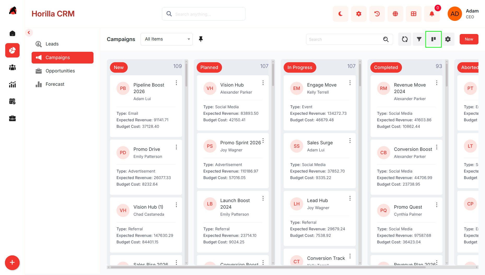
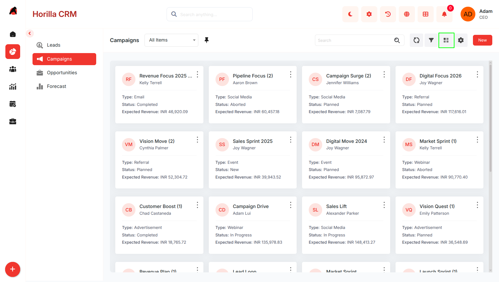
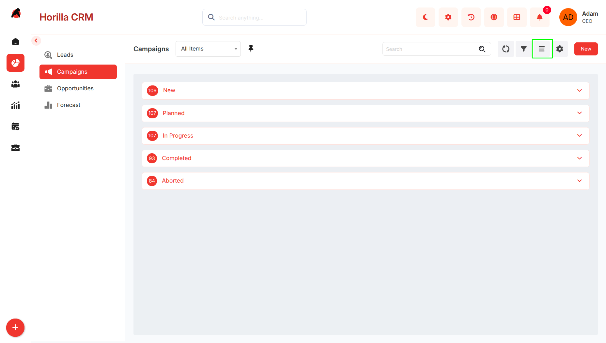
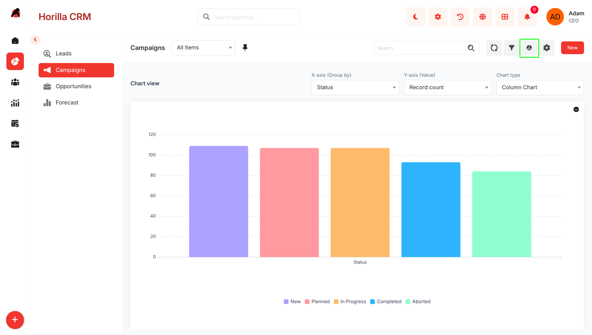
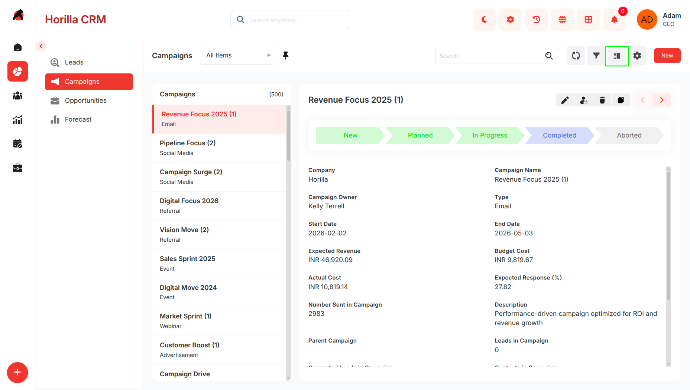
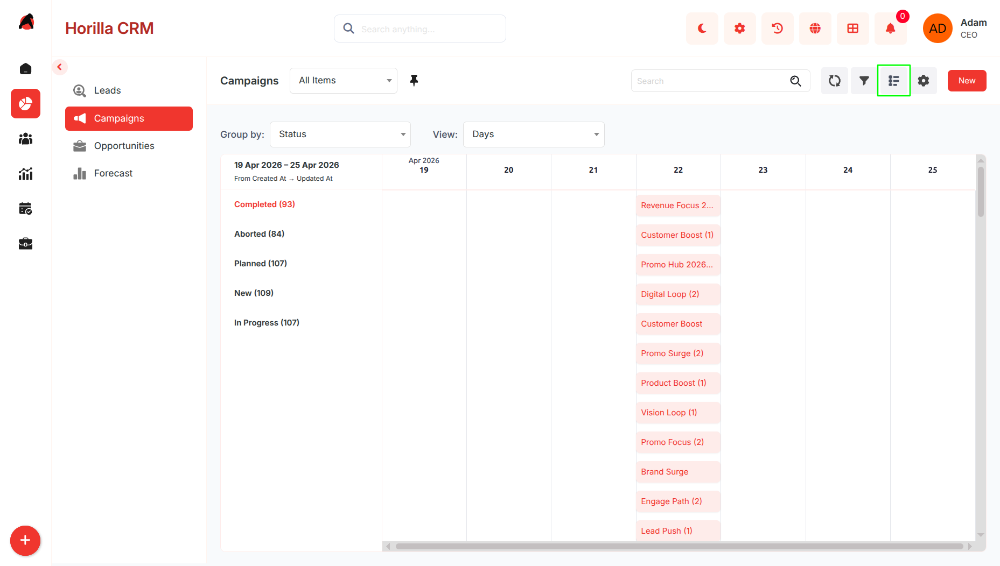
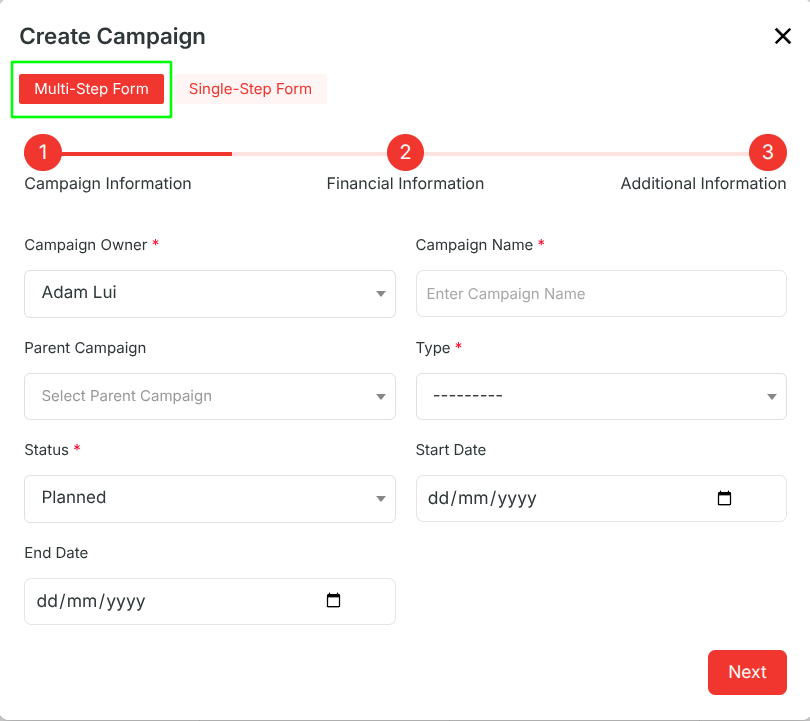
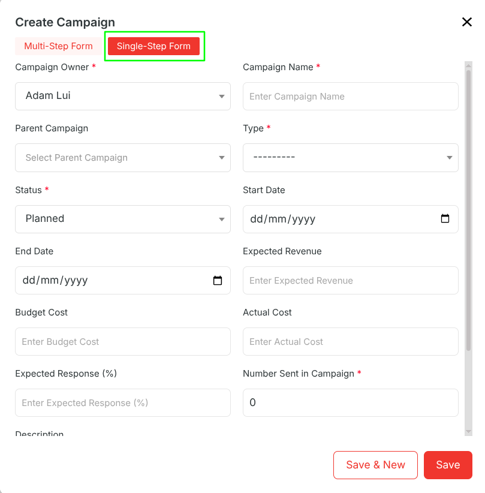
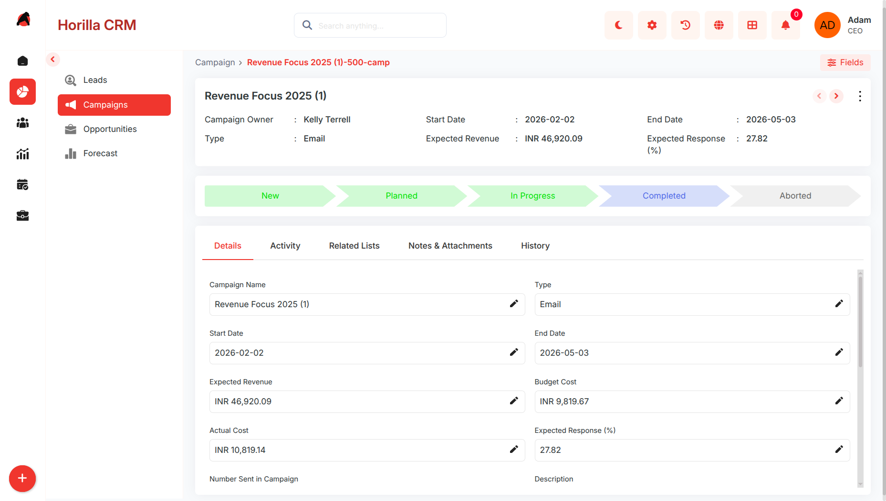

# **Campaigns – Functional Guide**

## **Introduction**

The **Twixio CRM Campaigns Module** is designed to simplify the creation, execution, and tracking of marketing initiatives. It provides organizations with a unified platform to plan campaign activities, define target audiences, manage budgets, and evaluate results. By giving marketing teams visibility into performance metrics such as response rates and conversions, the module enables smarter decision-making and continuous optimization. Through integration with other CRM modules like **Leads** and **Contacts**, Campaigns bridge the gap between marketing and sales, ensuring alignment and improving overall business impact.

## **Key Features and Functionalities**

### **1.1 Campaigns Overview**

* **Purpose:** Present all campaigns in a centralized list for quick access and management.  
* Access via the **“Sales”** section in the sidebar and choose **“Campaigns.”**  
* Includes search, filtering, and sorting to easily locate campaigns by name, type, or status.  
* Provides customizable filters for personalized views.  
* Bulk actions (Update, Export, Delete) available by selecting multiple campaigns through checkboxes.  
    

### **1.2 Kanban View**

* **Purpose:** Offer a visual workflow to monitor campaigns by their progress or status.  
* Categorization can be adjusted using **Kanban settings**.  
* Drag-and-drop cards to update campaign stages instantly.  
* Helps teams understand campaign progress at a glance and prioritize tasks efficiently.

### **1.3 Card View**

**Purpose:** Present campaigns in a compact, easy-to-scan format.

* Switch to Card View from the toolbar  
* Displays campaigns as individual cards  
* Each card shows:  
  * Campaign Name  
  * Campaign Owner  
  * Campaign Type  
  * Status  
  * Expected Revenue  
* Makes it easier to quickly scan multiple campaigns  
* Supports the same search and filter options as List View

### **1.4 Group By View**

**Purpose:** Organize campaigns into categorized groups for better analysis.

* Switch to Group By View from the toolbar  
* Group campaigns based on fields such as:  
  * Status  
  * Campaign Type  
  * Campaign Owner  
* Displays campaigns in collapsible sections  
* Helps in comparing similar campaigns  
* Makes it easier to identify trends, gaps, and concentrations

### **1.5 Chart View**

**Purpose:** Visualize campaign data for insights and reporting.

* Switch to Chart View from the toolbar  
* Displays data using charts and graphs  
* Visualizes:  
  * Campaign statuses  
  * Campaign types  
  * Budget and revenue distribution  
* Helps in understanding trends quickly  
* Useful for performance analysis and reporting

### **1.6 Split View**

**Purpose:** Improve efficiency by viewing lists and details together.

* Activate Split View from the toolbar  
* Screen is divided into two panels:  
  * Left panel: Campaign list  
  * Right panel: Campaign details  
* Clicking a campaign loads its details instantly  
* Eliminates the need for full page navigation  
* Helps in quick comparison and review

### **1.7 Timeline View**

**Purpose:** Display campaigns in chronological order for planning.

* Switch to Timeline View from the toolbar  
* Organizes campaigns based on:  
  * Creation date  
  * Last updated date  
* Allows grouping by campaign status  
* Timeline settings allow switching to start/end date view  
* Helps identify overlaps and peak campaign periods  
* Useful for planning and tracking campaign schedules

### **1.8 Creating a New Campaigns**

* **Purpose:** Enable marketing teams to set up and launch new campaigns quickly.  
* Click **“New”** on the Campaigns page to open creation form.  
* The form supports two modes, which can be switched at any time:

#### **Multi-Step Form**

* Designed for guided and structured data entry by dividing the form into multiple steps:  
* **Step 1 – Basic Info:** Enter owner, campaign name, status, start/end date, and campaign type.  
* **Step 2 – Financials:** Add budget cost, actual cost, expected revenue, and estimated response.  
* **Step 3 – Additional Info:** Fill in description, audience size.  
* Navigate using **Next** / **Previous** until complete.  
* Click **Save** to finalize and register the campaign.

  #### **Single-Step Form**

  

* Designed for quick data entry when all information is readily available:  
* Displays all campaign fields on a single page.  
* Allows faster input without step navigation.  
* Use the **toggle option in the form header** to switch to Single-Step mode.  
* Click **Save** to create the lead.

### **1.9 Campaign Detailed Information**

* **Purpose:** Provide full visibility into an individual campaign’s information and progress.  
* Open by clicking a campaign name in the **list** or **Kanban view**.  
* Displays related activities, performance stats, and history for context.  
* Update campaign status directly or mark it completed by selecting the final stage in the progress bar.

