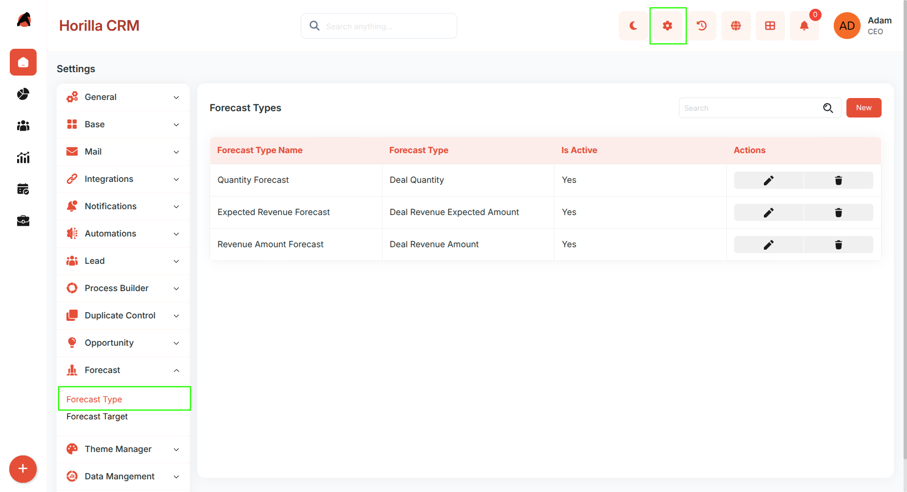
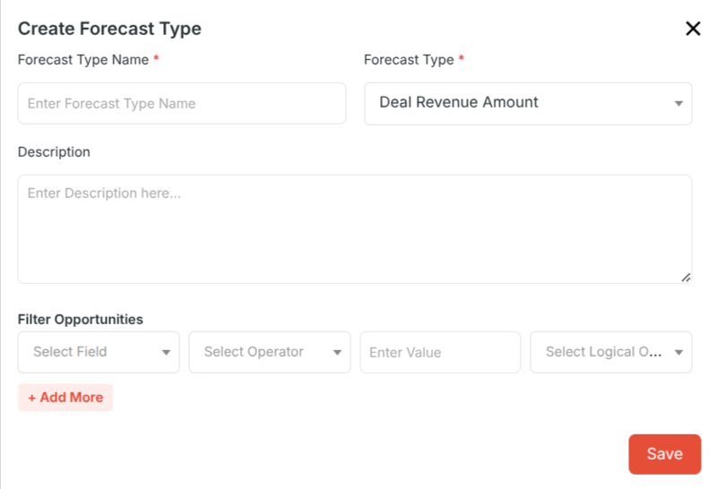
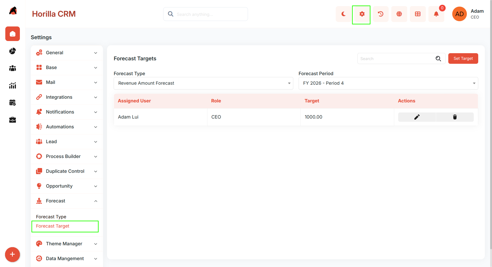
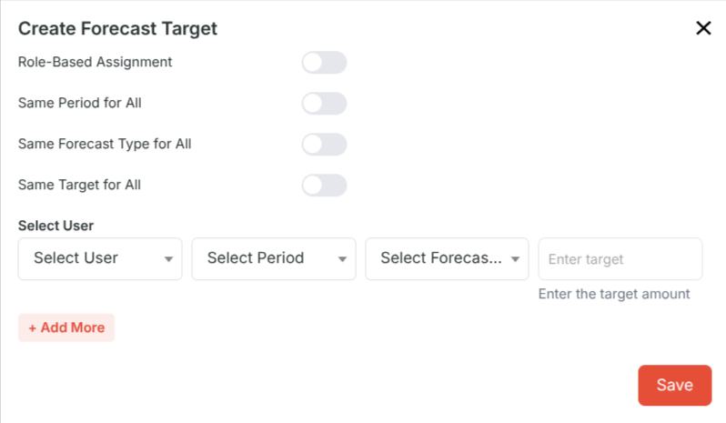
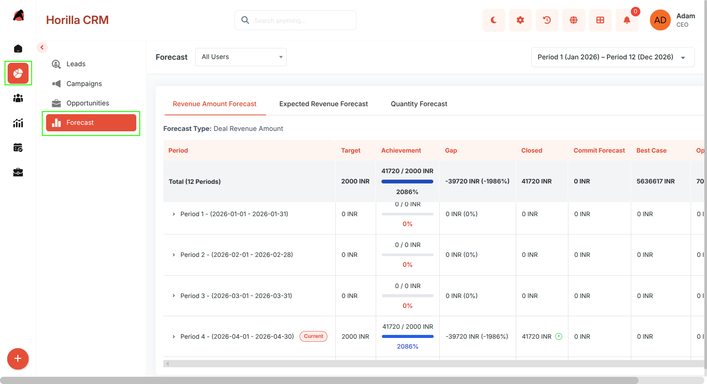
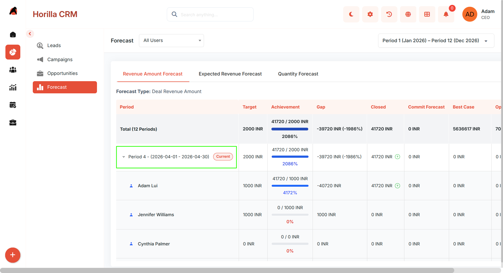
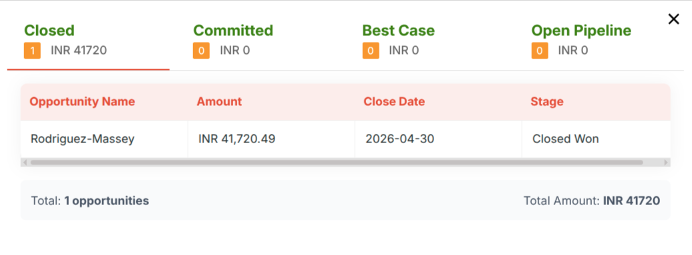

# **Forecast – Functional Guide**

## **Introduction**

The **Twixio CRM Forecast Module** is a sophisticated feature designed to streamline sales forecasting and target management within the CRM ecosystem. It provides a comprehensive, intuitive interface that empowers businesses to set **revenue and quantity targets**, track performance against goals, and gain visibility into sales pipeline metrics. This module supports *customizable forecast types*, fiscal-year-based navigation, period-based target setting, role-based target assignment, and real-time achievement tracking.

## **Key Features and Functionalities**

### **1\. Forecast Types Management**

**Purpose:** Define and manage different categories of forecasts to align with business objectives.

#### **Accessing Forecast Types**

* Navigate to Settings → Forecast → Forecast Type.  
* Displays all configured forecast categories in a list.

#### **Viewing Forecast Types**

* Columns displayed: **Forecast Type Name**, **Forecast Type** *(Deal Quantity or Deal Revenue Amount)*, **Is Active**.  
* Actions: **Edit** or **Delete** each forecast type.

#### **Creating a New Forecast Type**

* Click **New** to open the creation form.

* Fill in:  
  * **Forecast Type Name** *(required)*  
  * **Forecast Type** *(required)* — Deal Revenue Amount or Deal Quantity  
  * **Description** *(optional)*  
  * **Filter Opportunities** — configure advanced filtering conditions using *Field*, *Operator*, *Value*, and *Logical Operator*. Click **\+ Add More** to add multiple conditions.  
* Click **Save**.

#### **Managing Existing Forecast Types**

* Use the **search bar** to locate specific forecast types.  
* **Edit** using the pencil icon or **Delete** using the trash icon.

### **2\. Forecast Targets Configuration**

**Purpose:** Set and manage performance targets for team members across specific periods and forecast types.

#### **Accessing Forecast Targets**

* Navigate to Settings → Forecast → Forecast Target.  
* Filter the list using **Forecast Type** and **Forecast Period** dropdowns at the top.

#### **Viewing Forecast Targets**

* Columns displayed: **Assigned User**, **Role**, **Target**, **Actions**.

#### **Creating a New Forecast Target**

* Click **Set Target** to open the target creation form.

* Toggle options to simplify bulk entry:  
  * **Role-Based Assignment** — enable to assign targets by role; the user list filters to only users with the selected role.  
  * **Same Period for All** — apply a single period across all target rows.  
  * **Same Forecast Type for All** — use the same forecast type for all rows.  
  * **Same Target for All** — set a uniform target value for all rows.  
* Per-row fields *(shown when corresponding toggle is off)*:  
  * Select **User**  
  * Select **Period**  
  * Select **Forecast Type**  
  * Enter **Target Amount**  
* Click **\+ Add More** to add additional rows for multiple users or periods.  
* The system *validates for duplicate combinations* (same user \+ period \+ forecast type) and prevents saving duplicates.  
* Click **Save** to finalize.

#### **Managing Existing Targets**

* **Edit** targets using the pencil icon or **Delete** using the trash icon.

### **3\. Forecast Dashboard and Performance Tracking**

**Purpose:** Provide real-time visibility into forecast achievement, pipeline health, and period-over-period performance.

#### **Accessing the Forecast Dashboard**

* Click **Forecast** from the main left sidebar.

#### **Dashboard Filters**

* **All Users** dropdown — filter the dashboard to a specific user.  
* **Fiscal Year** selector — navigate between fiscal year instances using **Previous** and **Next** controls. Defaults to the *current active fiscal year*.  
* **Forecast Type** tabs — toggle between configured forecast types; each tab shows its own metrics.

#### **Dashboard Metrics**

**Overview Row** *(Total — all periods):*

* **Target**, **Achievement** *(progress bar with closed amount / target and percentage)*, **Gap**, **Closed**, **Commit Forecast**, **Best Case**, **Open Pipeline**.

**Period-by-Period Breakdown:**

* Each period *(e.g., January 2025, February 2025\)* is shown as an *expandable row*.  
* Each row shows: **Target**, **Achievement**, **Gap**, **Closed**, **Commit Forecast**, **Best Case**, **Open Pipeline** for that period.

**Expanded Period View:**

* Shows the period total in the first row.  
* Lists each individual team member's contribution with their own **Target**, **Achievement**, **Gap**, **Closed**, **Commit Forecast**, **Best Case**, and **Open Pipeline** values.

**Opportunity Detail Modal**

* Clicking any **Closed**, **Commit Forecast**, **Best Case**, or **Open Pipeline** value opens a modal popup listing the opportunities that make up that figure.
* The modal is organised into four tabs: **Closed**, **Committed**, **Best Case**, and **Open Pipeline**.
* Each tab displays the opportunity name and its amount (or quantity for quantity-based forecast types).
* Clicking an opportunity name navigates directly to that opportunity's detail view.
* This works at the **total row level**, at each **period row level**, and at the **individual user level** inside an expanded period.
