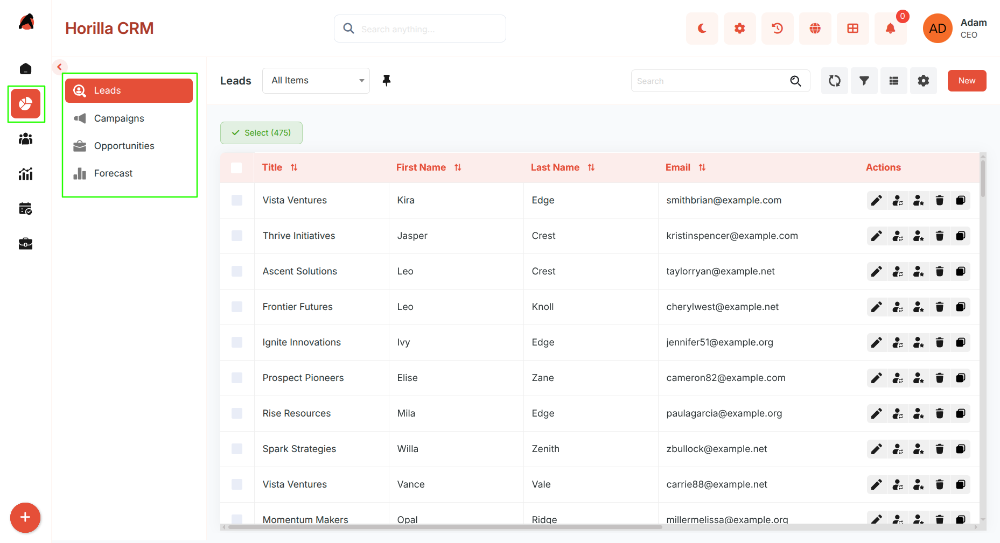
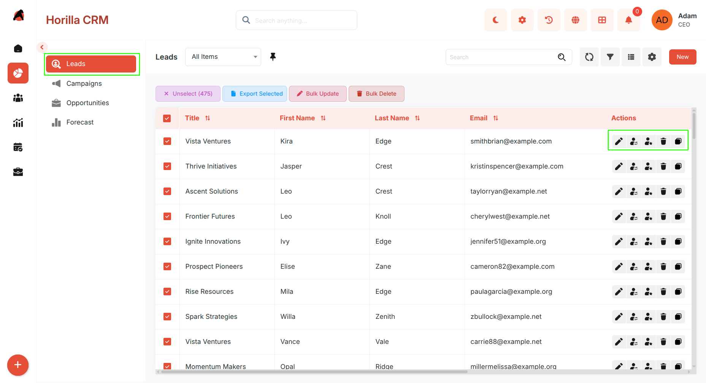
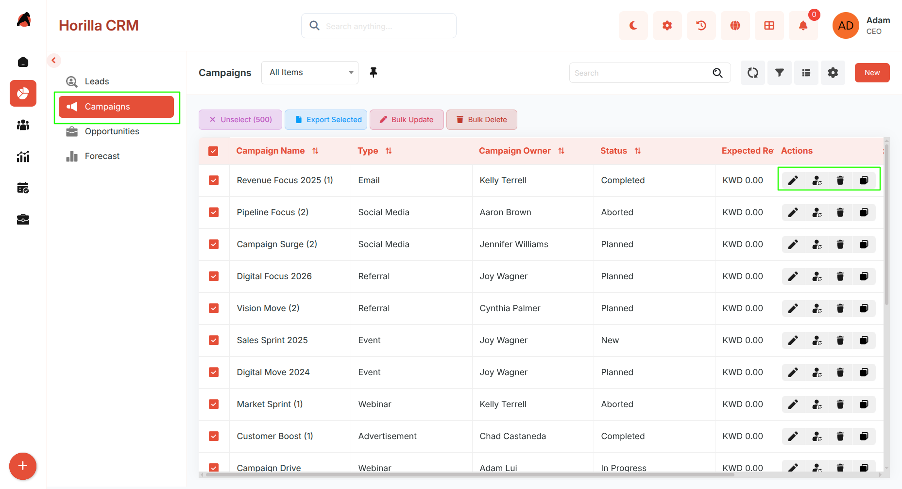
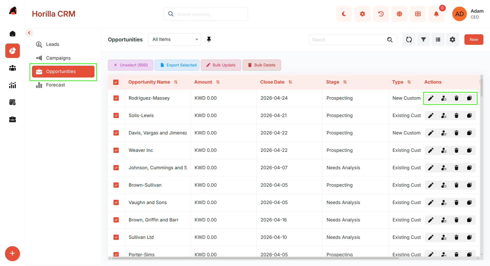
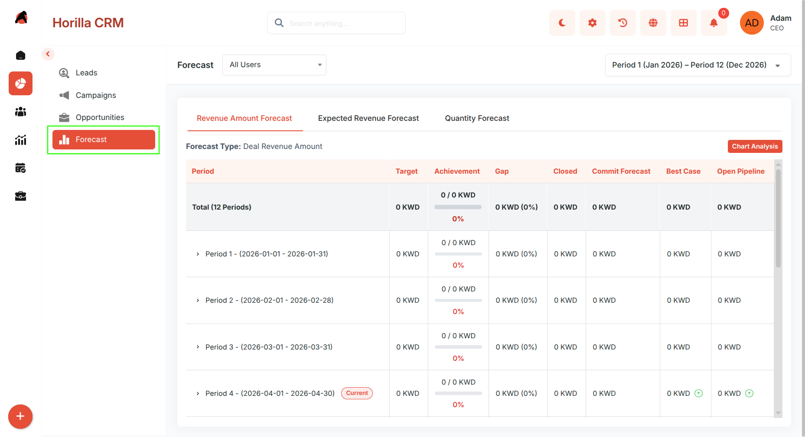

## **Sales – Functional Guide**

### **Introduction**

The Twixio CRM Sales Section is a comprehensive suite designed to manage the complete sales lifecycle — from lead generation to deal closure and performance forecasting. This section integrates four powerful modules: **Leads**, **Campaigns**, **Opportunities**, and **Forecasts**. Together, they provide businesses with an integrated platform to capture potential customers, execute marketing activities, manage ongoing deals, and monitor sales targets.

### **1\. Sales Section Overview**

**Purpose:** Provide a centralized workspace for managing all sales-related data and activities.

**Access:** Navigate to the **Sales** section in the sidebar, which includes four sub-sections: **Leads**, **Campaigns**, **Opportunities**, and **Forecasts**.

**Key Features:**

* Unified access to all sales modules.  
* Integrated workflows between marketing, sales, and forecasting.  
* Search, filtering, and bulk operations across modules.  
* Multiple view options for flexible visualization.  
* Seamless transition of records across modules (e.g., Lead → Opportunity).  
* Real-time progress and performance tracking.

### **1.1 Leads Module**

**Purpose:** Manage and convert potential customers into qualified sales opportunities.

**Access:** Sales → Leads

**Key Features:**

* **List View** — Centralized lead list with filters, sorting, and bulk actions (Update, Export, Delete).  
* **Kanban View** — Visual representation of leads by stage with drag-and-drop updates.  
* **Card View** — Compact card layout for a quick overview of each lead.  
* **Group By View** — Segment leads by any field (stage, source, owner, industry).  
* **Chart View** — ECharts-based visualizations for lead distribution and trends.  
* **Split View** — Side-by-side list and detail panel for fast review and editing.  
* **Timeline View** — Chronological view of leads based on dates.  
* **Lead Creation** — Multi-step or single-step form capturing basic, company, location, and requirements details.  
* **Detailed View** — Complete lead record with related lists, activities, notes, attachments, and history.  
* **Conversion** — Convert leads into Accounts, Contacts, and Opportunities from the detail view or via the Actions menu in any list view.

### **1.2 Campaigns Module**

**Purpose:** Plan, execute, and monitor marketing campaigns to generate leads and measure performance.

**Access:** Sales → Campaigns

**Key Features:**

* **List View** — Consolidated campaign list with search, filtering, and bulk actions.  
* **Kanban View** — Visual board to track campaigns by status or stage.  
* **Card View** — Compact card display for a quick campaign overview.  
* **Group By View** — Segment campaigns by any field for comparative analysis.  
* **Chart View** — Visual campaign performance analytics.  
* **Split View** — Side-by-side campaign list and detail panel.  
* **Timeline View** — Chronological view of campaigns by date.  
* **Campaign Creation** — Step-based form for campaign type, duration, and financials (budget, expected revenue, actual cost).  
* **Detailed View** — Performance stats, related activities, related lists, and campaign history.  
* **Campaign Hierarchy** — View parent-child relationships between campaigns.  
* **Integration** — Direct linkage between campaigns and generated leads or contacts for conversion tracking.

### **1.3 Opportunities Module**

**Purpose:** Manage deals, track sales progress, and close opportunities efficiently.

**Access:** Sales → Opportunities

**Key Features:**

* **List View** — Comprehensive opportunity list with filters and bulk actions.  
* **Kanban View** — Visual sales pipeline grouped by stage with drag-and-drop updates.  
* **Card View** — Compact card layout per opportunity.  
* **Group By View** — Segment opportunities by stage, owner, source, or any field.  
* **Chart View** — Pipeline health and deal distribution visualizations.  
* **Split View** — Side-by-side opportunity list and detail panel.  
* **Timeline View** — Chronological opportunity tracking.  
* **Opportunity Creation** — Multi-step or single-step form covering basic info, amount, expected close date, and additional sales details.  
* **Detailed View** — Complete record with related lists, contact roles, activities, cadences, and history.  
* **Stage Management** — Update or close opportunities using the progress bar stages.  
* **Big Deal Alert** — Configurable alerts that trigger notifications when high-value opportunities are created or updated.  
* **Opportunity Split** — Distribute revenue credit across multiple team members when team selling is enabled.  
* **Opportunity Teams** — Assign teams to opportunities with Read/Write or Read-Only access control.  
* **Integration** — Direct linkage with accounts, contacts, campaigns, and forecast data.

### **1.4 Forecast Module**

**Purpose:** Set sales targets, track progress, and evaluate performance across periods and teams.

**Access:** Sales → Forecast

**Key Features:**

* **Forecast Types** — Define forecast categories such as Revenue or Quantity with configurable measurement units.  
* **Target Configuration** — Assign targets by user or role for specific periods; supports role-based and condition-based targeting.  
* **Forecast Dashboard** — Visual insights showing targets, achievements, gaps, and pipeline health.  
* **User-Level Tracking** — Drill down by team member, role, or forecast period for granular performance analysis.  
* **Integration** — Syncs with Opportunities for real-time revenue and pipeline calculations.

