# **Leads – Functional Guide**

1. ## **Introduction**

The Leads module in Twixio CRM is designed to simplify and optimize the process of managing potential customers. It provides a structured and efficient way to capture, track, and convert leads into business opportunities.

With a user-friendly interface and powerful features, the module helps teams organize lead information, monitor progress across different stages, and ensure timely follow-ups. By centralizing lead data and supporting integration with other business tools, it enhances productivity and enables a seamless sales workflow.

2. ## **Key Features and Functionalities**

   1. ### **Leads Overview**

**Purpose:** Provide a centralized view of all leads for efficient management.

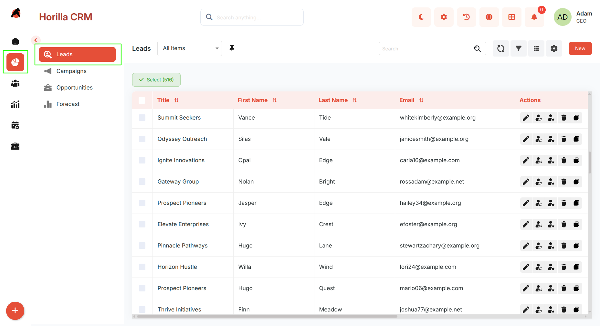

* Navigate to **Sales → Leads** to access the leads list.  
* View all leads in a structured tabular format.  
* Use **search and filters** to quickly locate leads based on criteria such as name or lead source.  
* Columns are **sortable**, and filters are customizable for better usability.  
* Perform **bulk actions** by selecting leads using checkboxes:  
  * Update  
  * Export  
  * Bulk Delete

  2. ### **Kanban View**

**Purpose:** Offer a visual representation of leads based on their stages.

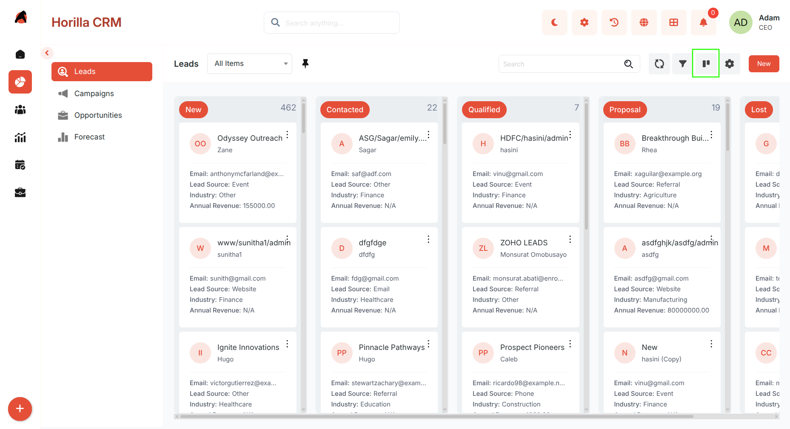

* View leads organized into columns representing different stages.  
* Customize stage categorization through Kanban settings.  
* Use **drag-and-drop** to move leads between stages.  
* Easily track progress and pipeline movement.

  3. ### **Card View**

**Purpose:** Present leads in a compact, easy-to-scan format.

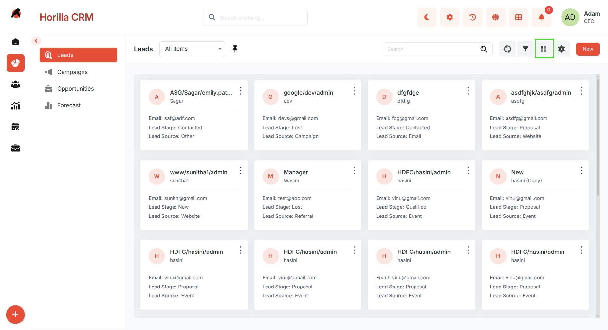

* Switch to Card View from the toolbar.  
* Each card displays key details:  
  * Name  
  * Lead Source  
  * Stage  
  * Lead Owner  
* Supports the same **search and filter** options as List View.

  4. ### **Group By View**

**Purpose:** Organize leads into categorized groups for better analysis.

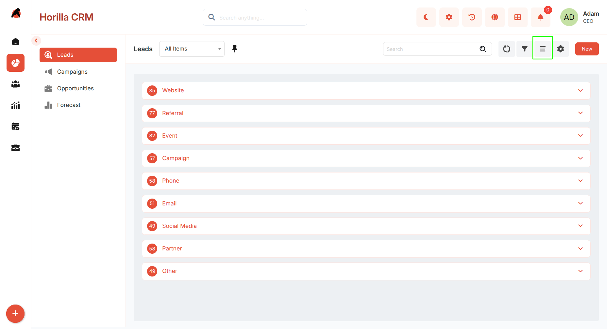

* Switch to Group By View from the toolbar.  
* Group leads by fields such as:  
  * Lead Stage  
  * Lead Source  
  * Lead Owner  
  * Industry  
* View leads in **collapsible sections** for easier comparison.  
* Helps identify trends, concentrations, and gaps.

  5. ### **Chart View**

**Purpose:** Visualize lead data for insights and reporting.

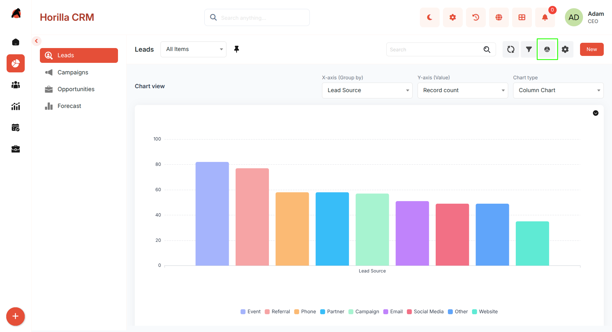

* Switch to Chart View from the toolbar.  
* Displays graphical representations of:  
  * Lead stages  
  * Lead sources  
  * Lead ownership  
* Useful for analyzing pipeline health and trends.

  6. ### **Split View**

**Purpose:** Improve efficiency by viewing lists and details simultaneously.

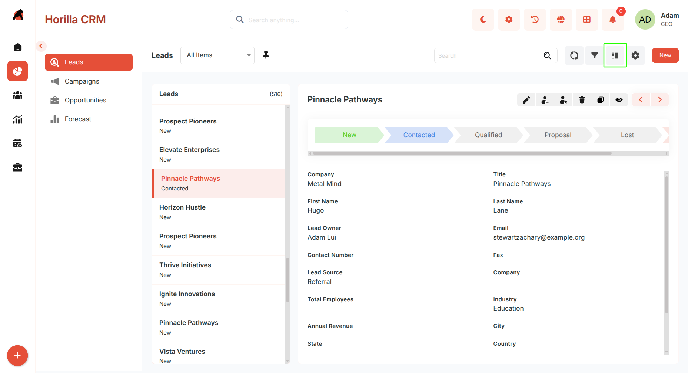

* Activate Split View from the toolbar.  
* Left panel: Lead list  
* Right panel: Lead details  
* Clicking a lead instantly loads its details without page navigation.

  7. ### **Timeline View**

**Purpose:** Display leads in chronological order.

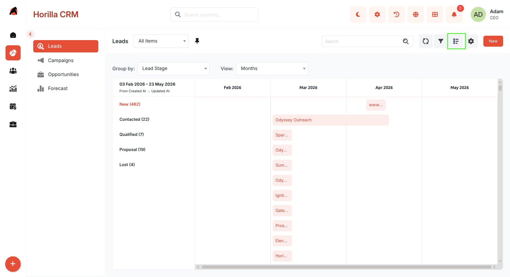

* Switch to Timeline View from the toolbar.  
* Organizes leads based on:  
  * Creation date  
  * Activity date  
* Helps identify activity trends and peak periods.

---

8. ### **Creating a New Lead**

**Purpose:** Capture and store new lead information.

* Click the **“New”** button on the Leads page to open the lead creation form.  
* The form supports two modes, which can be switched at any time:

  #### **Multi-Step Form**

Designed for guided and structured data entry by dividing the form into multiple steps:

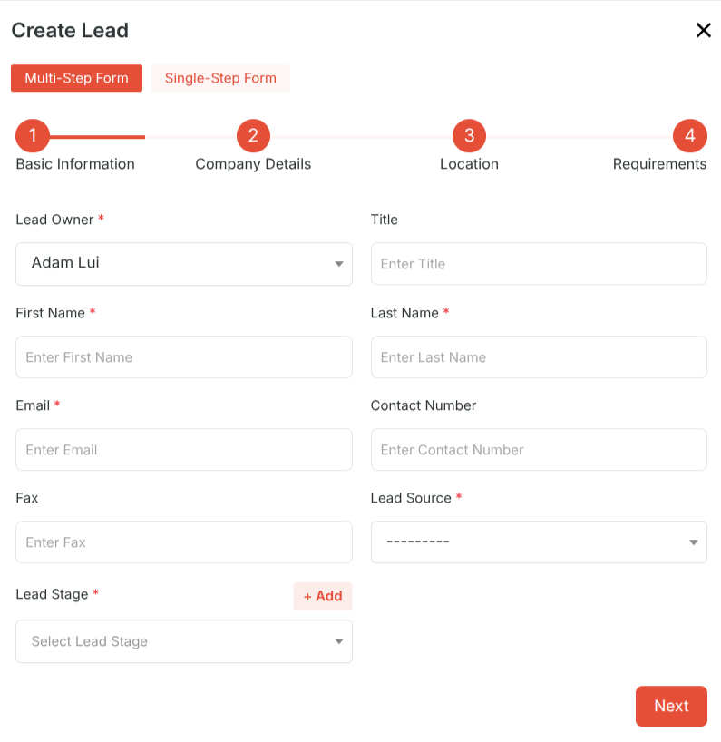

* **Step 1 — Basic Information**  
  * Lead Owner  
  * Name  
  * Email  
  * Lead Source  
  * Industry  
* **Step 2 — Company Details**  
  * Title  
  * Contact Number  
  * Lead Currency  
* **Step 3 — Location**  
* **Step 4 — Requirements**  
* Use **Next** and **Previous** to move between steps.  
* Click **Save** to create the lead.

  #### **Single-Step Form**

Designed for quick data entry when all information is readily available:

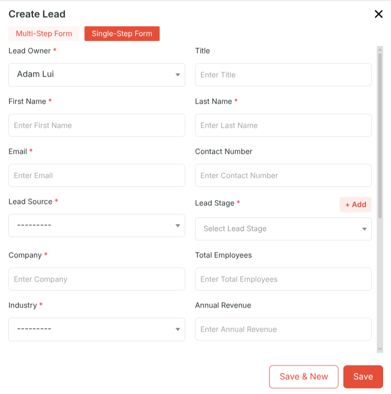

* Displays all lead fields on a single page.  
* Allows faster input without step navigation.  
* Use the **toggle option in the form header** to switch to Single-Step mode.  
* Click **Save** to create the lead.

  9. **Lead Detailed Information**

**Purpose:** Provide a complete view and management interface for each lead.

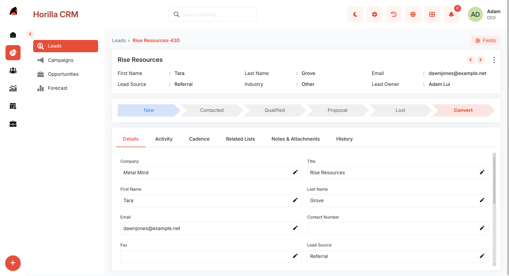

* Open by clicking a lead from any view.  
* Includes:  
  * Related lists  
  * Activities  
  * Notes  
  * Attachments  
  * History  
* Allows direct lead conversion through the progress bar.

  10. ### **Lead Conversion Process**

**Purpose:** Convert leads into actionable business entities such as Accounts, Contacts, and Opportunities.

**From the Detail View**

* Open the **Lead Detail View**.

* Click the **final stage** in the progress bar to initiate the conversion process.

**From the Actions Menu (List / Card / Kanban / Group by views)**

* Click the **Actions** menu.

* Choose **Convert**.

#### **Conversion Form**

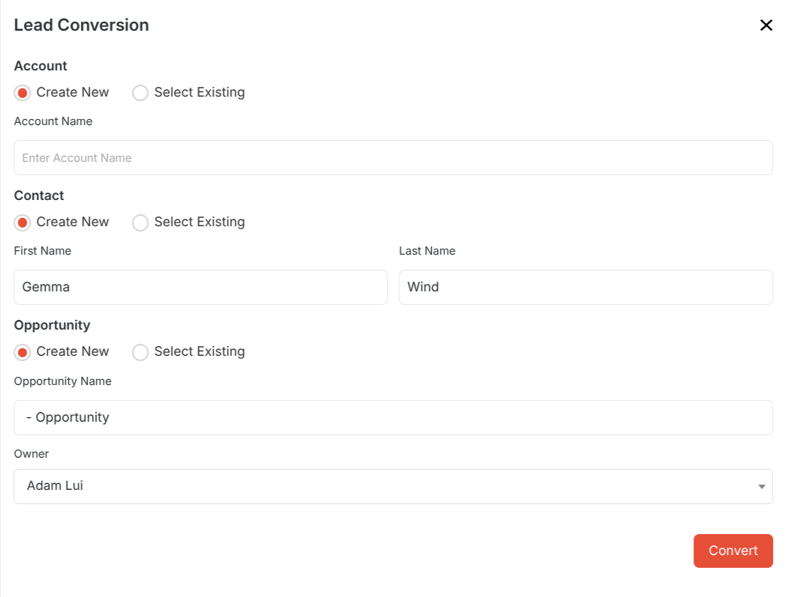

**Choose the entities to create**:

*  **Account**

* **Contact**

* **Opportunity**

**Provide the required details:**

* **Account Name**

* **Contact First Name & Last Name**

* **Opportunity Name**

Click **Convert** to complete the process.

### 

