# **Opportunities – Functional Guide**

## **Introduction**

The Opportunities module in Twixio CRM is designed to simplify and optimize the management of active sales deals. It provides a structured and efficient way to track opportunities through pipeline stages, monitor progress, and close deals. With a user-friendly interface and powerful features, the module helps teams organize deal information, manage related contacts and activities, and ensure timely follow-ups — enabling a seamless sales workflow from prospect to close.

## **Key Features and Functionalities**

### **Opportunities Overview**

**Purpose:** Provide a centralized view of all opportunities for efficient management.

**Access:** Sales → Opportunities

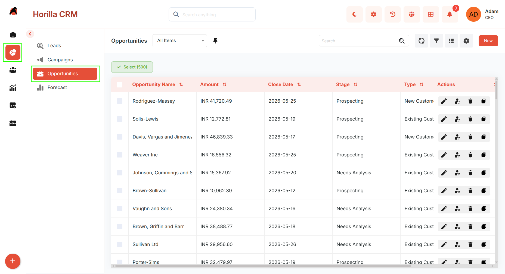

* View all opportunities in a structured tabular format.  
* Use search and filters to quickly locate opportunities based on criteria such as name, stage, or owner.  
* Columns are sortable and filters are customizable for better usability.  
* Perform bulk actions by selecting opportunities using checkboxes: **Update**, **Export**, **Bulk Delete**.

### **Kanban View**

**Purpose:** Offer a visual representation of opportunities organized by their current sales stage.

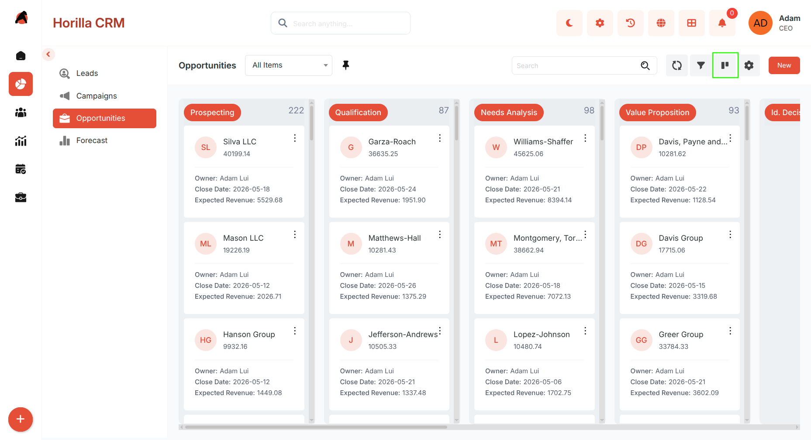

* View opportunities organized into columns representing different stages.  
* Customize stage categorization through Kanban settings.  
* Use drag-and-drop to move opportunities between stages.  
* Easily track pipeline progress and movement.

### **Card View**

**Purpose:** Present opportunities in a compact, easy-to-scan format.

* Switch to Card View from the toolbar.  
* Each card displays key details: Name, Stage, Amount, Owner.  
* Supports the same search and filter options as List View.

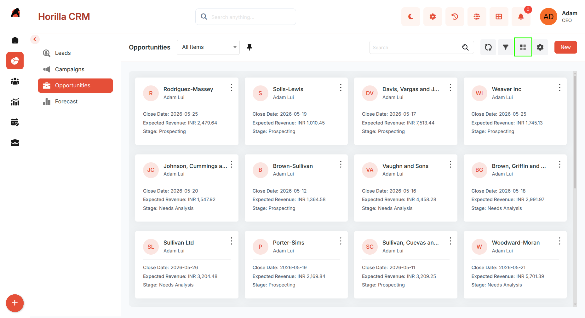

### **Group By View**

**Purpose:** Organize opportunities into categorized groups for better analysis.

* Switch to Group By View from the toolbar.  
* Group opportunities by fields such as Stage, Owner, Lead Source, Account.  
* View opportunities in collapsible sections for easier comparison.  
* Helps identify trends, concentrations, and gaps across categories.

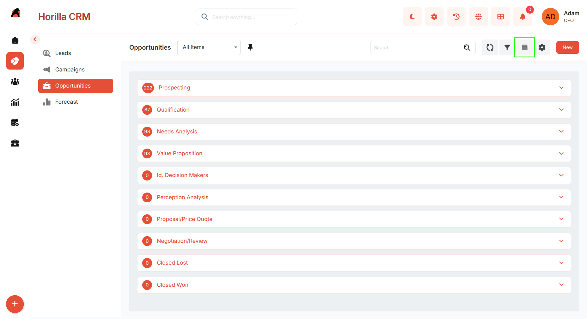

### **Chart View**

**Purpose:** Visualize opportunity data for insights and reporting.

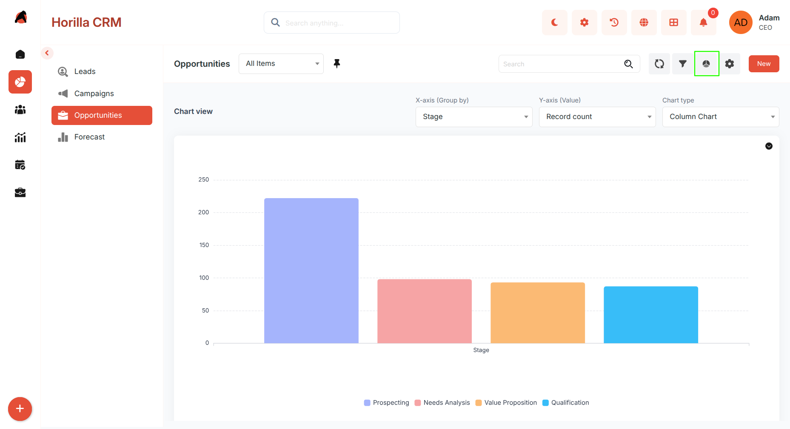

* Switch to Chart View from the toolbar.  
* Displays graphical representations of opportunity stages, sources, and ownership.  
* Useful for analyzing pipeline health and deal distribution trends.

### **Split View**

**Purpose:** Improve efficiency by viewing list and details simultaneously.

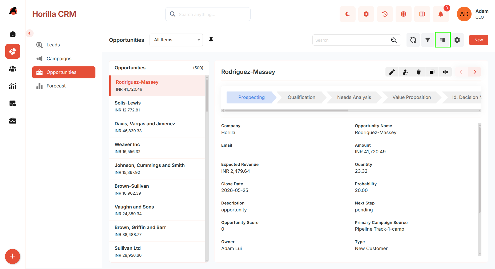

* Activate Split View from the toolbar.  
* Left panel: Opportunity list.  
* Right panel: Opportunity details.  
* Clicking an opportunity instantly loads its details without page navigation.

### **Timeline View**

**Purpose:** Display opportunities in chronological order.

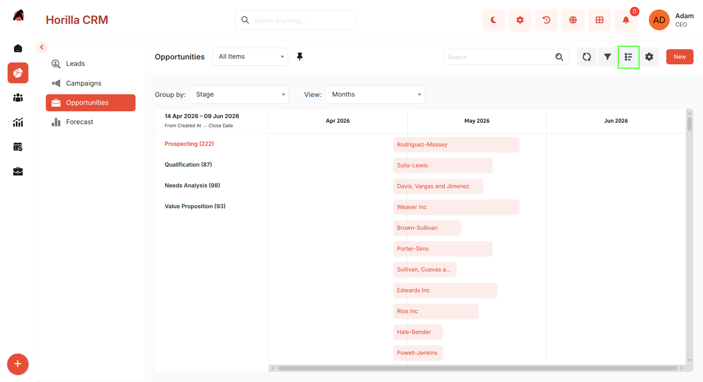

* Switch to Timeline View from the toolbar.  
* Organizes opportunities based on creation or activity dates.  
* Helps identify activity trends and peak sales periods.

### **Creating a New Opportunity**

**Purpose:** Capture and store new opportunity information.

Click the **New** button on the Opportunities page to open the creation form. The form supports two modes, which can be switched at any time:

##### **Multi-Step Form**

Designed for guided and structured data entry divided into steps:

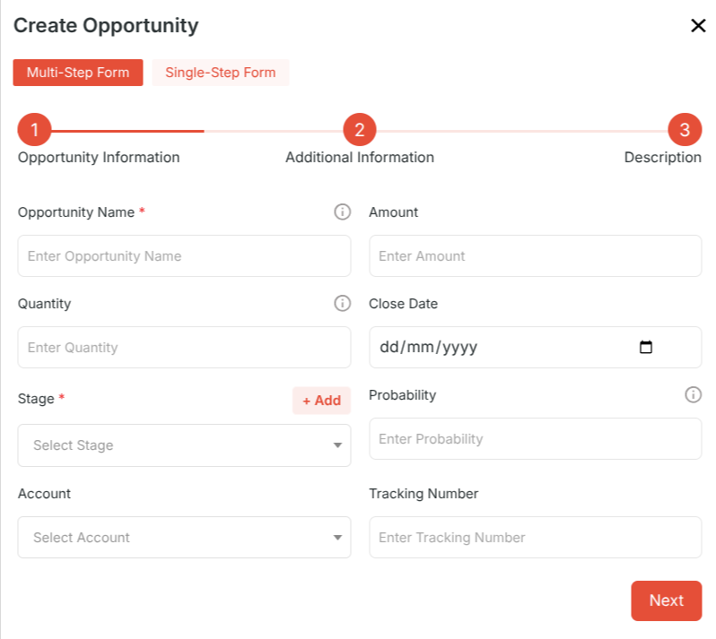

* **Step 1 — Opportunity Information:** Owner, Name, Account, Amount, Expected Close Date, Stage  
* **Step 2 — Additional Information:** Probability, Lead Source, Campaign  
* **Step 3 — Description**

Use **Next** and **Previous** to move between steps. Click **Save** to create the opportunity.

#### **Single-Step Form**

Designed for quick data entry when all information is readily available:

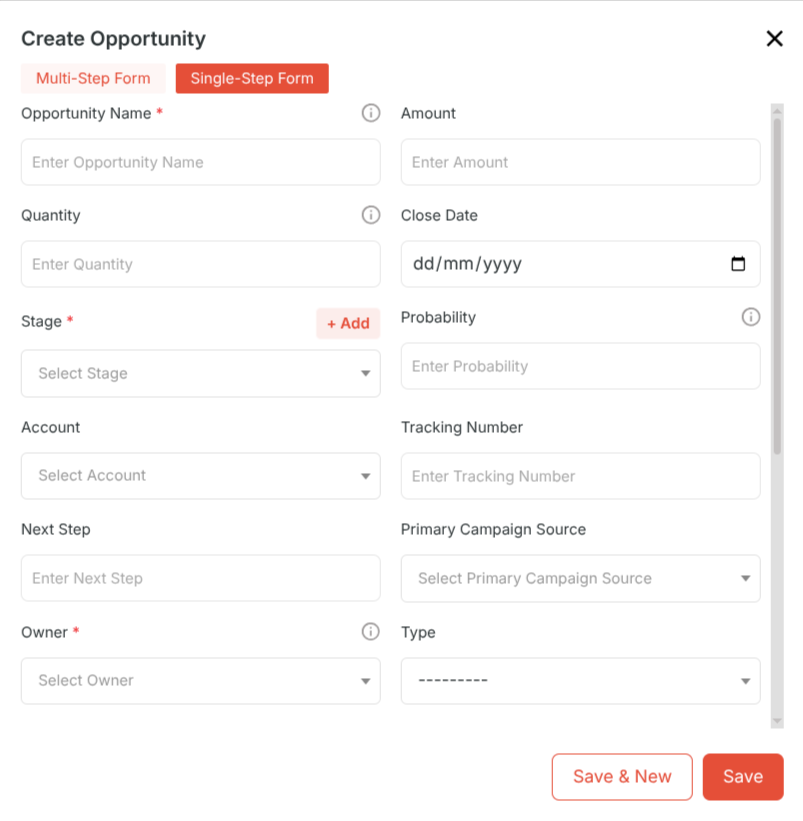

* Displays all opportunity fields on a single page.  
* Allows faster input without step navigation.  
* Use the **toggle** in the form header to switch to Single-Step mode.  
* Click **Save** to create the opportunity.

### **Opportunity Detailed Information**

**Purpose:** Provide a complete view and management interface for each opportunity.

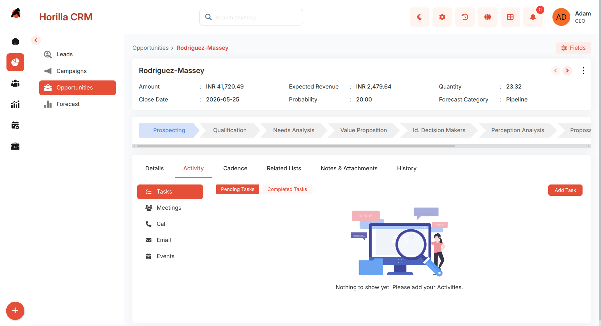

Open by clicking an opportunity from any view. Includes:

* Related lists (Contacts with roles, opportunity team,opportunity splits)  
* Activities  
* Cadences  
* Notes and attachments  
* History

### **Closing an Opportunity**

**Purpose:** Mark an opportunity as won or lost when it reaches the final stage.

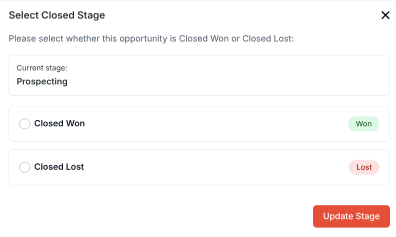

* Click the final stage in the progress bar on the opportunity detail view.  
* A selection modal appears with two options:  
  * **Closed Won** — marks the deal as successfully closed.  
  * **Closed Lost** — marks the deal as lost.  
* Select the appropriate outcome to finalize the opportunity.

