# **Calendar – Functional Guide**

## **Introduction**

The Twixio CRM Calendar Module provides users with a unified interface to manage all CRM-related activities in a time-based format. It helps schedule, track, and organize tasks, meetings, events, and availability directly within the CRM. With multiple calendar views, quick actions, and integration with other modules, the Calendar ensures that users never miss critical engagements while maintaining full control of their schedules.

## **Key Features and Functionalities**

### **1.1 Calendar Views**

**Purpose:** Provide flexible time-based perspectives for managing activities.

* **Month View** – Displays all activities in a monthly grid.  
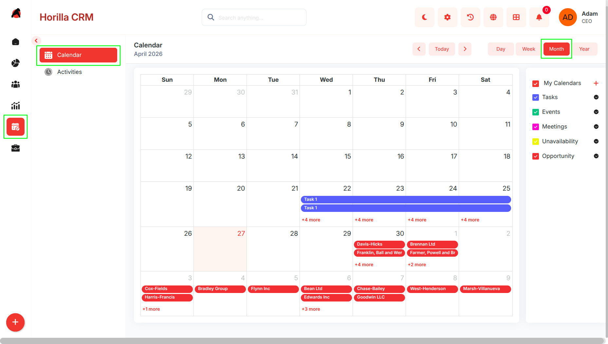  

* **Week View** – Shows detailed scheduling across the week.  
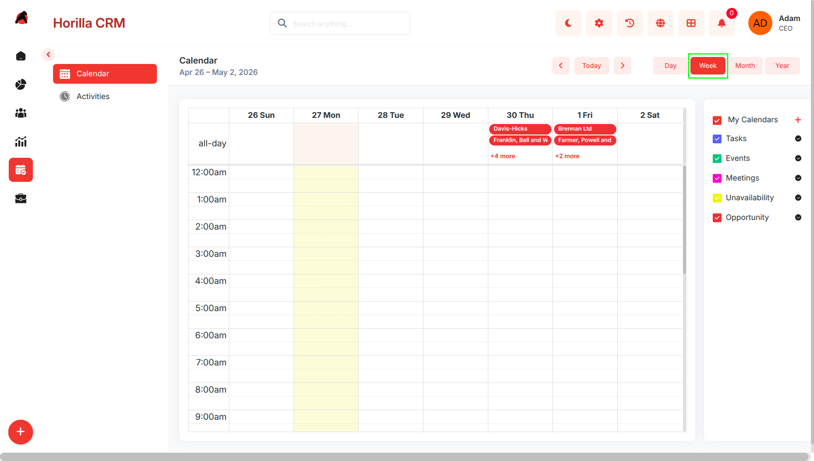  

* **Day View** – Focused view of a single day’s activities.  
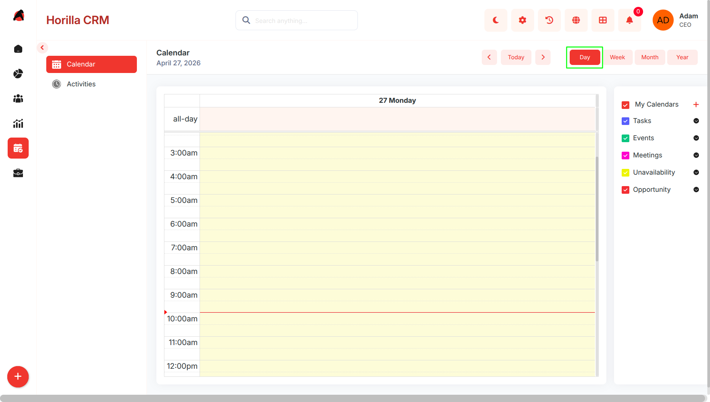  
    
* **Year View** – Provides a broader overview of activity distribution across the year.  
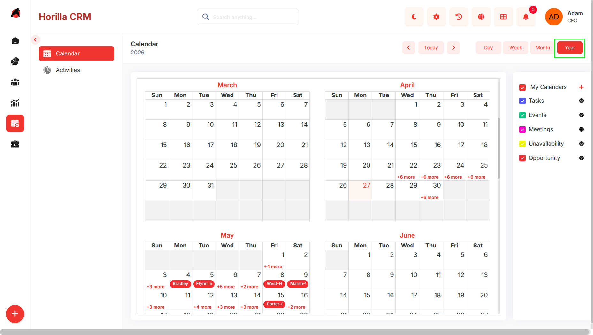 

* Navigation options: Today, Previous, Next.  
 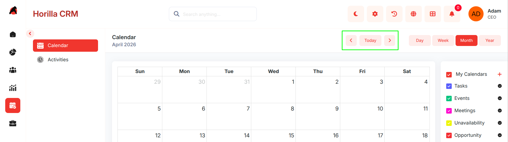 

### **1.2 Activities and Activity Preference** 

**Purpose:** Display CRM activities in an interactive, color-coded calendar interface.

* Supports multiple activity types: **Task, Event, Meeting, Unavailability**.  
* Activities appear on their scheduled start and end times.  
* **Colors are user-configurable** (each user can define preferences for activity types).  
* Users can filter which activity types are visible (e.g., only show Tasks & Meetings).  
* Users can choose which activity types to display.  
* Customizable **color coding per user** for activity types.

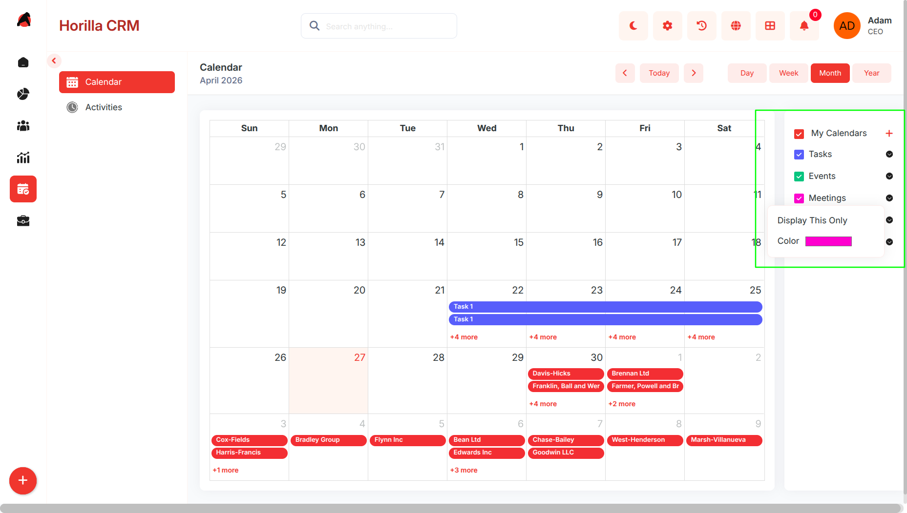 

### **1.3 Creating a New Activity**

**Purpose:** Enable users to schedule and manage CRM-related activities.

* Add activities directly from the calendar.

* Once saved, activities are instantly visible in the selected calendar view.  
  

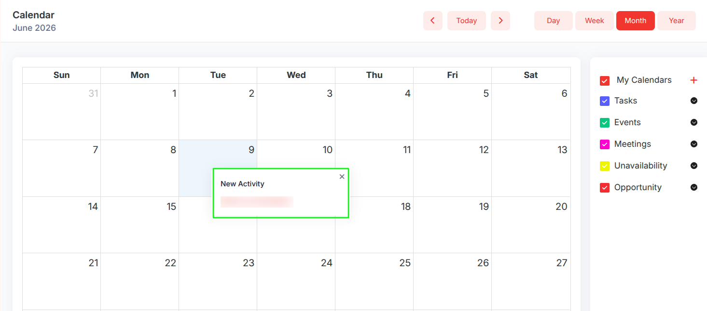 

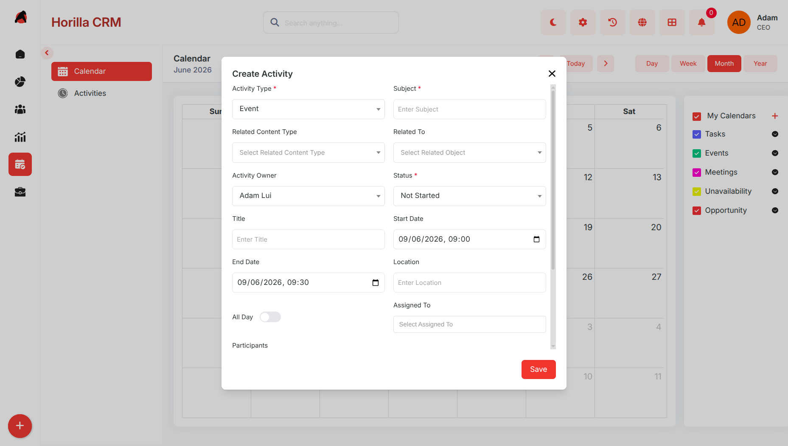 

### **1.4 Activity Detail View**

**Purpose:** Provide quick and complete access to activity information.

* **Short Detail Popup (on calendar click):**

  * Shows Subject, Description, Assigned User, Dates, and Status.

  * Quick actions: **Edit, Delete, Mark Complete, Info (full view)**.

* **Full Detail View (via Info):**

  * Displays all fields with inline editing.

  * History tab to track updates (status changes, reassignments, etc.).

  * Progress tracking for status updates (e.g., Pending → Completed).

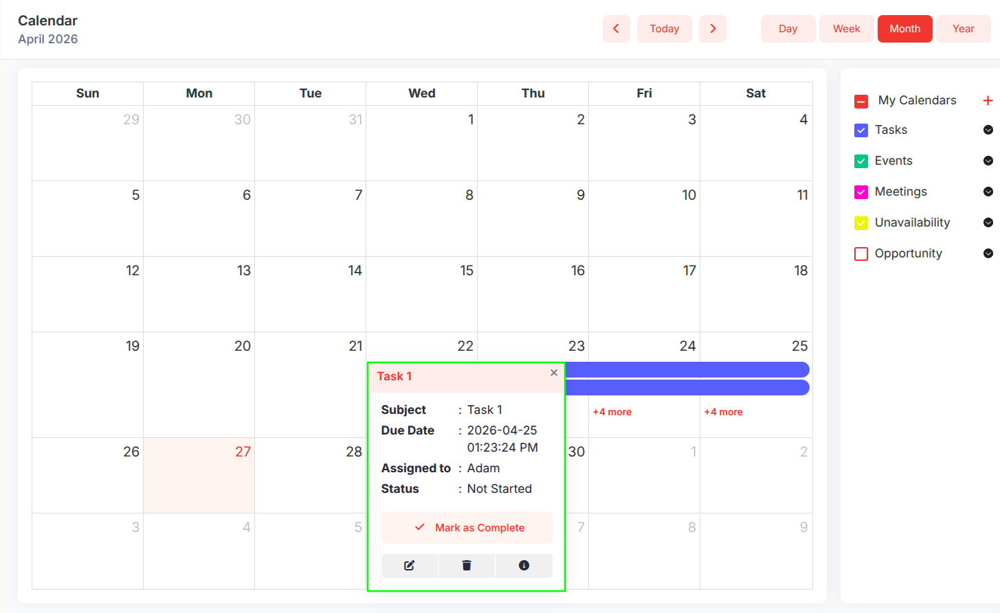 

### **1.5 Unavailability Management**

**Purpose:** Allow users to block specific times to avoid scheduling conflicts.

* Users can mark themselves unavailable for specific dates or time slots.

* Appears on the calendar as a dedicated activity type.

* Notes to explain the unavailability reason.

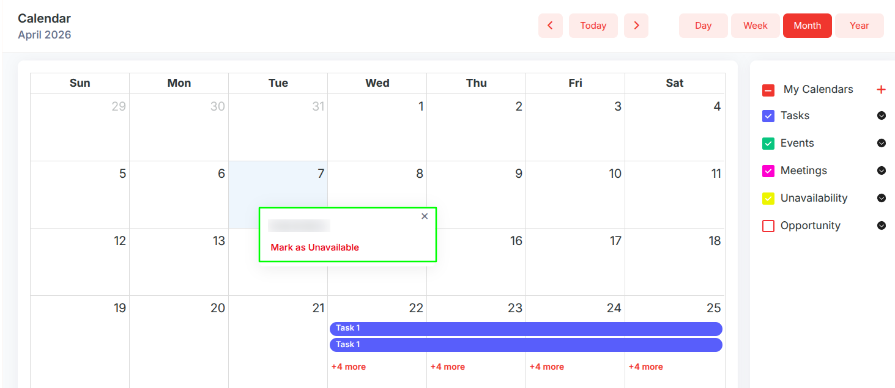  

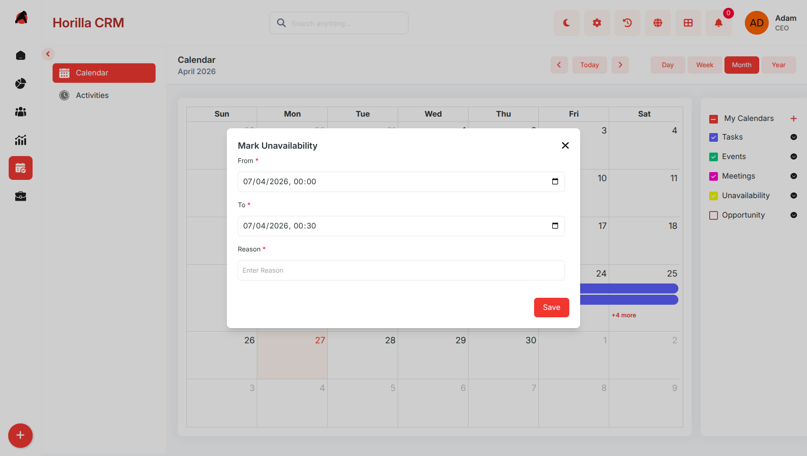  

**1.6 Custom Calendars**

Purpose: Allow users to create personalized calendar overlays linked to any CRM module.

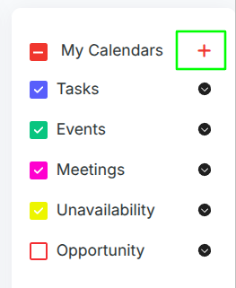 

* Accessible via the \+ button next to My Calendars in the right sidebar  
* Custom calendars display records from any permitted CRM module as color-coded events on the calendar grid  
* Each custom calendar appears in the sidebar alongside default calendar types with its own visibility checkbox

**Creating a Custom Calendar**

Purpose: Enable users to build a custom calendar overlay linked to a specific CRM module.

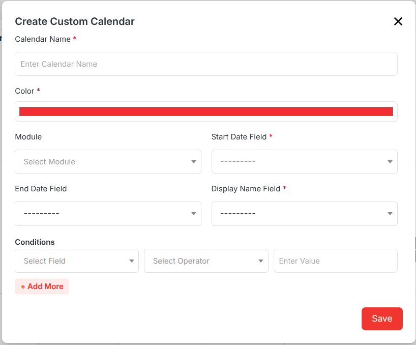 

* Click the \+ button in the sidebar to open the Create Custom Calendar modal

Fill in the required details:

* Calendar Name — Name displayed in the sidebar and on calendar events  
* Color — Color applied to all events from this calendar on the grid  
* Module — The CRM module whose records will be shown as events  
* Start Date Field — The date field used as the event start date  
* End Date Field — The date field used as the event end date (optional)  
* Display Name Field — The field whose value is shown as the event title on the grid  
* Optionally add Conditions to filter which records from the module appear  
* Click Save to create the calendar; it appears in the sidebar and events render on the grid immediately

**Custom Calendar Event Detail View**

Purpose: Provide quick access to record information directly from the calendar.

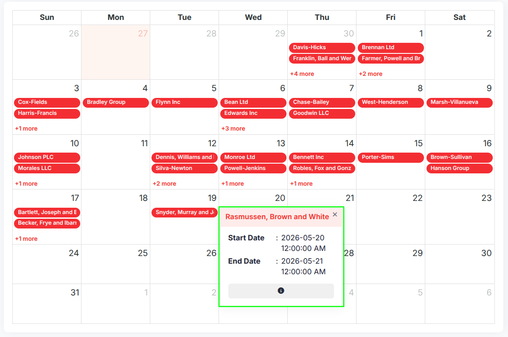

* Clicking a custom calendar event opens a small popup showing the event title, Start Date, and End Date  
* An Info button navigates to the full detail view of the linked record if available

**Managing Custom Calendars**

Purpose: Give users control over visibility, appearance, and configuration of their custom calendars.

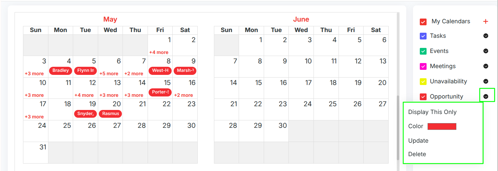

* Each custom calendar in the sidebar has a dropdown menu with the following actions:  
* Display This Only — Shows only the selected calendar and hides all others  
* Color — Change the calendar's display color; updates the sidebar and grid events immediately  
* Update — Opens the edit form with all existing configuration pre-filled for modification  
* Delete — Removes the calendar permanently after a confirmation prompt  
* The visibility checkbox on each custom calendar can be toggled to show or hide its events on the grid; preferences are saved automatically per user

##  **Benefits**

* Centralized scheduling of all CRM activities.

* Visual clarity with flexible views and color coding.

* Improved productivity with direct actions from the calendar interface.

* Prevents scheduling conflicts with unavailability tracking.

* Strengthens CRM’s 360° engagement tracking by linking activities with records.  
* Custom Calendars extend visibility to any CRM module, giving teams a date-driven view of opportunities, leads, and other records directly on the calendar

