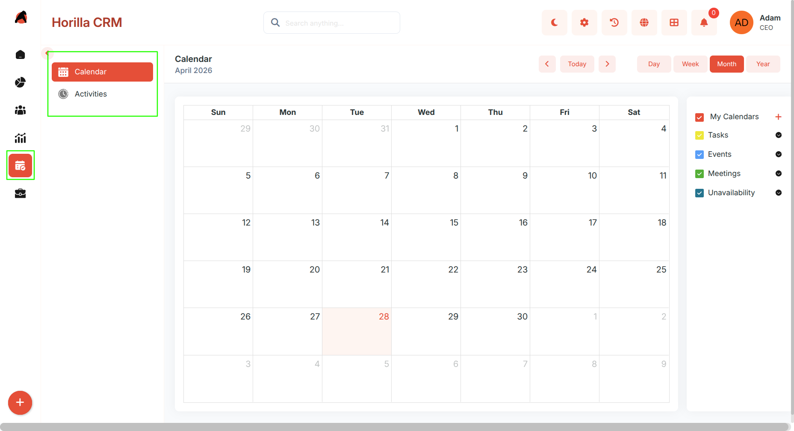
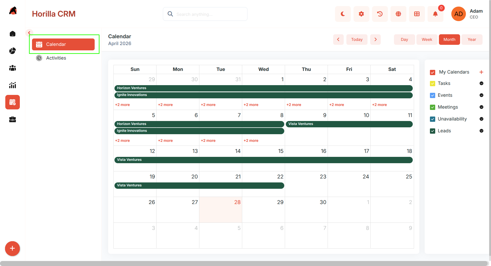
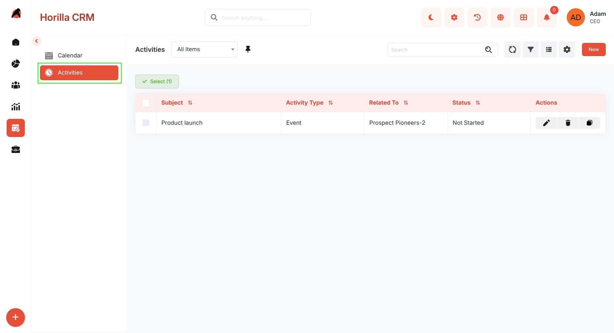

## **Schedule – Functional Guide**

### **Introduction**

The Twixio CRM Schedule Section provides users with an integrated workspace to manage all time-based activities within the CRM. It combines the **Calendar** and **Activities** modules to enable seamless scheduling, tracking, and organization of meetings, calls, tasks, events, emails, and availability. Together, these modules ensure efficient time management, prevent scheduling conflicts, and maintain a 360° view of all customer and business engagements.

### **1\. Schedule Section Overview**

**Purpose:** Provide a unified access point to view and manage all CRM-related schedules and activities.

**Access:** Navigate to the **Schedule** section in the sidebar, which includes two sub-sections: **Calendar** and **Activities**.

**Key Features:**

* Centralized control of all CRM activities and schedules.  
* Support for multiple activity types: Task, Meeting, Event, Call, Email, Unavailability.  
* Quick creation, editing, and tracking of activities from any interface.

### **1.1 Calendar Module**

**Purpose:** Manage all CRM-related activities in a visual, time-based calendar format.

**Access:** Schedule → Calendar

#### **Calendar Views**

* **Month View** — Displays all activities for the month in a grid layout.  
* **Week View** — Shows detailed scheduling for each week.  
* **Day View** — Focused display of a single day's activities.  
* **Year View** — High-level overview of yearly activity distribution.

Navigation tools: **Today**, **Previous**, **Next** for quick movement between periods.

#### **Custom Calendars**

* Users can create Custom Calendars linked to any CRM module (Leads, Opportunities, Contacts, etc.).  
* Each custom calendar maps a module's date field to the calendar view with a chosen color and display name field.  
* Multiple custom calendars can be active simultaneously, overlaying data from different modules on the same calendar.  
* Custom calendars are created and managed via the calendar settings panel.

#### **Google Calendar Integration**

* Users can connect their Google Calendar account from **My Settings → Google Calendar**.  
* Supports one-way (Twixio → Google) and two-way (Twixio ↔ Google) sync.  
* Changes sync in real time when the app is served over HTTPS using Google push notifications.  
* See the Google Calendar Integration guide for full setup steps.

#### **Activity Preferences**

* Color-coded activity visualization — each activity type has a user-configurable color.  
* Filters to display selected activity types only.  
* Activities appear on their respective start and end times.

#### **Creating a New Activity**

* Add activities directly from the calendar using quick-add or full-form creation.  
* Once saved, the activity instantly appears in the selected view.

#### **Activity Detail View**

* **Quick Detail Popup** — Displays subject, description, assigned user, dates, and status. Quick actions: Edit, Delete, Mark Complete, View Full Info.  
* **Full Detail View** — All activity fields with inline editing and a history tab.

#### **Unavailability Management**

* Users can mark themselves unavailable for specific dates or time slots.  
* Appears on the calendar as a dedicated activity type with optional notes.

### **1.2 Activities Module**

**Purpose:** Track, schedule, and manage all CRM-related engagements and follow-ups.

**Access:** Schedule → Activities

#### **Activities Overview**

* Displays all activity types in a consolidated list.  
* Search and filter for quick access to specific activities.  
* Key fields: Subject, Type, Source, Related To, Status.  
* Bulk actions: Edit, Delete, Export.

#### **Activities Kanban Display**

* Visual board showing activities grouped by status (e.g., Pending, Completed).  
* Drag-and-drop cards to update activity status directly.  
* Cards display subject, activity type, and related record.

#### **Creating a New Activity**

* Click **New** to open the creation form.  
* Core fields include: Activity Type, Subject, Description, Source, Related Record, Status, Start Date, End Date, Location, Assigned To.  
* Click **Save** to register the activity.

#### **Activity Detail View**

* **Details Tab** — All activity fields with inline editing. Fields shown are specific to the activity type.  
* **History Tab** — Tracks every change including subject edits, reassignments, and status transitions.  
* **Status Tracking** — Progress bar visually represents the activity stage (Pending → Completed).  
* Update activity status directly from the detail view.

