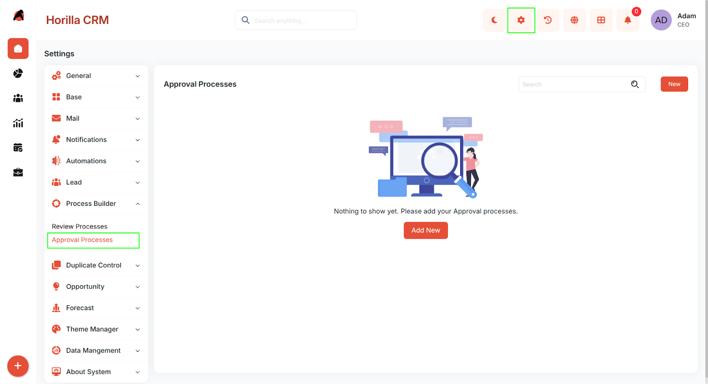
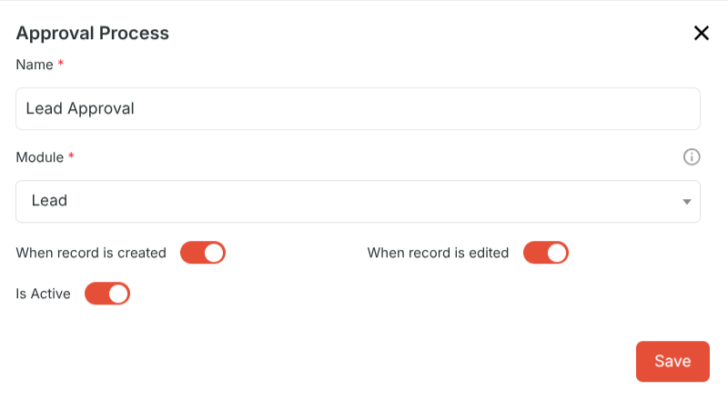
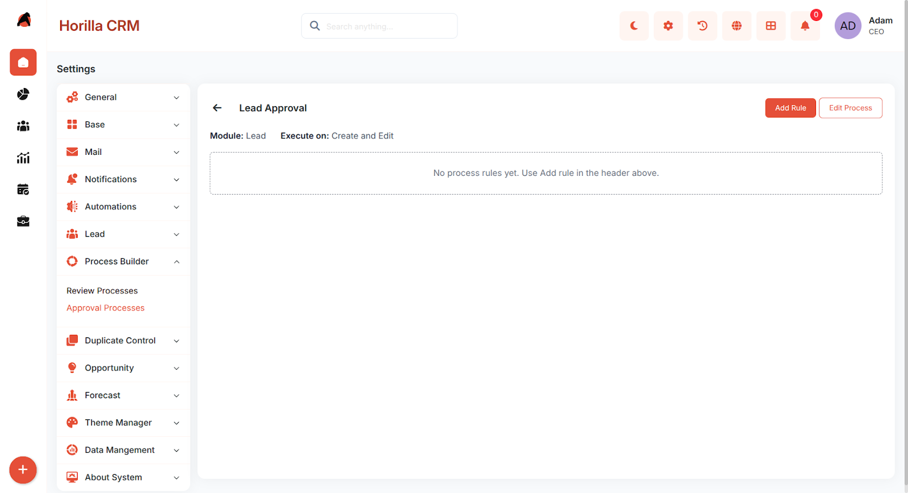
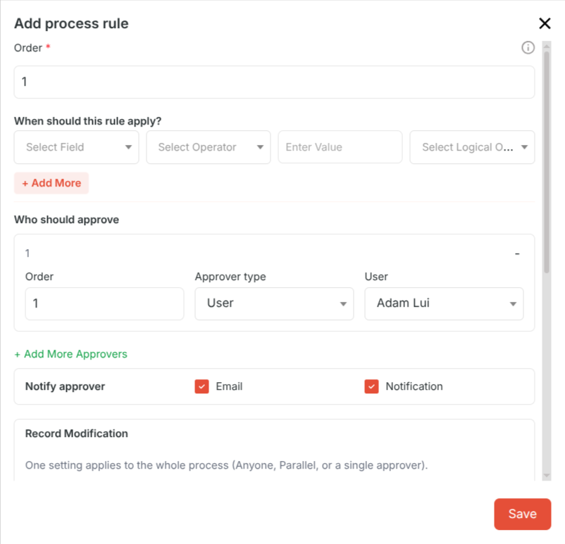
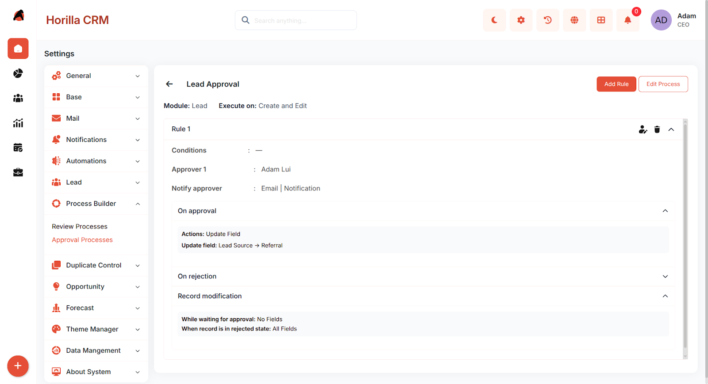
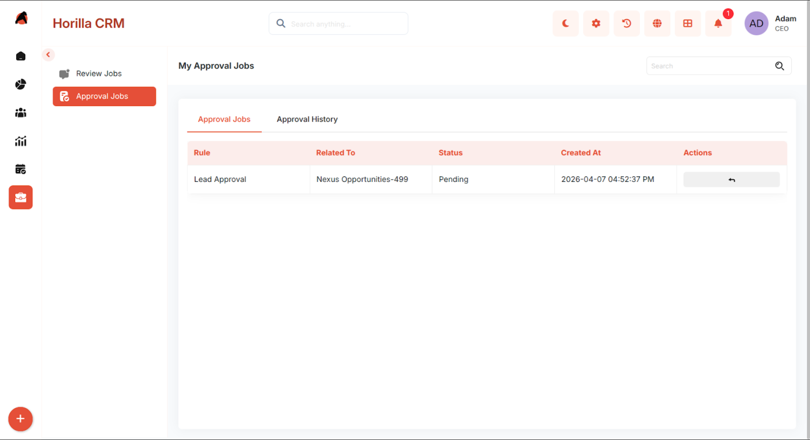
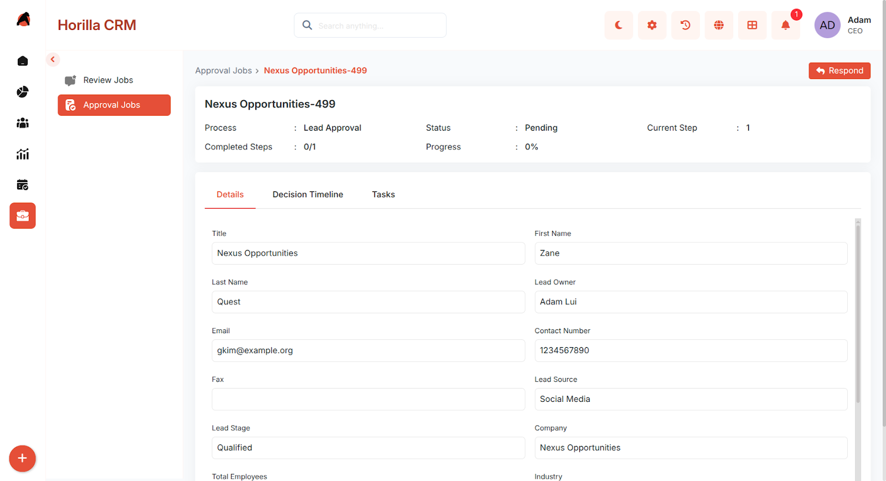
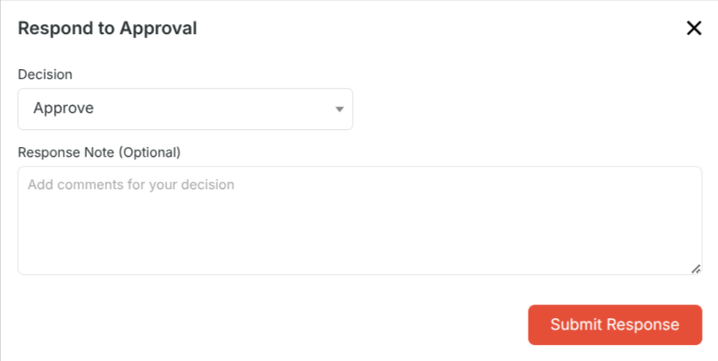
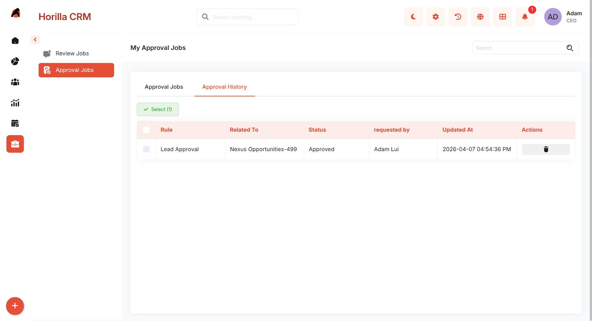

# **Twixio CRM Approval Process – Functional Guide**  
## **1\. Introduction**  
The Twixio CRM Approval Process module allows administrators to define automated approval workflows that trigger when CRM records are created or edited. Designated approvers are notified and must review records before they proceed through the normal workflow. Administrators can configure multi-level approver chains, set conditions for when approval is required, and define actions that run automatically on approval or rejection.

## **2\. Key Features and Functionalities**

### **2.1 Approval Process Overview**  
Purpose: Display all configured approval processes in a centralised list for easy access and management.

* Navigate to Settings in the header and select Process Settings \> Approval Processes to view the list.  
* The interface displays the Name, Module, Trigger, Status, and available Actions for each process.  
* Includes a search functionality to quickly locate specific processes.  
* If no processes have been configured, the page displays a message: "Nothing to show yet. Please add your Approval Processes.”

### **2.2 Creating a New Approval Process**  
Purpose: Add a new automated approval workflow for a CRM module.

* Click the New button to open the Create Approval Process form. Fill in the required fields and click Save to activate the process.

### **Form Fields**  
  * Name – A descriptive name for the approval process (e.g., "High-Value Lead Approval").  
  * Module – The CRM module this process applies to: Lead, Opportunity, Account, or Contact.  
  * When a record is created – Enable to trigger the process when a new record is created.  
  * When a record is edited – Enable to trigger the process when an existing record is updated.  
  * Is Active – Enable or disable the process without deleting it.  
  * Both trigger options can be enabled simultaneously.

### **2.3 Process Detail View**  
Purpose: View all rules configured under a process and manage them from one place.

* Click on a process name from the list to open its Detail View.   
* An Add Rule button in the top navbar to add a new rule to the process.  
* An Edit Process button to modify the process-level settings.

If no rules have been added yet, the page displays: "No process rules yet. 

### **2.3 Adding Process Rules**  
Each approval process can contain one or more Process Rules. Rules are evaluated in order and the first matching rule is applied. After saving a process, click Add Rule to configure the rule.  

* Conditions (When This Rule Applies):Optional filter logic that determines when the rule fires. Conditions are built using:  
  * Field – The record field to evaluate (e.g., Status, Priority, Stage).  
  * Operator – The comparison to apply: equals, not equals, contains, is empty, greater than, etc.  
  * Value – The value to compare against (e.g., High, Closed Won).  
  * Logical Operator – Combine multiple conditions using AND or OR.  
  * Click \+ Add More to add additional condition rows. If no conditions are set, the rule fires for every matching trigger event.  
      
* Approvers (Who Must Approve)  
  Define who must approve the record. Multiple approvers can be added to create a sequential chain.

* Order – The sequence in which this approver acts (1 \= first, 2 \= second, etc.).  
* Approver Type – How the approver is identified:  
  * User – A specific named user.  
  * Role – Any user assigned that role can approve.  
  * Owner's Manager – The manager of the user who owns the record.  
* Approval Method – Sequential (one approver at a time in order) or Parallel (all notified at once, with "Anyone" or "Everyone must approve" options).  
* Approval Actions (On Approval)  
  * Actions triggered automatically when the record is approved:  
  * Update Field – Updates a specified field on the record to a defined value.  
  * Assign Task – Creates a task linked to the record with a title and description.  
  * Send Mail – Sends an email to configured recipients using a mail template or custom body.  
  * Send Notification – Delivers an in-app notification to configured recipients.  
* Rejection Actions (On Rejection)  
  * The same action types are available for rejection outcomes and are configured separately from approval actions.  
    

## **3\. Approval Jobs (For Approvers)**  
Purpose: Allow designated approvers to review and act on pending approval requests.

Navigate to My Jobs \> Approval Jobs in the sidebar to view all pending approval requests assigned to the logged-in user.  

Each item shows the record details, module, process name, and requesting user.Click Review to open the full record before deciding.  
 
The approver can then:

* Approve – Marks the step as approved and advances to the next approver or completes the process.  
* Reject – Rejects the record and triggers configured rejection actions.

Add Comment – Optionally adds a note explaining the decision.  

## **4\. Approval History**  
Purpose: View completed approvals — both approved and rejected — for records the user was involved in.

Navigate to My Jobs \> Approval History to access the history list.  

* Click any record to view its full decision timeline including approver names, timestamps, and comments.  
* If a record was rejected, the original requester can click Resubmit to restart the approval process from the first step.  
* Only the original record requester or a superuser can resubmit a rejected approval.

## **5\. Effect on Record Visibility**

* While a record is in a pending or rejected approval state:  
  * The record is hidden from normal list views to prevent accidental edits.  
  * The record remains visible to approvers in their Approval Jobs queue.  
  * Once fully approved, the record reappears in standard list views and becomes fully editable.

## **6\. Best Practices**

* Use descriptive process names that include the module and trigger (e.g., "Lead – On Create – Manager Approval").  
* Use Conditions to target only records that genuinely require approval — avoid triggering on every save.  
* Always configure both Approval Actions and Rejection Actions so requesters are notified of the outcome.  
* Test new processes on a staging record before enabling in production.  
* Use the Is Active toggle to pause a process temporarily without losing its configuration.  
* Regularly review Approval History to identify bottlenecks where approvals are frequently delayed or rejected.

