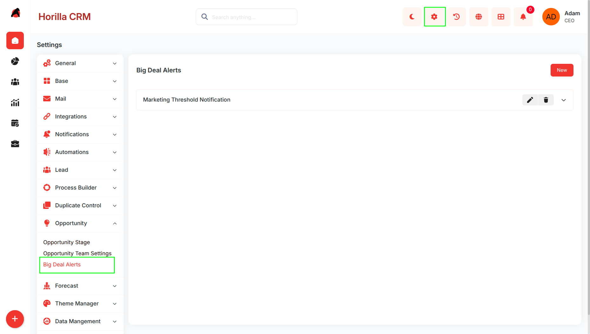
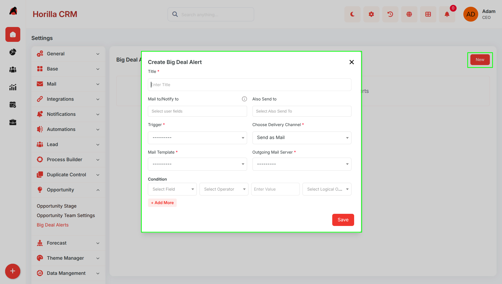
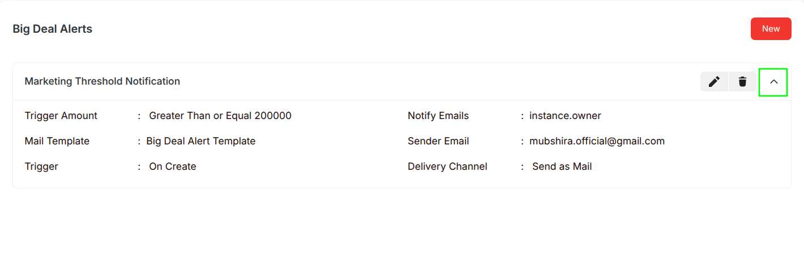
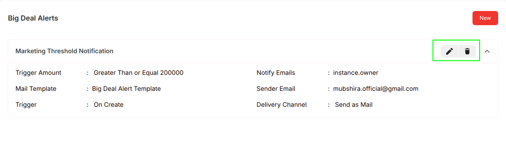

### **Big Deal Alert – Functional Guide**

### **Introduction**

The Big Deal Alert Module in Twixio CRM is designed to help organizations proactively monitor and manage high-value opportunities. It enables users to configure alert thresholds, receive timely notifications, and take swift action to maximize revenue potential. By providing centralized visibility and detailed insights into critical deals, the module ensures that stakeholders stay informed, improving decision-making and overall sales performance.

### **Key Features and Functionalities**

#### **1.1 Big Deal Alerts Overview**

**Purpose:** Present all Big Deal Alerts in an organized accordion view for simplified monitoring and management.

* Accessible via **Settings → Opportunity → Big Deal Alerts**  
* Displays all configured Big Deal Alerts in an expandable accordion layout  
* Each accordion entry shows the alert title with action buttons inline  
* Clicking an alert title expands the accordion to reveal the full configuration details  
* Supports quick search and filtering for easy alert identification  
* Provides **Edit** and **Delete** actions directly on each accordion row  
* The empty state displays a prompt to create the first Big Deal Alert when none exist

#### **1.2 Configuring Big Deal Alerts**

**Purpose:** Enable users to create and manage alerts for high-value opportunities efficiently.

* Click the **New** button in the top navigation bar to open the creation form  
* The form is built on the automation framework and pre-linked to the Opportunity module automatically

**Form Fields:**

* **Title** — Full-width text field for naming the alert *(required, must be unique across the system)*  
* **Trigger** — Dropdown to define when the alert fires:  
  * On Create  
  * On Update  
  * On Create or Update  
  * On Delete  
  * Scheduled  
* **Delivery Channel** — Dropdown to control how the notification is delivered:  
  * Send as Mail  
  * Send as Notification  
  * Send as Mail and Notification  
* **Mail Template** — Dropdown to select the email body template *(visible when delivery channel includes mail)*  
* **Outgoing Mail Server** — Dropdown to select the mail server used for sending *(visible when delivery channel includes mail)*  
* **Notification Template** — Dropdown to select the in-app notification template *(visible when delivery channel includes notification)*  
* **Mail to / Notify to** — Text field for specifying recipients; supports:  
  * Direct email addresses  
  * **self** (the user who triggered the action)  
  * Dynamic field references  
  * Multiple values can be entered as comma-separated entries  
* **Also Send to** — Multi-select field to add additional users who will receive the notification as CC recipients

**Conditions Section:**

* Dynamic rows where each condition defines when the alert should fire based on Opportunity field values

Each condition row includes:

* **Field** — The Opportunity field to evaluate *(e.g., Amount, Probability)*  
* **Operator** — The comparison to apply *(equal, not equal, greater than, less than, greater than or equal, less than or equal, contains)*  
* **Value** — The threshold value to compare against  
* **Logical Operator** — AND or OR to chain multiple conditions together  
* Multiple conditions can be added to the same alert for precise trigger control

**Scheduled Trigger Fields** *(visible only when Trigger is set to Scheduled)*:

* **Target Date Field** — The date or datetime field on the Opportunity to base the schedule on  
* **Adjust By** — The numeric offset amount  
* **Timing** — Whether the alert fires before or after the target date  
* **Offset Unit** — Days, weeks, or months  
* **Run Time** — Optional specific time of day to fire the alert

#### **1.3 Alert Expanded View**

**Purpose:** Provide comprehensive visibility into individual alert settings directly within the list.

* Click any alert title in the accordion list to expand its details inline  
* The expanded view displays a two-column grid layout with the following information:  
  * Amount conditions are labeled as **Trigger Amount**  
  * **Mail Template** name linked to the alert  
  * **Trigger type** *(e.g., On Create, On Update)*  
  * **Mail to / Notify to** recipients as configured  
  * **Sender email address** from the configured mail server  
  * **Delivery Channel** *(Mail, Notification, or Both)*

#### **1.4 Notifications and Delivery**

**Purpose:** Ensure timely and automated communication for high-value deals.

* Active alerts continuously monitor Opportunities and send notifications automatically when conditions are met

**Delivery Channels:**

* **Mail** — Sends an email using the selected mail template through the configured outgoing mail server  
* **Notification** — Delivers an in-app notification using the selected notification template  
* **Both** — Sends email and in-app notification simultaneously  
* Recipients are resolved dynamically at the time the alert fires based on the **Mail to / Notify to** field  
* Additional CC recipients configured in **Also Send to** receive the notification alongside the primary recipients  
* Scheduled alerts fire based on a date field on the Opportunity record with a configurable offset and optional run time

#### **1.5 Edit and Delete Functionality**

**Purpose:** Maintain accurate and up-to-date Big Deal Alerts for effective monitoring.

* **Edit**   
  * Click the edit icon on any accordion row to open the update form in a modal  
  * All alert parameters including title, trigger, conditions, delivery channel, templates, and recipients can be modified  
  * Changes are reflected immediately in the accordion list  
* **Delete**   
  * Click the delete icon on any accordion row to open a confirmation prompt before permanent removal  
  * The confirmation step prevents accidental deletion  
  * Once deleted, the alert is removed from the list and all associated notification activity stops

