# **Complete Guide to Cadences – Twixio CRM**

## **Overview**

Cadences define automated, multi-stage outreach workflows for CRM records. A cadence triggers a sequence of tasks, calls, and emails based on configured conditions.

Each stage progresses automatically when the previous stage’s activity reaches a defined status. Cadences support branching, allowing different follow-up actions based on different outcomes.

Cadences can be applied to:

* Lead  
* Contact  
* Account  
* Opportunity  

## **Navigation**

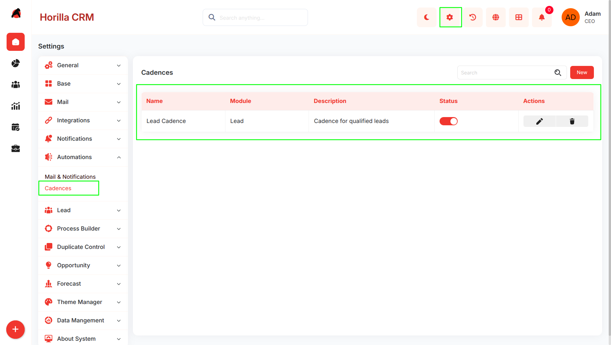

Settings → Automation Settings → Cadences

## **Cadence List**

Displays all created cadences with:

* Name  
* Module  
* Description  
* Is Active status  
* Edit/Delete actions

## **Create Cadence**

Click **New** to open the creation form.

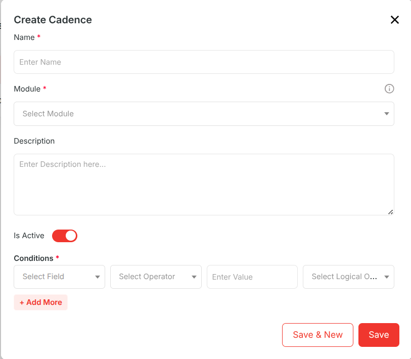

### **Fields**

1. **Name :** Name of the cadence.  
2. **Module :** The module this cadence applies to (Lead, Contact, Account, Opportunity).  
3. **Description :** Optional description.  
4. **Conditions** : which records are enrolled in the cadence  
5. **Is Active:**  Enables or disables the cadence.

## **Cadence Detail View**

Click the cadence name to open its detail view.

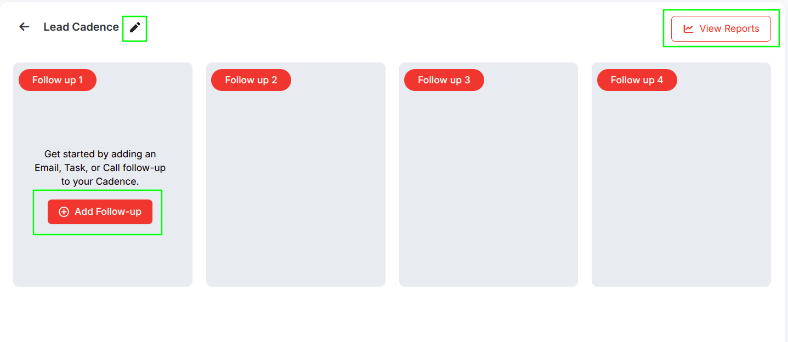

Displays follow-ups in a **kanban-style layout** with stages:

* Follow up 1,2 etc

### **Available Actions**

* Add Follow-up  
* Edit Cadence  
* View Reports

## **Follow-Ups**

Follow-ups are actions executed within a cadence.

Each follow-up belongs to a stage and can be:

* Task  
* Call  
* Email

Click **\+** in the detail view to add a follow-up.

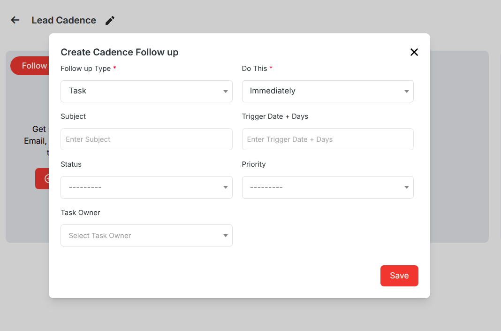

### **Common Fields**

1. **Follow up Type :** Task, Call, or Email.  
2. **Do This :**  When to execute (Immediately, Minute, Hour, Day, Month).  
3. **Do This Value :** Delay value (not required if Immediately).  
4. **After Previous Status Is :** Required from Follow up 2 onwards.

**Note:** Requires configured mail server to add email followup.

## **Follow-Up Stages**

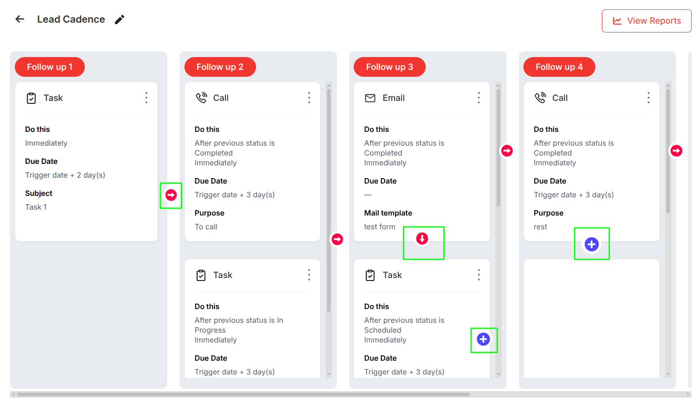

### **Follow up 1 (Initial Stage)**

* Only one follow-up allowed  
* Triggered when record matches conditions  
* No previous status required

### **Follow up 2+ (Subsequent Stages)**

* Triggered based on previous stage status  
* Requires “After Previous Status Is”

## **Branching Workflows**

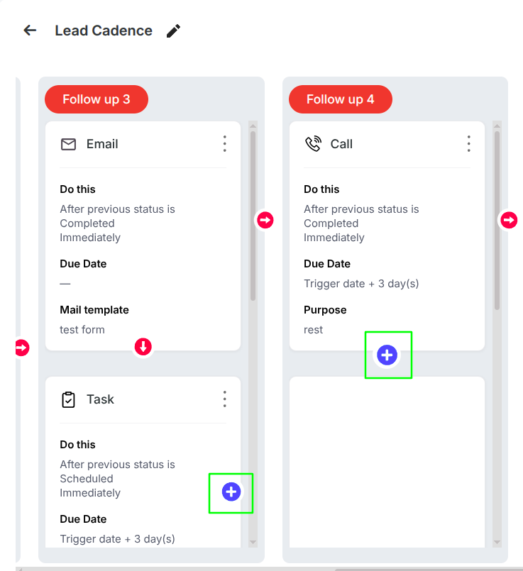

From Follow up 2 onwards, cadences support branching.

Multiple follow-ups can be created from one parent based on different statuses.

### **Example**

Follow up 1 → Task

* Completed → Follow up 2 (Email)  
* Overdue → Follow up 2 (Call)

Only the matching branch is executed.

## **Adding Follow-Ups**

* **\+ (right side)** → Add next stage  
* **\+ (below)** → Add same stage (FU3+)

**Note:**  
 A follow-up cannot be deleted if it has child branches.

## **Cadence Execution**

### **Record Enrollment**

When a record is created or updated:

* Active cadences are evaluated  
* Matching records trigger Follow up 1

### **Stage Progression**

When an activity status changes:

* Next-stage follow-ups are triggered  
* Only matching branch is executed

### **Backfill**

* On activation → Follow up 1 is applied to existing records  
* On update → Pending activities are synced

## **Cadence Reports**

Accessible from the detail view.

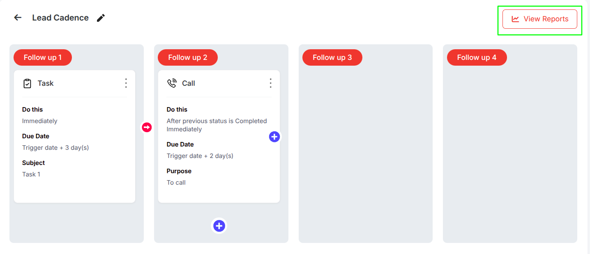

### **Task Report**

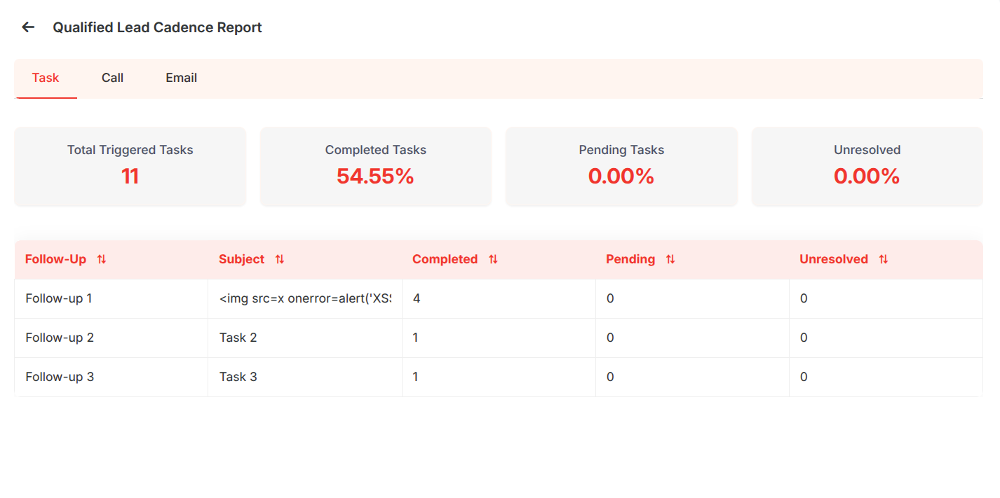

### **Call Report**

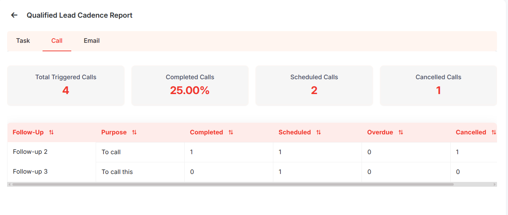

### **Email Report**

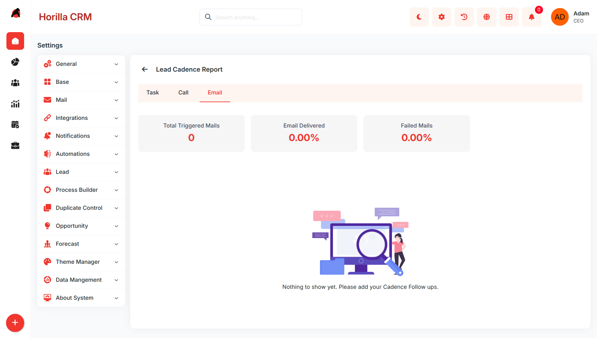

## **Cadence Tab on Record**

Available in CRM record detail view.

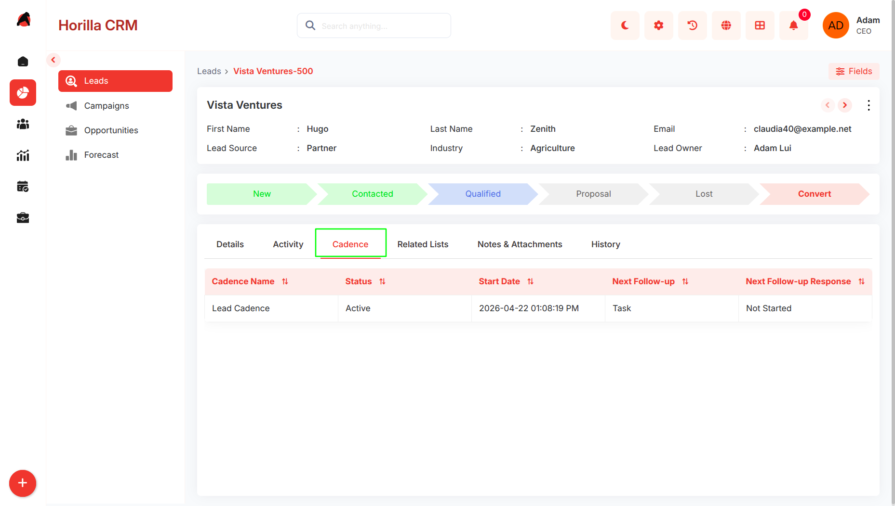

## **Editing and Deleting**

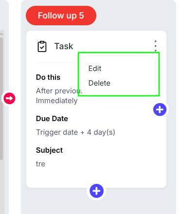

1. **Edit Cadence :**  From list or detail view.  
2. **Edit Follow-Up :** From follow-up card menu  
3. **Delete Follow-Up :**  Blocked if child branches exist.  
4. **Delete Cadence :** Removes all follow-ups and conditions.

## **Activate / Deactivate**

**Active**

* Cadence runs automatically

**Inactive**

* Execution stops

**Reactivation**

* Re-applies Follow up 1 to matching records

## **Expected Behavior**

* Users can create cadences for any supported module  
* Conditions determine record enrollment  
* Follow up 1 triggers automatically  
* Follow up 2+ depend on previous status  
* Branching allows multiple outcome paths  
* Tasks and calls create activities  
* Emails send using templates  
* Activation backfills existing records  
* Updates sync pending activities  
* Reports show execution metrics  
* Record view displays cadence progress  
* Follow-ups with children cannot be deleted  
* Execution is fully automated via system triggers
