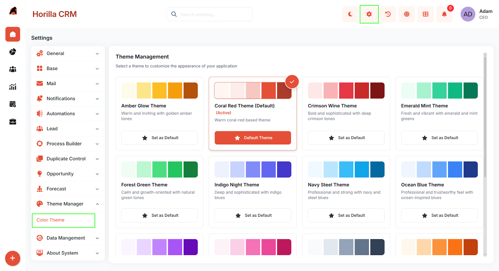
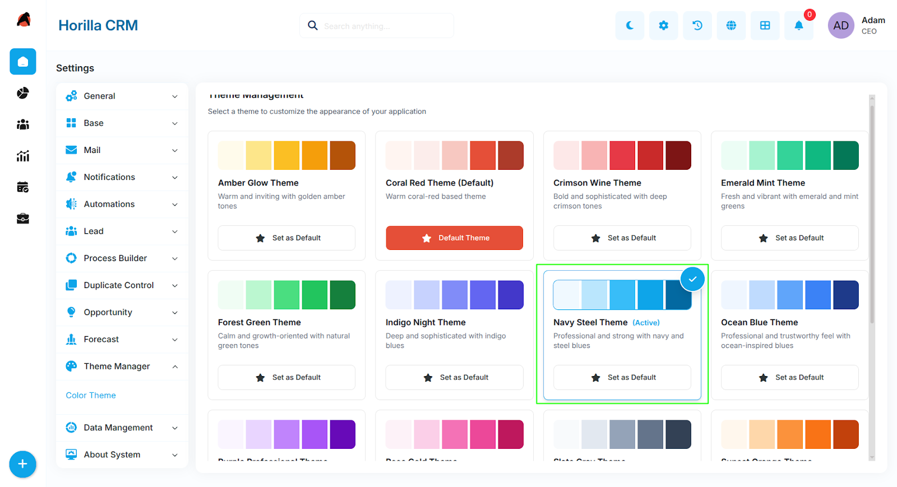
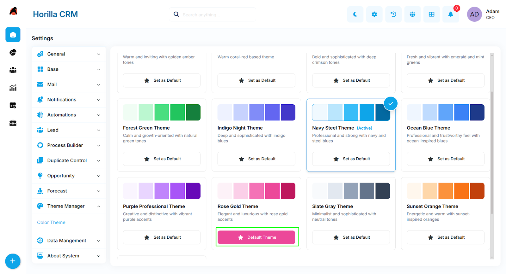

# **Twixio CRM Colour Theme – Functional Guide**  
## **1\. Introduction**

The Twixio CRM Colour Theme module allows administrators to personalise the visual appearance of the entire application by selecting from a set of pre-built colour themes. The chosen theme is applied company-wide and affects all UI elements including navigation, buttons, icons, forms, and background surfaces. An administrator can also designate a theme as the default for the login page.

## **2\. Key Features and Functionalities**

### **2.1 Colour Theme Overview**  
Purpose: Display all available colour themes in a grid view and allow administrators to activate or manage them.

* Navigate to Settings in the header and select Theme Manager \> Colour Theme to open the theme selection page.  
* The page displays a grid of theme cards, each showing:  
* A colour preview strip with sample swatches from the theme's palette.  
* The theme name with an (Active) label on the currently applied theme.  
* A short description of the theme's style.  
* An Activate button to apply the theme company-wide.  
* A Set as Default / Remove as Default button to control the login page appearance.

### **2.2 Available Themes**  
Twixio CRM ships with 14 pre-built colour themes. Each theme defines a complete palette covering primary, secondary, dark, and surface colour scales.

* Coral Red Theme (Default)	  
* Ocean Blue Theme	  
* Forest Green Theme	  
* Purple Professional Theme	  
* Slate Gray Theme	  
* Indigo Night Theme	  
* Sunset Orange Theme	  
* Crimson Wine Theme	Deep crimson  
* Teal Corporate Theme	  
* Amber Glow Theme	  
* Navy Steel Theme	  
* Rose Gold Theme	  
* Emerald Mint Theme	

### **2.3 Activating a Theme**  
Purpose: Apply a colour theme to the entire application for all users in the company.

* On the Colour Theme page, browse the available theme cards.  
* Click the Activate button on the desired theme card.  
* The page reloads automatically and the new theme is applied immediately across all pages, navigation, and UI components.  
* The activated theme card is labelled (Active) to indicate it is currently in use.  
* Activating a theme applies it company-wide. All users logged in under the same company will see the updated theme on their next page load.

### **2.4 Setting a Default Theme for the Login Page**

Purpose: Control the colour theme displayed on the login screen before a user authenticates.

* On the Colour Theme page, locate the theme to be used on the login page.  
* Click the Set as Default button on that theme card.  
* The selected theme will now be applied to the login page for all visitors.  
* Only one theme can be marked as the login page default at a time. Setting a new default automatically removes the flag from the previously designated default.  
* To remove the default designation without setting another, click Remove as Default on the currently active default theme.  
* The login page theme is independent of the company's active application theme. A user's last active theme is also saved locally in their browser so the login screen reflects their previous session's theme until overridden by the global default.

## **3\. Best Practices**

* Review all major screens (dashboard, Kanban, forms, calendar) after activating a new theme to confirm readability and visual consistency.  
* Use the Set as Default option to ensure the login page reflects the organisation's brand colours.  
* Only one theme can be active at a time — activating a new theme immediately replaces the previous one for all users.  
* Coordinate theme changes with your team to avoid confusion from sudden visual changes during business hours.  
* The Coral Red Theme (Default) is the system baseline and will be applied automatically if no company theme has been configured.
