# **Twixio CRM Duplicate Control – Functional Guide**  
## **1\. Introduction**  
The Twixio CRM Duplicate Control module helps administrators prevent and manage duplicate records across CRM modules. It works in two parts: Matching Rules define how records are compared, and Duplicate Rules define what happens when a match is found. When duplicates are detected, users are alerted during record creation or editing, and can merge duplicate records directly from the record's detail view.

## **2\. Key Features and Functionalities**

### **2.1 Duplicate Control Overview**

Purpose: Display and manage all matching rules and duplicate rules from a centralised settings area.

* Navigate to Settings in the header and select Duplicate Control to open the section.  
* The sidebar contains two sub-sections:  
  * Matching Rules – Define how records are compared for similarity.  
  * Duplicate Rules – Define what happens when a match is found.

 
Supported modules: Leads, Contacts, and Accounts.

### **2.2 Matching Rules**

Purpose: Define the fields and comparison method used to identify potential duplicates.  
Navigate to Settings \> Duplicate Control \> Matching Rules to view all configured matching rules in an accordion list.  
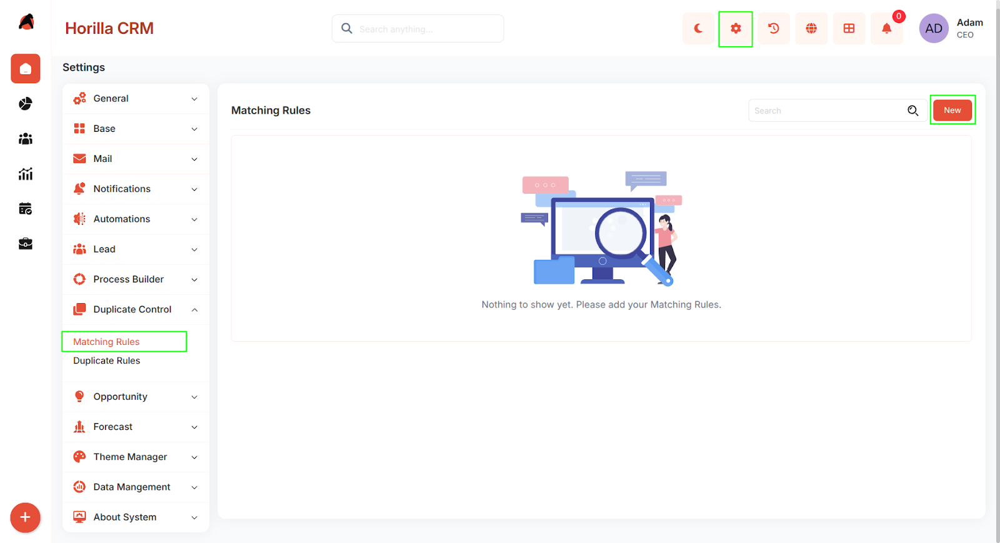 

Click New to open the Create Matching Rule form.  
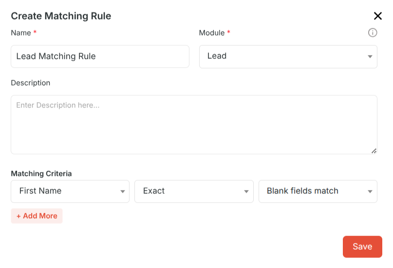

Form Fields

* Name – A unique descriptive name for the matching rule (e.g., "Lead Email Match").  
* Module – The CRM module this rule applies to: Lead, Contact, or Account.  
* Description – Optional notes describing the purpose of the rule.  
* Matching Criteria: Each matching rule requires at least one criterion. Click \+ Add More to add additional criteria rows. For each criterion:  
  * Field – The record field to compare (e.g., Email, Phone, Full Name). Choices are dynamically populated based on the selected module.  
  * Matching Method – How the field values are compared:  
    * Exact – Only identical values are considered a match.  
    * Fuzzy – Partial or similar values are considered a match (uses contains logic).  
  * Match Blank Fields – Whether blank field values should be treated as a match. Enable to flag records where both values are empty.  
* All criteria within a matching rule are combined with AND logic — all fields must match for a record to be considered a duplicate.  
* Click Save to add the matching rule to the list.

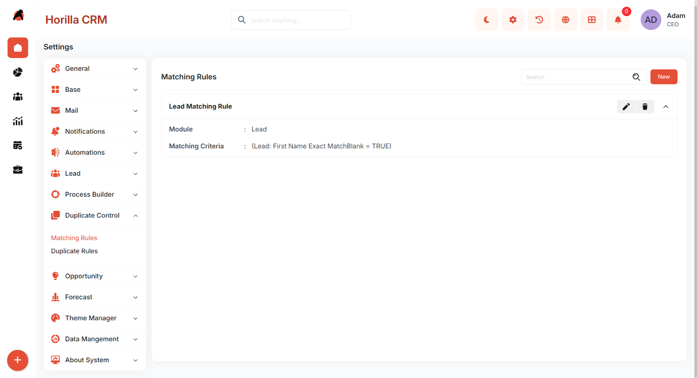

### **2.3 Duplicate Rules**  
Purpose: Define the action taken and alert shown when a potential duplicate is detected.  
Navigate to Settings \> Duplicate Control \> Duplicate Rules to view all configured duplicate rules.

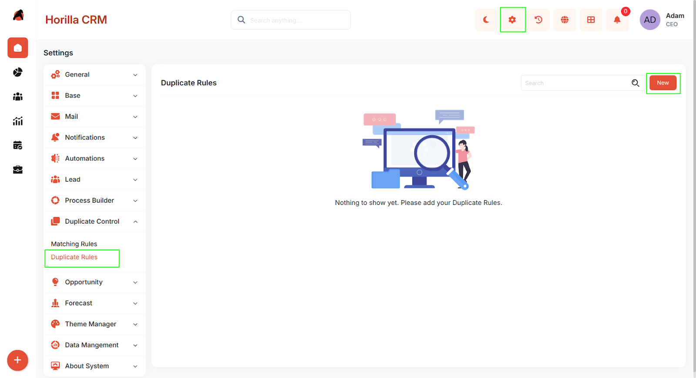  
Click New to open the Create Duplicate Rule form.

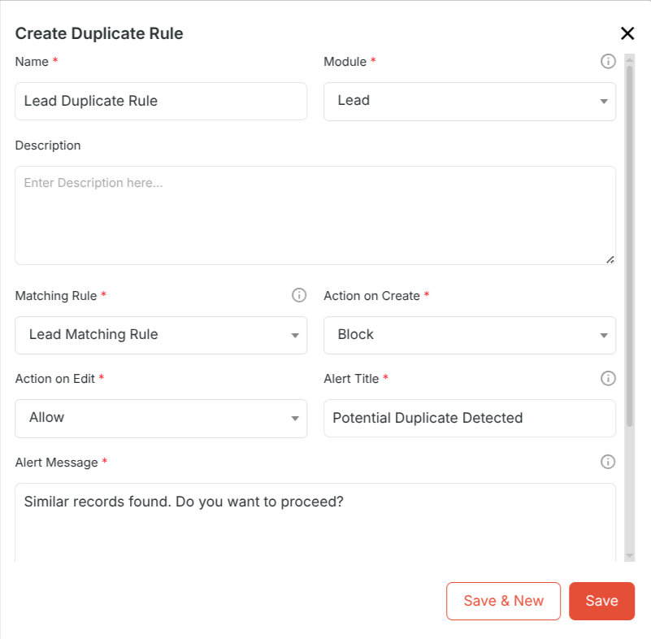  
Form Fields

* Name – A unique descriptive name for the duplicate rule (e.g., "Block Duplicate Leads on Create").  
* Module – The CRM module this rule applies to: Lead, Contact, or Account.  
* Matching Rule – Select which matching rule to use for detecting duplicates. The list is automatically filtered to show only rules configured for the selected module.  
* Description – Optional notes describing the purpose of the rule.  
* Action on Create – What happens when a user tries to save a new record that matches an existing one:  
  * Allow – Warns the user but permits saving.  
  * Block – Prevents saving until the user cancels.  
* Action on Edit – Same behaviour applied when an existing record is edited.  
* Alert Title – The heading displayed in the duplicate warning modal (e.g., "Potential Duplicate Found").  
* Alert Message – The message body explaining the situation to the user.  
* Show Duplicate Records – Enable to display the list of matching records inside the warning modal so users can review them before deciding.  
* Conditions (Optional): Restrict when the duplicate rule applies by adding filter  conditions. If no conditions are set, the rule applies to every record in the selected module.   
* Click Save to activate the duplicate rule.

## **3\. Duplicate Detection During Record Create or Edit**  
When a user saves a record, the system automatically checks for duplicates using any active duplicate rules configured for that module.If a match is found, a Duplicate Warning Modal appears showing:  
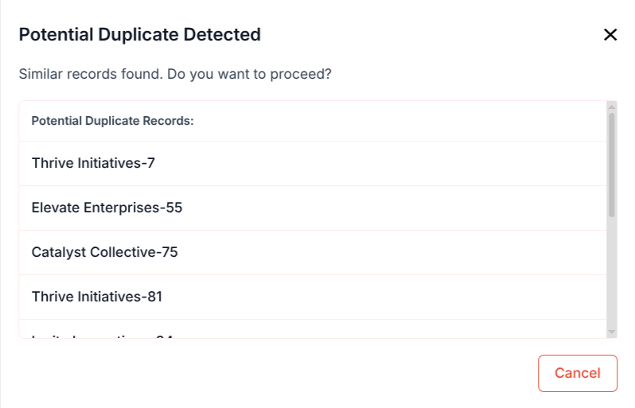

* The configured Alert Title and Alert Message.  
* A list of matching records if Show Duplicate Records is enabled, each showing key field values.  
* Action buttons based on the configured action:  
  * Allow mode: A Continue button to save anyway and a Cancel button to go back and edit.  
  * Block mode: A Cancel button only — the record cannot be saved.

## **4\. Potential Duplicates Tab (Record Detail View)**  
Purpose: Review all detected duplicates for an existing record and initiate a merge.

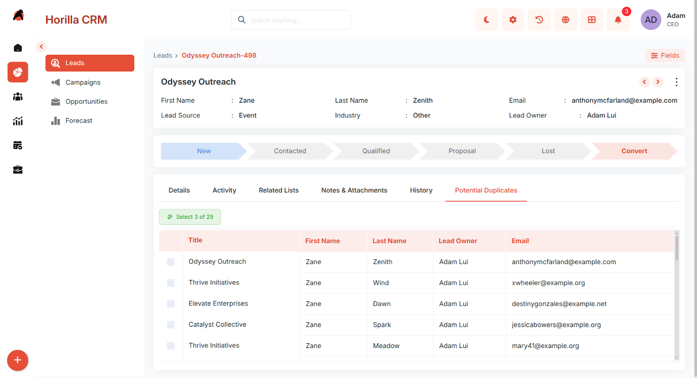

When viewing any Lead, Contact, or Account in detail view, a Potential Duplicates tab is automatically available. This tab displays:

* A list of all records that match the current record based on active matching rules.  
* Key field values for each matching record for quick comparison.  
* A Merge button to initiate the merge flow for selected records.

Up to 3 records can be selected for merging at one time, including the current record.

## **5\. Merging Duplicate Records**  
Purpose: Consolidate duplicate records into one master record, preserving the correct field values.  
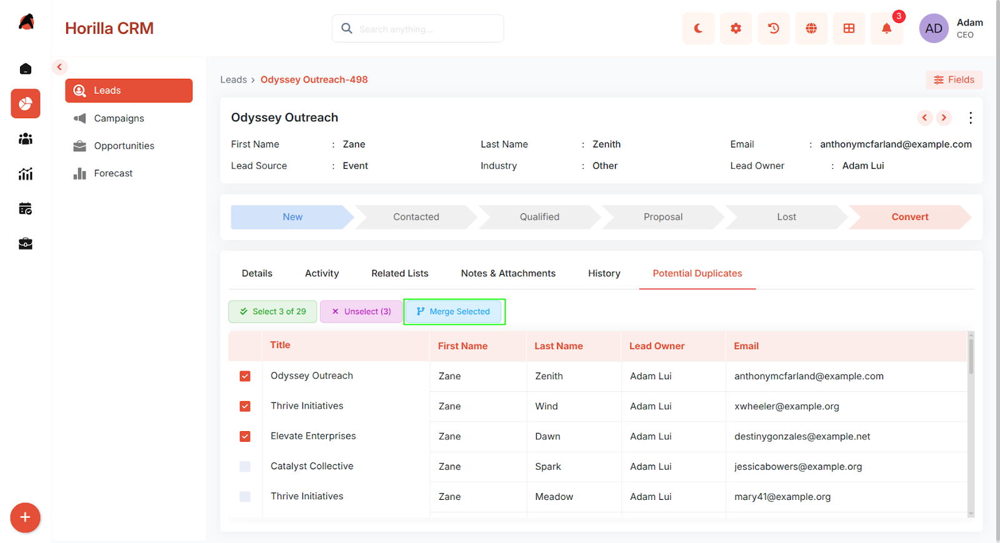

From the Potential Duplicates tab, select the records to merge and click Merge. The merge process has three steps:

**Step 1 – Compare**  
A side-by-side comparison of all selected records is displayed. For each field, the values from each record are shown in columns. Select the master record using the radio button at the top of a column — this automatically selects all that record's field values. Individual field values can still be overridden by selecting from a different column's radio button.

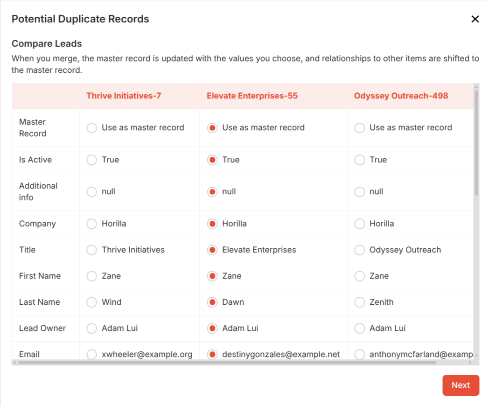

**Step 2 – Summary**  
A summary of the merge is displayed showing which record will become the master and the final value selected for each field. Review the summary and click Confirm to proceed, or go back to adjust selections.  
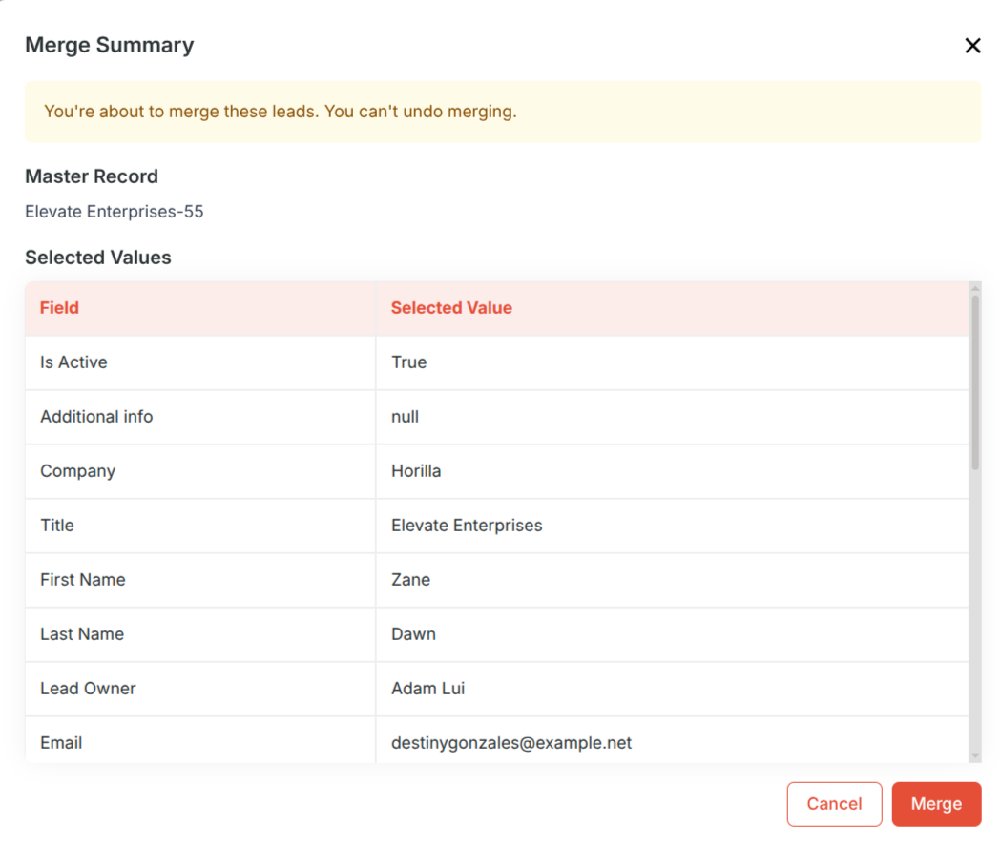

**Step 3 – Merge**  
The merge is executed. The master record is updated with the selected field values, and all non-master records are permanently deleted. A success message confirms the merge is complete.

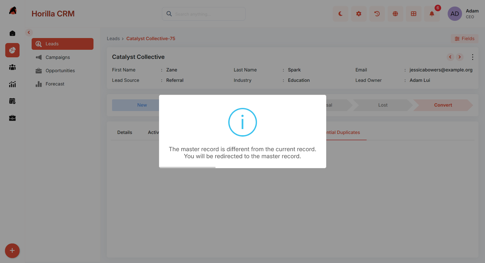

## **6\. Best Practices**

* Create Matching Rules before Duplicate Rules — a duplicate rule requires a matching rule to function.  
* Use Exact matching for unique identifiers like Email or Phone, and Fuzzy matching for fields like Name where slight variations are common.  
* Use Conditions on duplicate rules to target specific record states — for example, only check for duplicates when Lead Status is "New".  
* Set Action on Create to Block for critical modules where duplicate entries would cause data issues (e.g., Contacts by email).  
* Set Action on Edit to Allow to warn users without preventing saves during routine updates.  
* Enable Show Duplicate Records in the alert so users can immediately identify the conflicting record without leaving the form.  
* Always review the Compare step carefully during a merge — the deletion of non-master records is permanent.

