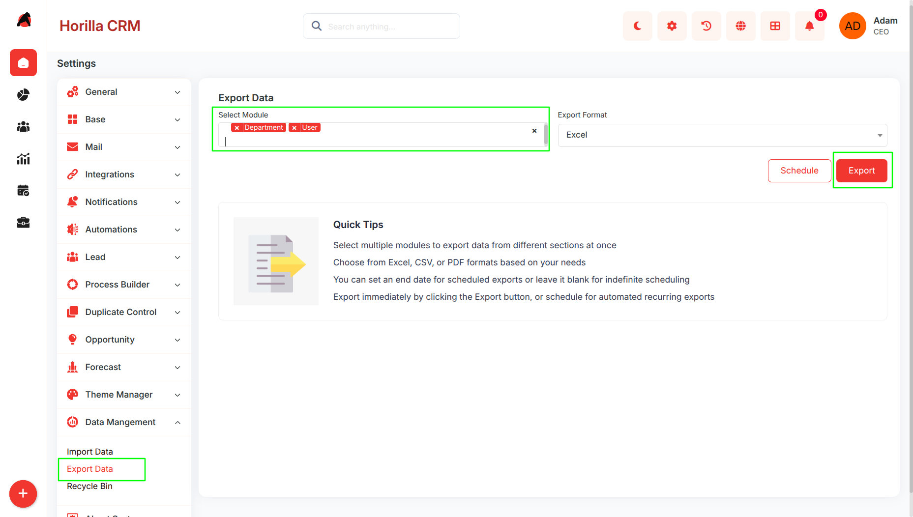
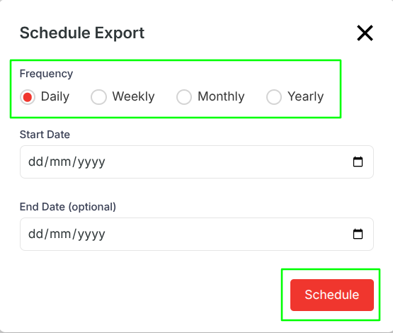
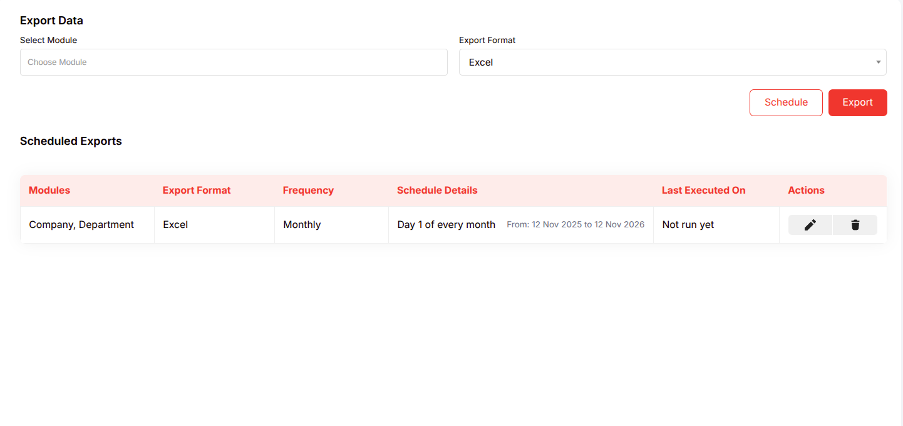

# **Export Data - Functional Guide**

## **Introduction**

The Twixio CRM Export Data feature, found under the Data Management section, allows users to efficiently extract and download data from various CRM modules. This functionality supports both immediate exports and automated scheduled exports, enabling businesses to generate reports, perform data analysis, or integrate information with external tools.

Exports are available in formats such as Excel, CSV, or PDF, providing flexibility for different use cases. The module integrates seamlessly with core CRM sections like Base, Mail, Leads, Opportunities, and Forecast, ensuring comprehensive data portability while maintaining data integrity and security.

## **Key Features and Functionalities**

### **2.1 Export Data Overview**

- **Purpose:** Provide a user-friendly interface for selecting modules, formats, and scheduling options to export CRM data.

- Navigate to the “**Settings**” and select “**Data Management”** \> “**Export Data.**”
- Supports selection of single or multiple modules
- If a single module is selected the export downloads directly in the chosen format .
- If multiple modules are selected (e.g., Company and Department), the system bundles the files into a ZIP archive for convenient multi-file handling.  

### **2.2 Scheduled Exports**

- **Purpose:** Automate recurring data exports that run at defined intervals and deliver the file directly to the user's email inbox.

- Click the Schedule button on the Export Data page to open the Schedule Export modal. The module(s) and format already selected on the main page are passed into the schedule automatically.
- The modal contains the following fields:
- **Frequency (Required)**
  - Four options displayed as radio buttons. Select how often the export should repeat:
  - **Daily** — Runs every day from the start date onward.
  - **Weekly** — Runs once per week on a chosen day.
  - **Monthly** — Runs once per month on a chosen date.
  - **Yearly** — Runs once per year on a chosen date and month.
- Selecting a frequency option dynamically shows or hides the relevant sub-fields below.
- **Day of Wee**k (Shown when Weekly is selected — Required)
  - A dropdown to select the day the export should run each week.
  - Options: Monday, Tuesday, Wednesday, Thursday, Friday, Saturday, Sunday.
- **Day of Month** (Shown when Monthly is selected — Required)
  - A dropdown to select which day of the month the export runs.
  - Options: 1 through 31\.
- **Day of Month** (Shown when Yearly is selected — Required)
  - A dropdown to select the day within the chosen month for the yearly export.
  - Options: 1 through 31\.
- **Month** (Shown when Yearly is selected — Required)
  - A dropdown to select the month for the yearly export.
  - Options: January through December.
- **Start Date (**Required)
  - A date picker for when the schedule becomes active. Must be today or a future date — past dates are not accepted.
- **End Date** (Optional)
  - A date picker for when the schedule should stop. If left blank, the schedule runs indefinitely. If provided, it must be a date after the Start Date.
- **Schedule Button**
  - Submits the form. On success, the modal closes and the new schedule appears immediately in the Scheduled Exports list below. If validation fails, inline error messages are shown next to the relevant fields without closing the modal.  

- View scheduled exports in the table format, where each row provides at-a-glance details and execution status.

