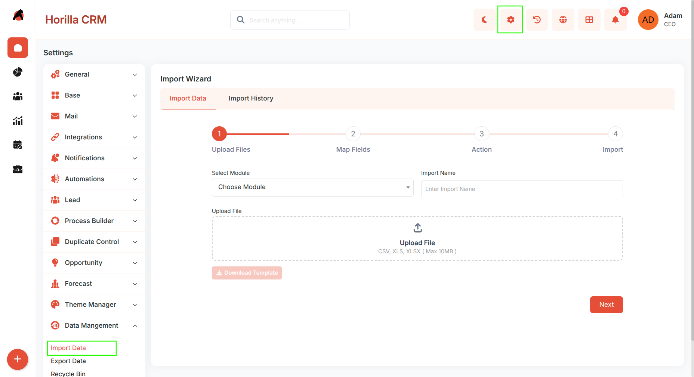
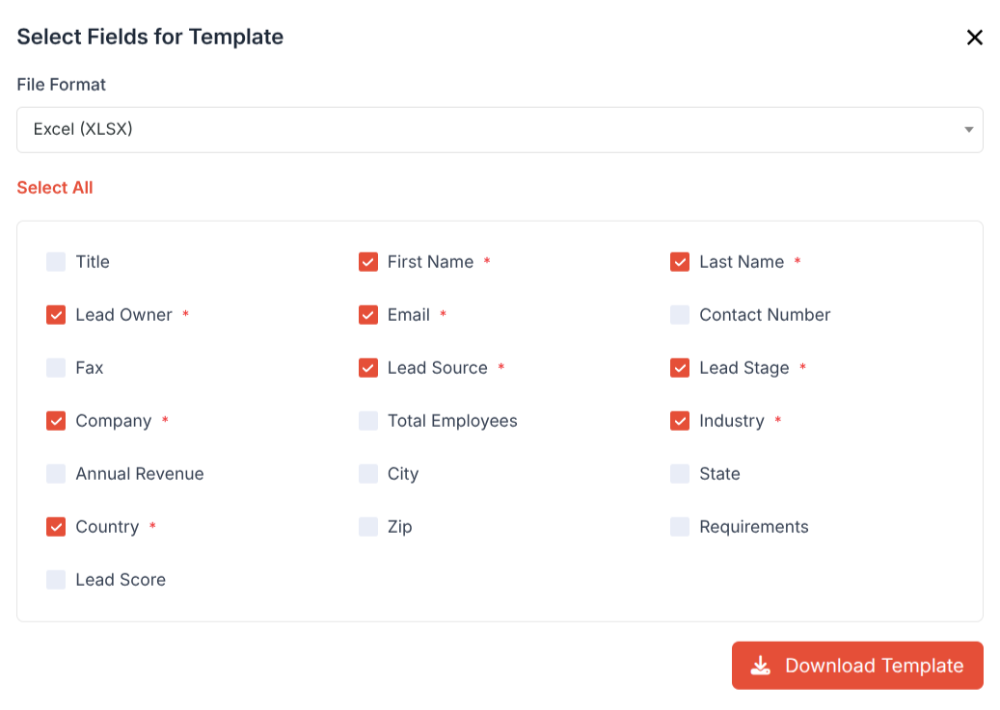
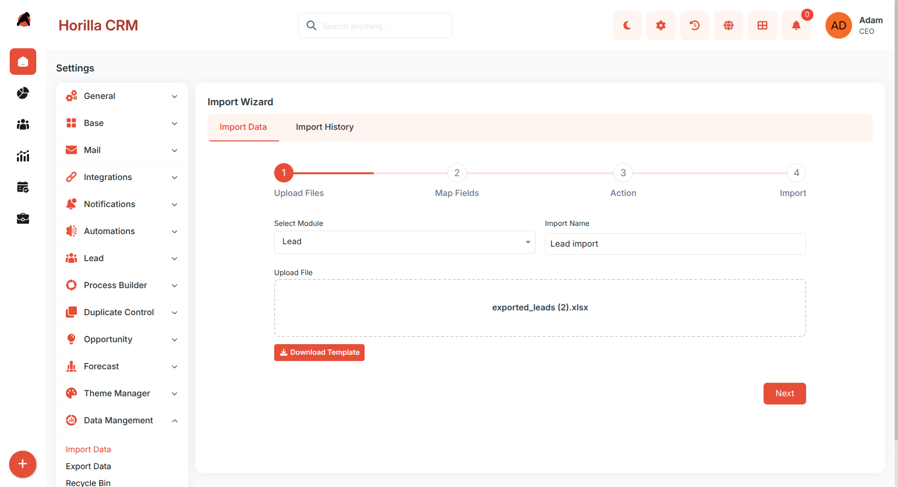
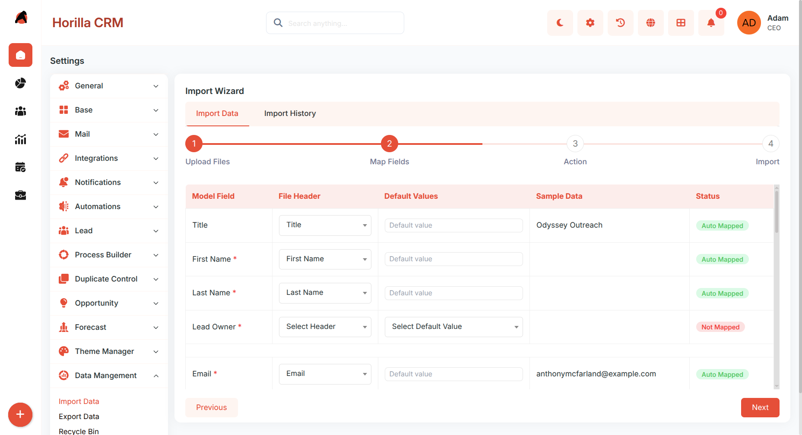
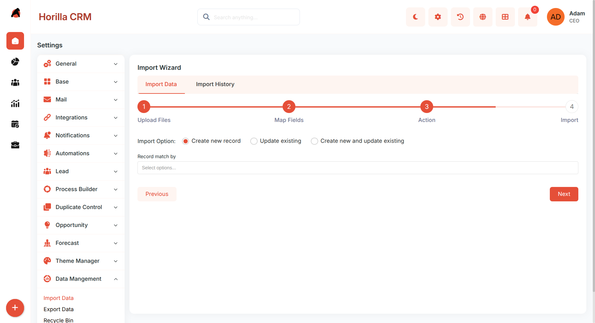
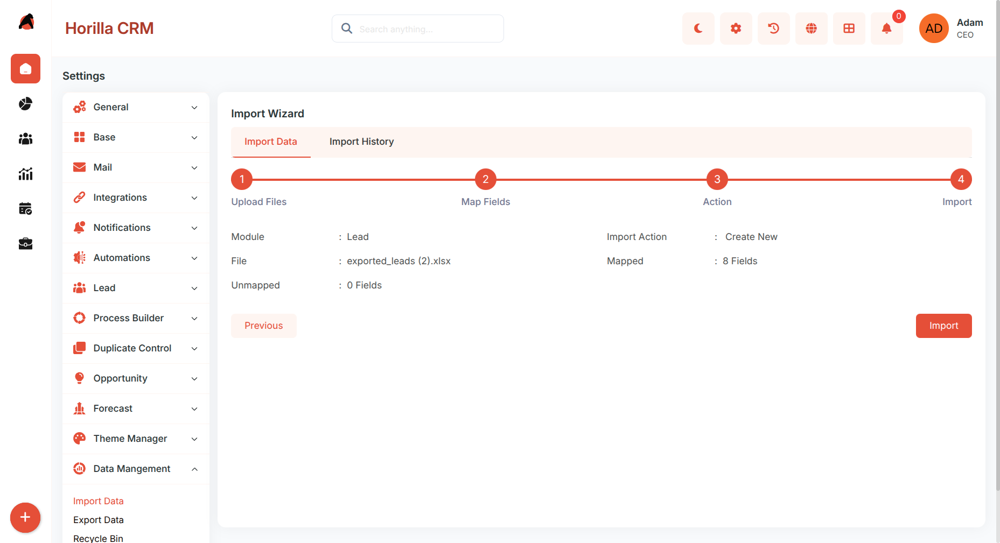
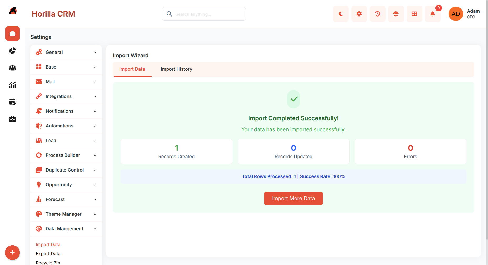
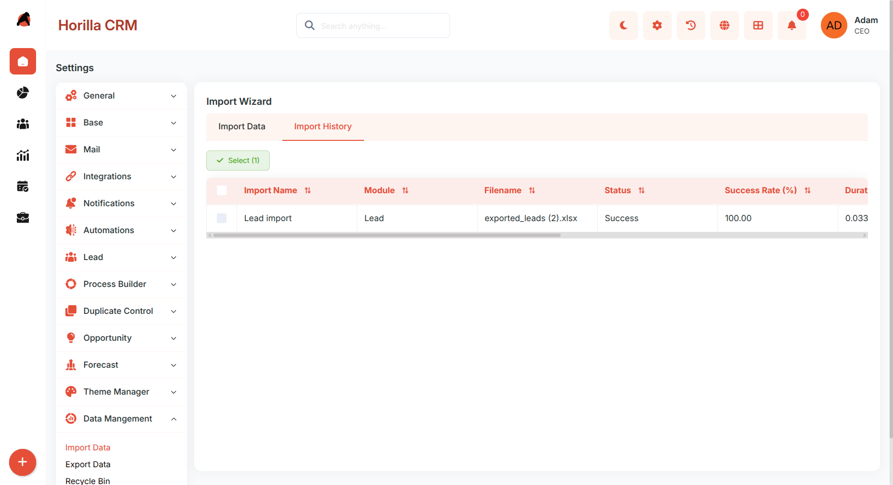

## **Import Data – Functional Guide**

### **Introduction**

The **Twixio CRM Import Data Module** simplifies the process of transferring external data into the CRM system. It allows users to bring data from spreadsheets or other sources into CRM modules such as **Leads**, **Accounts**, **Contacts**, and **Opportunities**. With a structured import wizard, intelligent field mapping, value mapping for choice fields, and a downloadable template generator, this feature ensures *accurate, duplicate-free data migration*.

### **Key Features and Functionalities**

#### **1.1 Import Wizard Overview**

**Purpose:** Guide users through a step-by-step process to import data efficiently.

**Access:** Settings → Data Management → Import Data

The Import Data interface includes two main tabs:

* **Import Data** — start a new import process.  
* **Import History** — review past imports and logs.

#### **1.2 Download Import Template**

**Purpose:** Provide a pre-formatted file with the correct column headers for a selected module so users can prepare their data accurately before importing.

* Click **Download Template** on the Import Data page.  
* Select the **Module** *(Lead, Account, Contact, Opportunity, etc.)*.  
* Choose which fields to include in the template — *required fields are pre-selected and cannot be deselected*.  
* Select the file format: **CSV** or **XLSX**.  
* Click **Download** to get the ready-to-fill template file.

#### **1.3 Upload File**

**Purpose:** Start the import by selecting the module and uploading the source file.

* Choose the **Module**.  
* Enter a clear **Import Name** *(e.g., "Q4 2025 Lead Import")*.  
* Upload your data file. Supported formats: `CSV` · `XLS` · `XLSX`.  
* Click **Next** to proceed after file validation.

#### **1.4 Map Fields**

**Purpose:** Match file columns with CRM fields to ensure correct data placement.

The mapping screen shows:

* **Model Field** — CRM field name.  
* **File Header** — matching column from your uploaded file.  
* **Default Value** — fallback for unmapped fields.  
* **Sample Data** — preview from your file.  
* **Status** — mapping progress.  
* Fields marked with `*` are **required**.  
* The system *auto-maps* fields with matching names.  
* Fields marked as **Not Mapped** require manual mapping or a default value.

**Value Mapping for Choice and Relation Fields:**

* For fields with fixed choices *(e.g., Lead Source, Industry)* or foreign key fields, a **Value Mapping** panel appears.  
* It lists the unique values found in your uploaded file and lets you map each one to the correct CRM option.  
* The system attempts to *auto-map* values with matching names.  
* Unmapped values can be manually assigned or left to use the **default value**.

Click **Next** after all required fields are mapped.

#### **1.5 Action Configuration**

**Purpose:** Define how the system should handle new and existing records.

**Import Options:**

* **Create New Records** — adds all rows as new data.  
* **Update Existing** — updates records that already exist.  
* **Create New and Update Existing** — combines both intelligently.

**Record Match By:** Choose the matching field *(Email, Company Name, Phone Number, Unique Identifier)* when updating or combining.

Click **Next** to proceed.

#### **1.6 Import Summary**

**Purpose:** Review all import settings before execution.

The summary displays:

* Selected **Module**, uploaded **File Name**, and chosen **Import Action**.  
* Number of **Mapped** and **Unmapped** fields.

Click **Import** to start the process.

#### **1.7 Import Completion**

**Purpose:** Provide results and insights after the import process.

Once complete, the system shows:

* **Import Statistics:** Records Created · Records Updated · Errors.  
* **Processing Summary:** Total rows processed and success rate.

Users can:

* Click **Import More Data** to begin another import.  
* Visit the related module to review imported records.  
* Check **Import History** for logs and detailed information.

#### **1.8 Import History**

**Purpose:** Track all import activities for review, auditing, and error recovery.

**Access:** `Import History` tab on the Import Data page.

Displays all completed imports with the following details:

* **Import Name** — name given at the time of import.  
* **Module** — CRM module imported into.  
* **Original Filename** — name of the uploaded file.  
* **Status** — Completed or Failed.  
* **Success Rate** — percentage of rows imported successfully.  
* **Duration** — time taken to complete the import.  
* **Created At** — date and time of the import.  
* **Created By** — user who performed the import.  
* **Imported File** — download the original uploaded file.  
* **Error File** — download a file listing only the failed rows with error details for correction and re-import.

