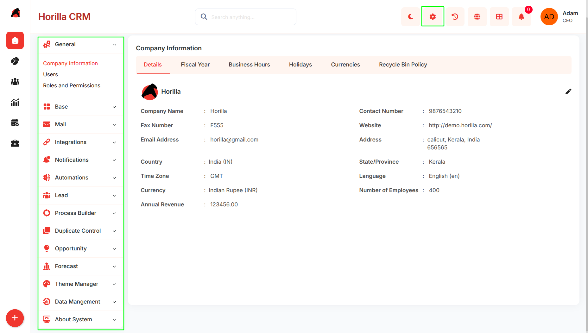

# **Settings**

# **Introduction**

The Twixio CRM Settings Section is the administrative hub for system-wide configuration, user management, and organizational structure. It enables administrators to configure company details, manage users and access control, establish operational hierarchies, and maintain data governance across the entire CRM platform.

## **Key Features and Functionalities**

1. ### **General Settings**

   **Purpose:** Configure core organizational information and system-wide policies.  
   **Access:** Settings → **General**

   **Key Features:**

1. **.Company Information:** Organization details, fiscal year, business hours, holidays, currencies, data retention  
2. **Users:** User management, creation, profiles, login history  
3. **Roles and Permissions:** Role-based access control, user permissions, Super User management.  
   

2. ### **Base Settings**

   **Purpose:** Establish organizational structure and business rules.  
   **Access:** Settings → **Base**  
   **Key Features:**  
1. **Department Management :** Define organizational departments  
2. **Branches (Companies) :** Manage multiple business units with automated stage setup  
3. **Scoring Rules :** Create point-based lead/opportunity qualification  
4. **Roles :** Team Role, Customer Role, Partner Role definitions  
   

3. ### **Mail Settings**

   **Purpose:** Configure email integration and communication channels.  
   **Access:** Settings → **Mail**  
   **Key Features:**  
1. **Outgoing Mail Server :** SMTP/relay configuration for outbound email  
2. **Incoming Mail Server** : MAP/POP configuration for inbound email  
3. **Mail Template :** Manage reusable email templates

4. **Integrations Settings**  
   **Purpose**: Connect Twixio CRM with external services.  
   **Access**: Settings → **Integrations**  
   **Key Features:**  
1. **Google Calendar Sync:** Enable and configure two-way sync of CRM activities with Google Calendar (visible only when Google integration is enabled)  
     
5. **Notifications Settings**  
   **Purpose**: Manage reusable notification content for system alerts.  
   **Access**: Settings → **Notifications**  
   **Key Features:**  
1. **Notification Templates:** Create and manage templates used by automations and system triggers  
     
6. **Automations Settings**  
   **Purpose**: Configure system-wide automation rules and multi-step outreach sequences.  
   **Access**: Settings → **Automations**  
   **Key Features:**  
1. **Mail & Notifications:** Create trigger-based automation rules that send emails or push notifications on CRM events (e.g., lead assigned, stage changed)  
2. **Cadences:** Build multi-step outreach sequences (e.g., email day 1 → call day 3 → follow-up day 7\) that run automatically against leads, contacts, or opportunities  
      

7. ### **Lead Settings**

   **Purpose:** Configure lead management pipeline.  
   **Access:** Settings → **Lead**  
   **Key Features:**  
1. **Lead Stage:** Define pipeline stages with probability and final stage enforcement  
2. **Web to Lead :** Embed lead capture forms on external websites  
3. **Mail to Lead :** Auto-create leads from incoming email (requires Incoming Mail config)  
     
8. **Process Builder Settings**  
   **Purpose**: Define structured workflows for approvals and reviews across the CRM.  
   **Access**: Settings → **Process Builder**  
   **Key Features:**  
1. **Review Processes:** Configure multi-step review workflows (e.g., deal review, record sign-off) that route records through defined reviewers in sequence  
2. **Approval Processes:** Define approval rules and chains for actions that require managerial or team sign-off before proceeding

   

9. **Duplicate Control Settings**  
   **Purpose**: Prevent and manage duplicate records across the CRM.  
   **Access**: Settings → **Duplicate Control**  
   **Key Features:**  
1. **Matching Rules**: Define field-level rules for identifying potential duplicates  
2. **Duplicate Rules:** Set threshold and merge policies based on matching rule scores

10. ###  **Opportunity Settings**

    **Purpose:** Configure opportunity management and deal monitoring.  
    **Access:** Settings → **Opportunity**  
    **Key Features:**  
1. **Opportunity Stage:** Define sales pipeline stages with Open/Closed classification  
2. **Opportunity Team Settings:** Enable and configure team selling mode  
3. **Opportunity Split Settings:** Configure split-commission types (visible only when team selling is enabled)  
4. **Big Deal Alert:** Configure high-value opportunity notifications

11. ###  **Forecast Settings**

    **Purpose:** Configure forecasting parameters.  
    **Access:** Settings → **Forecast**  
    **Key Features:**  
1. **Forecast Type:** Define forecast categories (e.g., Best Case, Committed, Pipeline)  
2. **Forecast Target:** Set revenue targets per user, team, or period

12.  **Theme Settings**  
    **Purpose**: Customize the visual appearance of the CRM.  
    **Access**: Settings → **Theme**  
    **Key Features:**  
1. **Color Themes:** Create and apply custom color themes across the entire CRM interface
 

13. ###  **Data Management**

    **Purpose:** Manage data migration, export, and retention.  
    **Access**: Settings → **Data Management**  
    **Key Features:**  
1. **Import Data:** Bulk migration with field mapping (CSV, XLS, XLSX)  
2. **Export Data:** Bulk export of CRM records to CSV/Excel  
3. **Recycle Bin:** Manage soft-deleted records with restore or permanent delete options

14.  **About System**  
    **Purpose**: View system metadata and version information.  
    **Access**: Settings → **About System**  
    **Key Features:**  
1. **Version Info**: Displays the current Twixio CRM version and system build details
