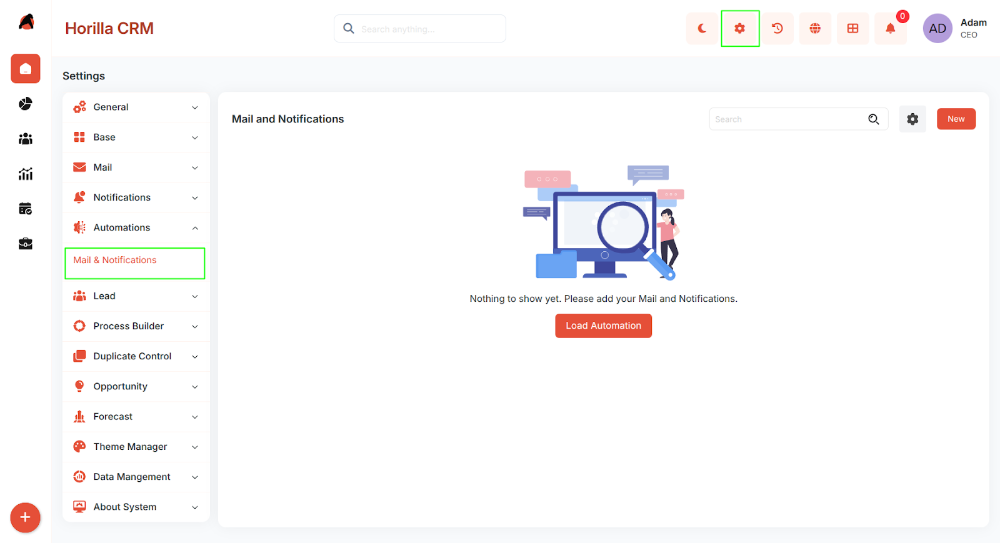
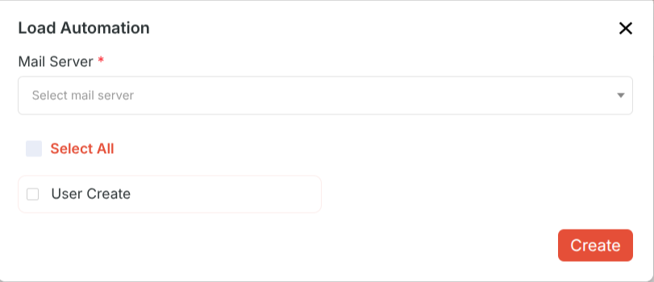
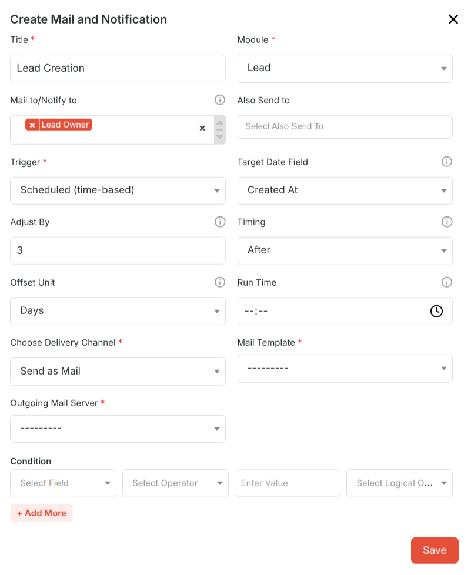
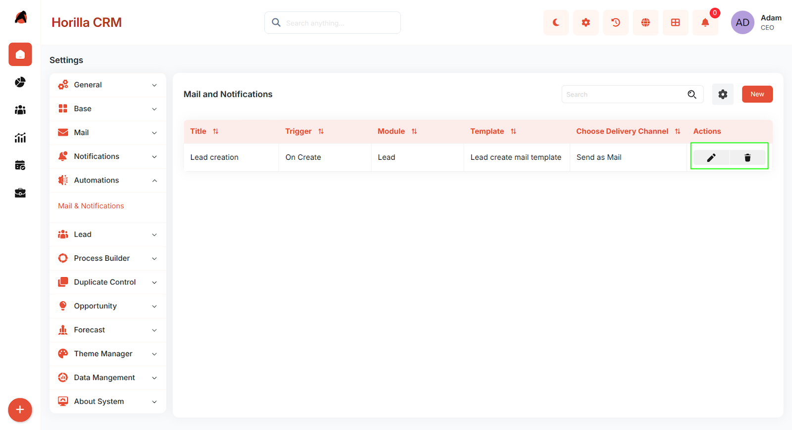

# **Twixio CRM Mail & Notifications – Functional Guide**

## **1\. Introduction**

The Twixio CRM Mail & Notifications module enables automated email and in-app notifications based on CRM events or schedules. Administrators can define rules for any module, select trigger types, configure delivery channels, and apply conditions to ensure the right people are notified at the right time.

## **2\. Key Features and Functionalities**

### **2.1 Mail & Notifications Overview**

Purpose: Display all configured notification rules in a centralized list for easy access and management.

* Navigate to Settings in the header and select Automations \> Mail & Notifications to view the list.  
* The interface displays the Title, Module, Trigger type, Delivery Channel, and available Actions for each rule.  
* Includes a search functionality to quickly locate specific notification rules.  
* A Load Automation button is available to import pre-built automation rules into the system.  
* If no rules have been configured yet, the page displays a message: "Nothing to show yet. Please add your Mail and Notifications."

### **2.2 Load Automation**

Purpose: Import pre-built automation rules into the Mail & Notifications list using an existing outgoing mail server.

* Click the Load Automation button on the Mail & Notifications page to open the Load Automation modal.  
* Mail Server – Select an outgoing mail server from the dropdown. An outgoing mail server must be configured under Mail settings before this option becomes available.  
* Once a mail server is selected, the available pre-built automation rules are listed below with checkboxes.  
* Select All – Check this option to select all listed automation rules at once.  
* Individual rules can also be selected by checking their individual checkboxes (e.g., User Create).  
* Click the Create button to import the selected automation rules into the Mail & Notifications list.

### **2.2 Creating a New Mail & Notification Rule**

Purpose: Add new automated notification rules for any CRM module.

* Click the New button to open the Create Mail and Notification form.  
* Fill in the required fields and click Save to activate the rule.  
* The form fields available depend on the selected Trigger and Delivery Channel.

###  **Form Fields**

* Title – A descriptive name for the notification rule.  
* Module – The CRM module this rule applies to (e.g., Lead, Contact, Department, Opportunity).  
* Mail to/Notify to – The user field(s) on the record that will receive the notification (e.g., Created By, Assigned To).  
* Also Send to – Additional recipients to be copied on the notification outside of the record's user fields.  
* Trigger – Defines when the rule fires. The available options are:  
  * On Create – Fires when a new record is created in the selected module.  
  * On Update – Fires when an existing record is edited and saved.  
  * On Create and Update – Fires on both record creation and any subsequent update.  
  * On Delete – Fires when a record is permanently deleted from the selected module.  
  * Scheduled (time-based) – Fires automatically at a configured time relative to a date field on the record.  
* Target Date Field – Available only for Scheduled trigger. The date field on the record used as the reference point for the schedule (e.g., Follow Up Date, Due Date).  
* Adjust By – Available only for Scheduled trigger. A numeric offset applied before or after the Target Date Field (e.g., \-2 for 2 days before, 3 for 3 days after).  
* Timing – Available only for Scheduled trigger. The direction of the offset: Before or After the target date.  
* Offset Unit – Available only for Scheduled trigger. The time unit for the Adjust By value: Days, Hours, Weeks, or Months.  
* Run Time – Available only for Scheduled trigger. The specific time of day (HH:MM) at which the scheduled notification will be sent.  
* Choose Delivery Channel – How the notification is delivered. Options are:  
  * Send as Mail – Sends a formatted email using the selected Mail Template and Outgoing Mail Server.  
  * Send as Notification – Delivers an in-app notification within Twixio CRM. Requires a Notification Template.  
  * Send as Mail and Notification – Sends both an email and an in-app notification at the same time.  
* Mail Template – The pre-configured email template used for the notification body. Required when sending as Mail.  
* Notification Template – The template used for the in-app notification. Required when sending as Notification or Mail and Notification.  
* Outgoing Mail Server – The configured mail server used to dispatch the email. Required when sending as Mail.  
* Condition – Optional filter logic to restrict when the rule fires. Conditions are built using:  
  * Select Field – The record field to evaluate (e.g., Status, Priority, Stage).  
  * Select Operator – The comparison to apply: equals, not equals, contains, is empty, greater than, etc.  
  * Enter Value – The value to compare against (e.g., High, Closed Won).  
  * Select Logical Operator – Combine multiple conditions using AND or OR.  
  * Click \+ Add More to add additional condition rows. If no conditions are set, the rule fires for every matching trigger event.

### **2.3 Managing Existing Rules**

Purpose: Provide management options for configured notification rules.

* Edit icon – Opens the rule form pre-populated with current settings for modification.

* Delete icon – Permanently removes the notification rule.

* Enable/Disable toggle – Activates or deactivates a rule without deleting it. Inactive rules will not fire even if their trigger conditions are met.

## **3\. Best Practices**

* Use descriptive rule titles that include the module, trigger, and recipient (e.g., Lead \- On Create \- Notify Sales Manager).

* Always configure and verify Mail Templates and Outgoing Mail Servers before activating rules.

* Use Conditions to avoid notification overload — send alerts only for genuinely actionable events.

* For Scheduled triggers, ensure the Target Date Field is consistently populated on all records in the selected module.

* For On Delete rules, test in a staging environment before enabling in production.

* When using Send as Mail and Notification, ensure both the Mail Template and Notification Template are configured and up to date.

* Regularly review active rules and disable or delete any that are no longer relevant.
