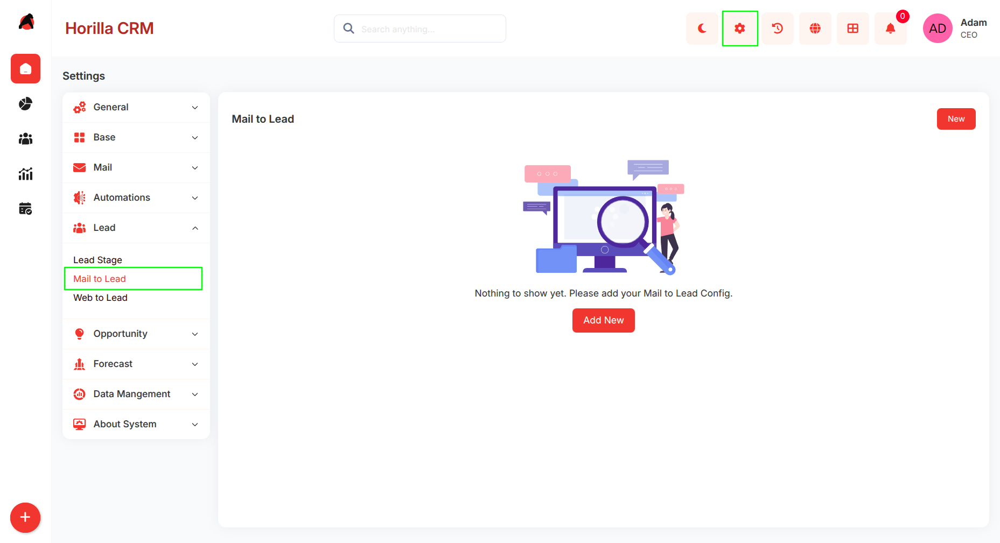
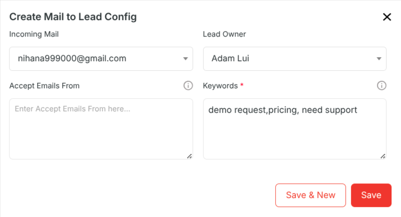
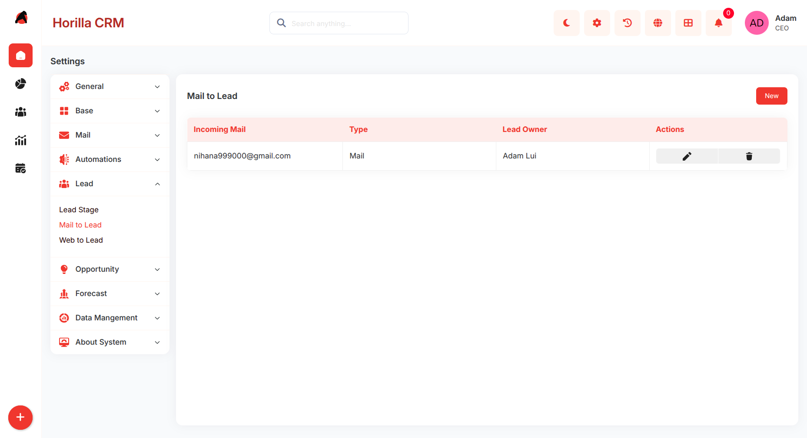
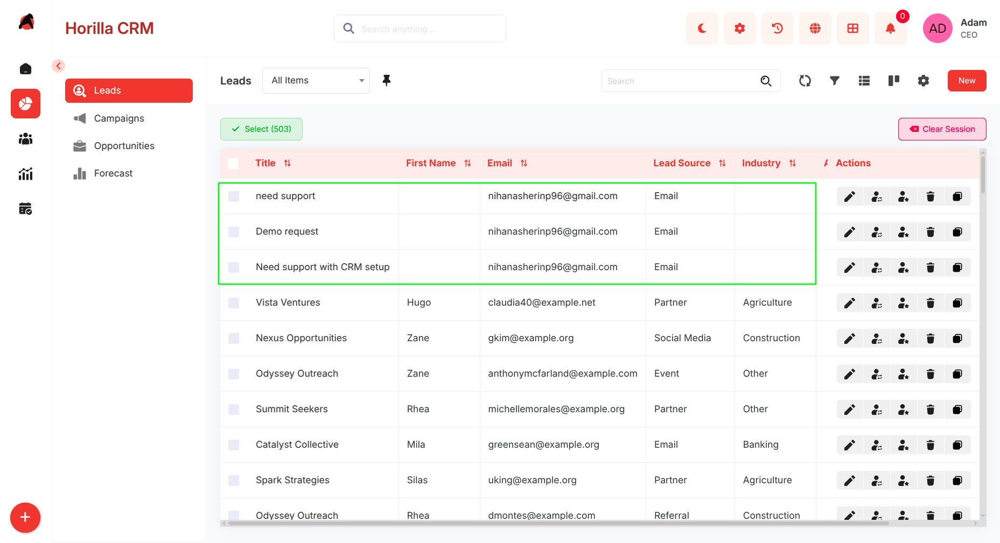

# **Automating Lead Capture with Mail to Lead in Twixio CRM**

## **Introduction**

**Mail to Lead** in Twixio CRM is an automation feature that converts incoming emails into lead records based on predefined configuration rules.

This functionality ensures that all relevant email inquiries are captured as leads without manual intervention, improving response time and reducing data entry efforts.

## **Purpose**

* Automate lead creation from incoming emails  
* Standardize lead capture process  
* Reduce manual data entry errors  
* Ensure timely follow-up on customer inquiries  
* Filter and capture only relevant communications

## **Navigation Path**

To access Mail to Lead configuration:

**Settings → Lead → Mail to Lead**

This opens the Mail to Lead configuration module where users can create, edit, and manage rules.

## **Creating a Mail to Lead Configuration**

To create a new configuration:

1. Click on the **Add New** button  
2. The **Create Mail to Lead Config** form will open

**1\. Incoming Mail**

* Defines the email inbox to monitor  
* Only emails received in the selected mailbox are processed  
* Supports multiple configurations for different mailboxes

**2\. Lead Owner**

* Specifies the user assigned to created leads  
* All leads generated from this configuration are assigned to this user  
* Ensures ownership and accountability

**3\. Accept Emails From (Optional)**

* Filters emails based on sender address or domain  
* If defined, only matching senders will create leads  
* If empty, all incoming emails are considered

**4\. Keywords (Mandatory)**

* Defines trigger words or phrases  
* Only emails containing these keywords will generate leads  
* Used to filter high-intent or relevant inquiries

### **Configuration List View**

After saving, configurations are displayed in a list view.

**Displayed Information:**

* Incoming Mail  
* Type (Mail)  
* Lead Owner

**Available Actions:**

* Edit configuration  
* Delete configuration

This allows centralized management of all Mail to Lead rules.

**System Workflow**

Once a Mail to Lead configuration is active, the system processes emails automatically.

### **Workflow Steps:**

1. System monitors configured mailbox  
2. Incoming email is received  
3. Email is validated against:  
   * Sender (if defined)  
   * Keywords (mandatory)  
4. If conditions match:  
   * Lead record is created  
   * Lead Source is set to **Mail**  
   * Email content is stored in lead description  
   * Lead is assigned to configured owner

No manual interaction is required after setup.

## **Data Handling**

### **Lead Creation Rules**

* Each qualifying email generates one lead  
* Duplicate handling depends on system configuration (if applicable)  
* Email body is stored as lead context

### **Lead Fields Auto-Populated**

* Lead Source → Mail  
* Description → Email content  
* Owner → Configured user

## **Use Cases**

* Capturing sales inquiries from shared inboxes  
* Converting website contact emails into leads  
* Filtering high-intent emails using keywords  
* Managing multiple business email channels

## **Benefits**

* Automated lead capture  
* Faster response time  
* Reduced manual workload  
* Improved data consistency  
* Better lead filtering and quality control

## **Best Practices**

* Use dedicated inboxes for lead capture (e.g., sales@, info@)  
* Define precise and relevant keywords  
* Restrict sender domains where necessary  
* Assign lead owners based on team structure  
* Periodically review and update configurations

## **Limitations / Considerations**

* Emails without defined keywords will not create leads  
* Overly broad keywords may generate irrelevant leads  
* Misconfigured sender filters may block valid inquiries  
* Requires proper mailbox setup and monitoring

