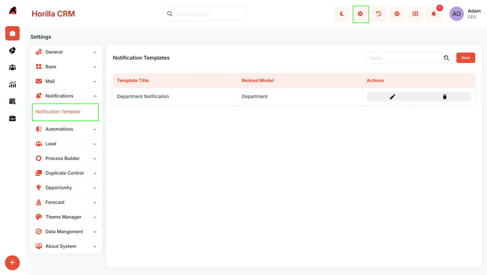
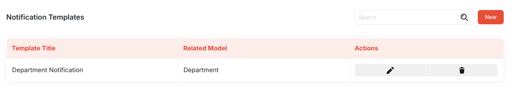
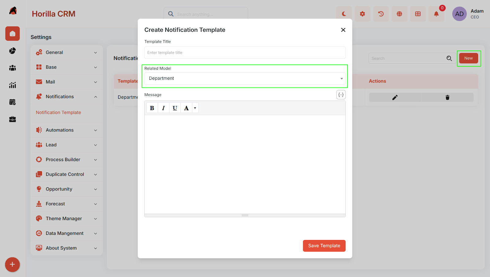
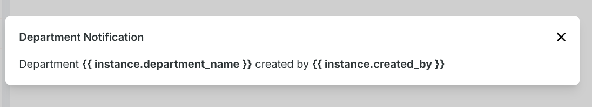

# **Notification Template in Twixio CRM \- A Complete Functional Guide**

## **Overview**

The **Notification Template** feature allows users to create reusable notification templates linked to specific system models. These templates can be used in automation workflows, including **Mail Automation**.

## **Navigation**

**Settings → Notifications → Notification Template**

## **Notification Template List**

The **Notification Template** page displays all created templates.

### **Available Information**

* **Template Title**  
* **Related Model**  
* **Actions**  
  * Edit  
  * Delete

### **Available Actions**

Users can:

* View existing templates  
* Search templates  
* Create a new template

## **Create Notification Template**

To create a new notification template, click **New**.

This opens the **Create Notification Template** form.

### **Fields**

#### **Template Title**

Specifies the name of the notification template.

#### **Related Model**

Defines the model associated with the template.

Users can select any available model from the list.

## **Template Detail View**

Once a template is created, clicking the **Template Title** opens the template detail view.

The detail view is used to access the template configuration and associated information.

## **Usage in Automation**

Notification templates created here can be used while configuring **Mail Automation**.

This allows users to reuse predefined notification structures in automated workflows.

## **Expected Behavior**

* Users can create notification templates.  
* Users can associate templates with available models.  
* Created templates are listed in the Notification Template page.  
* Clicking a template title opens its detail view.  
* Templates are available for use in **Mail Automation**.

