## **Opportunity Teams & Splits: Functional Guide**

### **Introduction**

The **Opportunity Teams** and **Opportunity Splits** features in Twixio CRM enable structured team collaboration and revenue attribution on individual opportunities. Team Selling must be enabled before either feature is accessible. Once enabled, users can assign team members to opportunities with defined roles and access levels, and optionally split revenue or quantity credit across those members using configurable split types.

1. ### **Enable Team Selling**

**Path:** Settings → Opportunity → Opportunity Team Settings

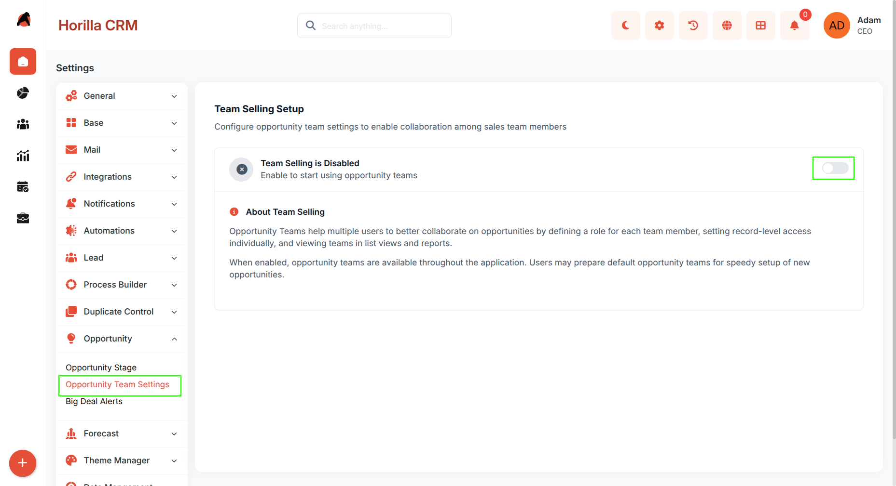

Team Selling is disabled by default. Navigate to the path above and click **Enable Team Selling** to activate the feature for your company. Once enabled, the Opportunity Teams list in My Settings and all split-related features become accessible. Disabling Team Selling hides all team and split features across the system.

2. ### **Opportunity Teams (My Settings)**

**Path:** My Settings → Opportunity Team *(This menu item appears only after Team Selling is enabled)*

#### **2.1 Teams List**

Displays all teams created by the logged-in user, with columns for Team Name and Description. Each team supports Edit and Delete actions. Click a team name to open its detail view.

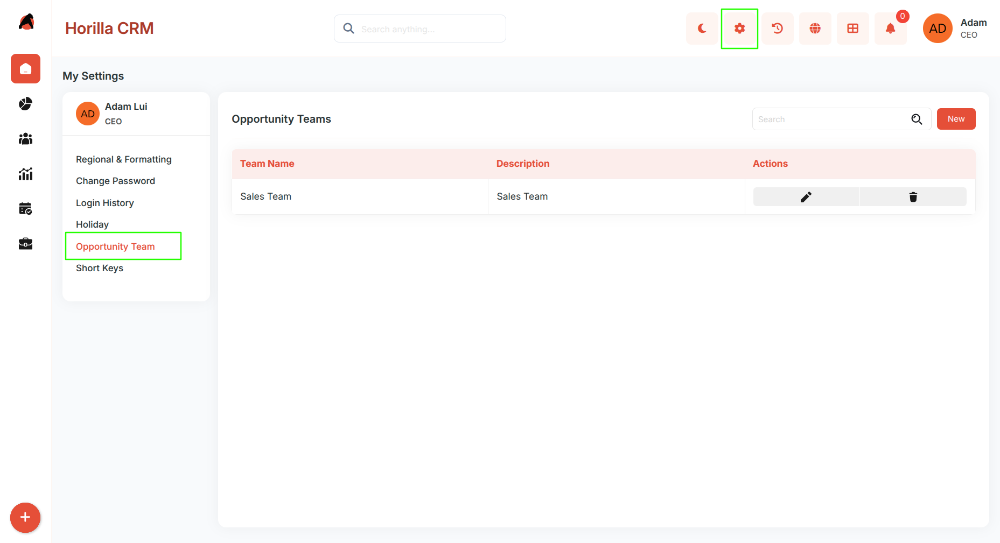

#### **2.2 Create a Team**

Click **New** to open the team creation form. Fill in the Team Name and Description, then use **Add Members** to select users, assign a team role, and set an opportunity access level (Read/Write or Read-Only) per member. Click **\+ Add More** to include multiple members at once, then click **Save**.

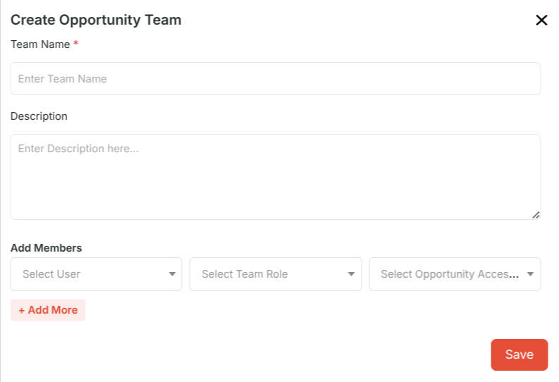

#### **2.3 Team Detail View**

Shows the team name and all members with columns for Team Member, Member Role, and Access Level. Per-member actions include Edit (to update role or access level) and Remove. Click **New** to add more members to an existing team.

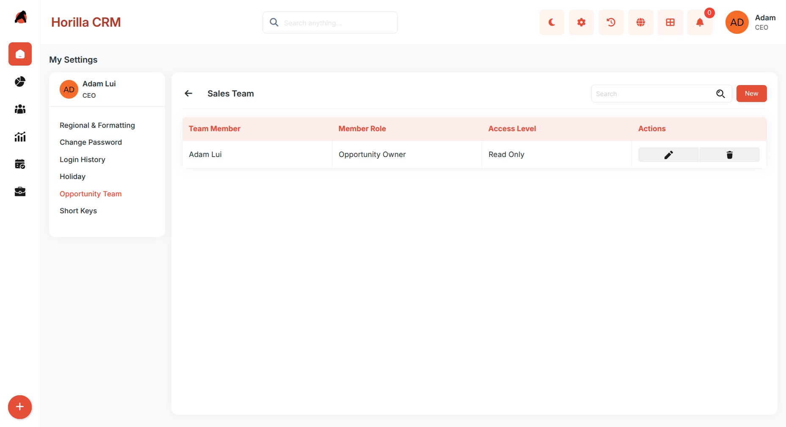

### **Opportunity Teams (Opportunity Detail View)**

When Team Selling is enabled, a **Team Members** related list appears on the opportunity detail view.

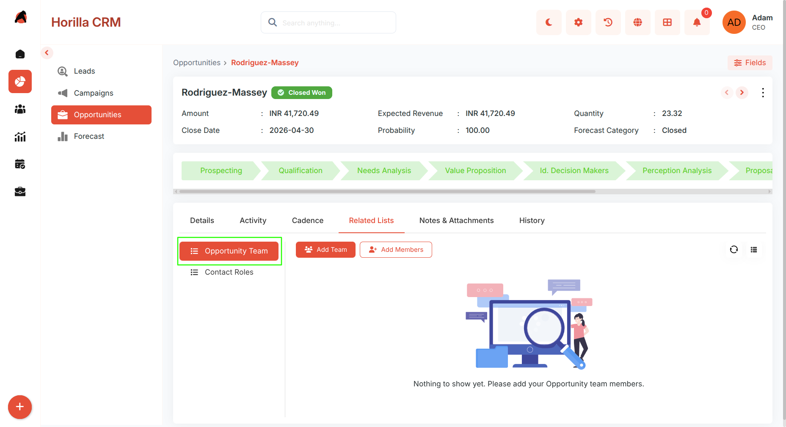

#### **3.1 Add Members Manually**

Click **New** in the Team Members related list, select one or more users, assign their Team Role and Opportunity Access level, then click **Save**.

#### **3.2 Add Default Team**

Click **Add Default Team**, select an existing Opportunity Team from the dropdown, and all members are added instantly with their pre-configured roles and access levels. Members already on the opportunity are skipped automatically.

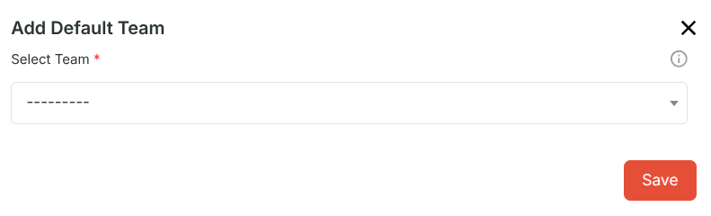

#### **3.3 Manage Members**

Use **Edit** to update a member's role or access level, or **Remove** to take them off the opportunity.

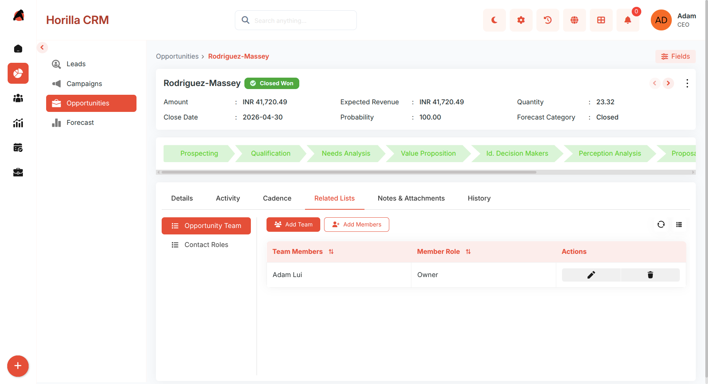

### **Opportunity Split Settings**

**Path:** Settings → Opportunity → Opportunity Split Settings *(This menu item appears only after Team Selling is enabled)*

#### **4.1 Enable Opportunity Splits**

Toggle **Enable Opportunity Splits** to activate revenue splitting. Disabling this option removes all existing split data permanently.

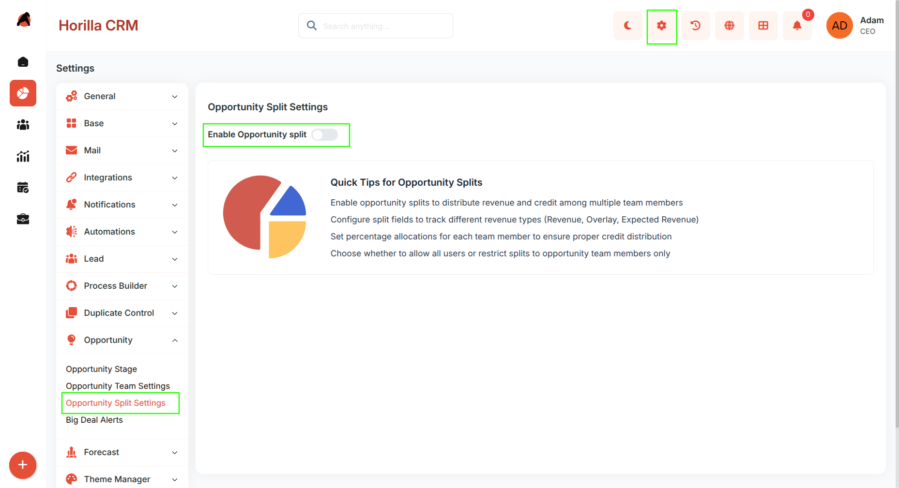

#### **4.2 Split Types**

All configured split types are listed with columns for Split Label, Split Field, Totals 100%, and Is Active. Each type can be toggled active or inactive. Four split types are created automatically:

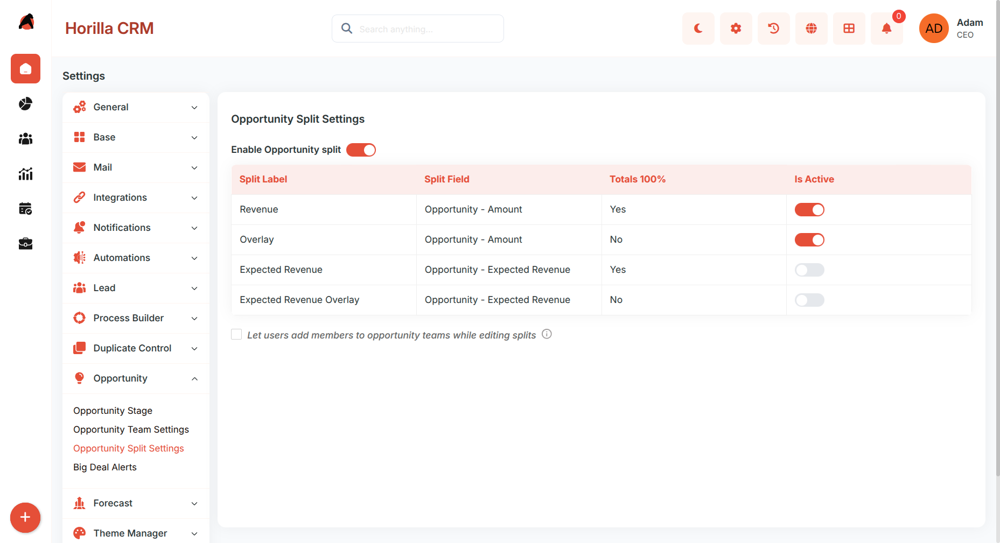

* **Revenue** — splits the Amount field; percentages must total 100%.  
* **Overlay** — splits the Amount field; percentages do not need to total 100%.  
* **Expected Revenue** — splits the Expected Revenue field; percentages must total 100%.  
* **Expected Revenue Overlay** — splits the Expected Revenue field; no 100% requirement.  
* **Allow All Users in Splits** —Toggle **Allow All Users in Splits** to control who can be assigned a split. When off (the default), only opportunity team members can be assigned splits. When on, any active company user is eligible.

### **Opportunity Splits (Opportunity Detail View)**

When Opportunity Splits are enabled, a **Splits** section appears on the opportunity detail view with a tab for each active split type.

#### **5.1 Split Tabs**

Each active split type appears as a separate tab (e.g., Revenue, Overlay, Expected Revenue). Switch between tabs to manage splits for different split types independently.

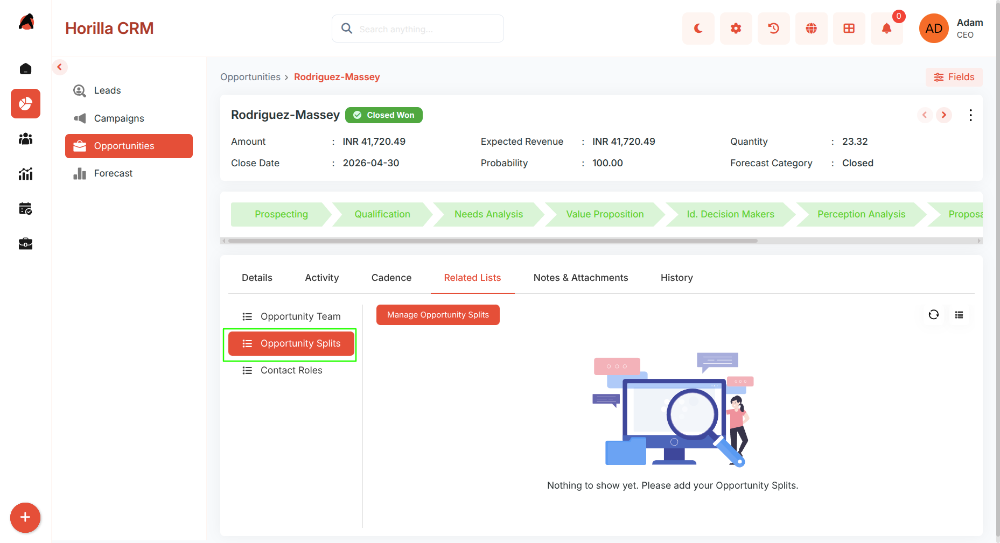

#### **5.2 Manage Opportunity splits**

Each tab shows a table with User, Split Percentage, and Split Amount columns. Click **\+ Add Row** to add a new assignment, select a user, then enter either a Split Percentage (the amount is calculated automatically) or a Split Amount (the percentage is recalculated automatically).

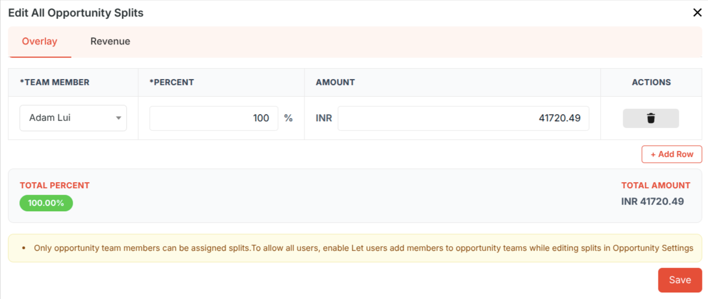

*  **Totals and Validation:** The table footer shows the Total Percentage and Total Amount across all rows. Split types with Totals 100% required will be validated before saving; overlay types accept any total.

*  **Save and Recalculate:** Click **Save** to store all split rows for the active split type. If the opportunity's amount or expected revenue changes later, click **Recalculate** to update all split amounts proportionally based on saved percentages. Individual rows can be removed using the delete icon.

