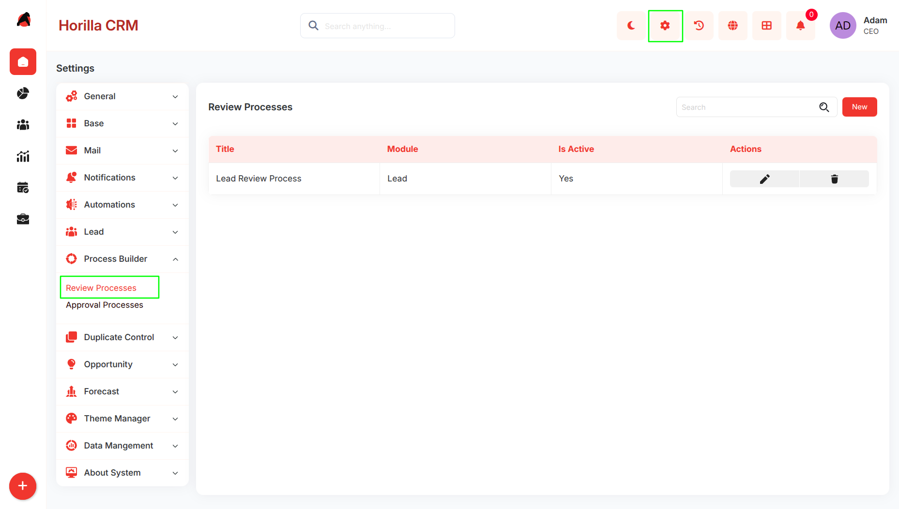
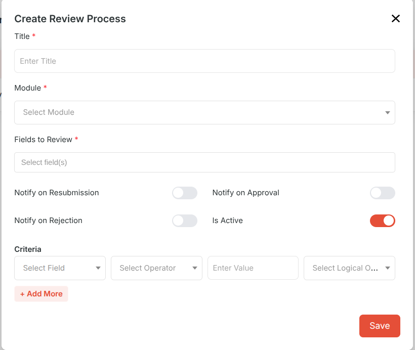
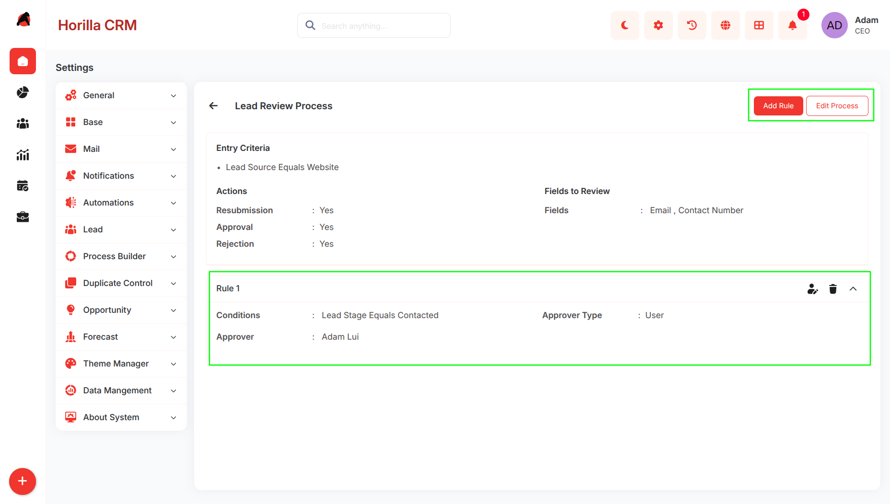
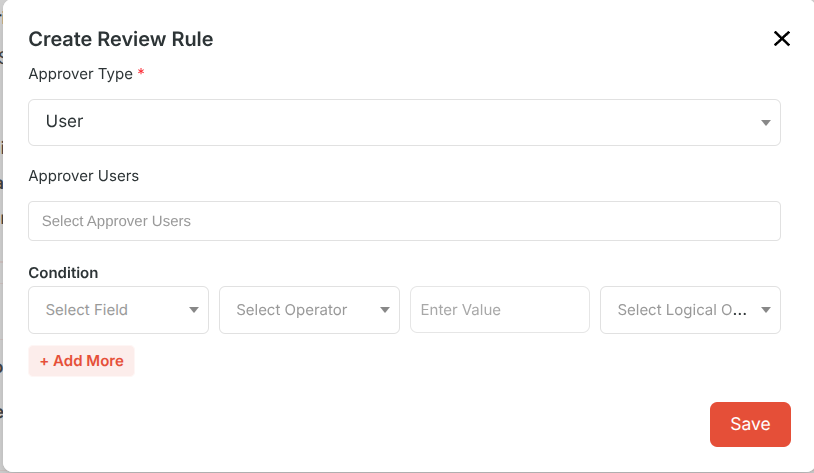
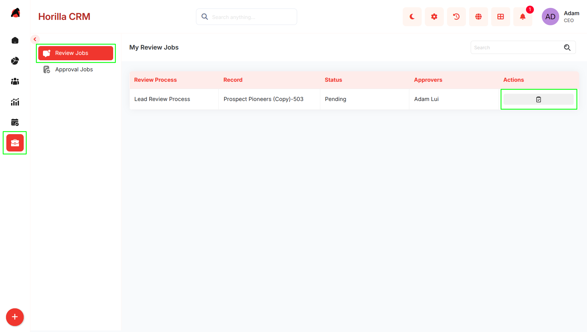
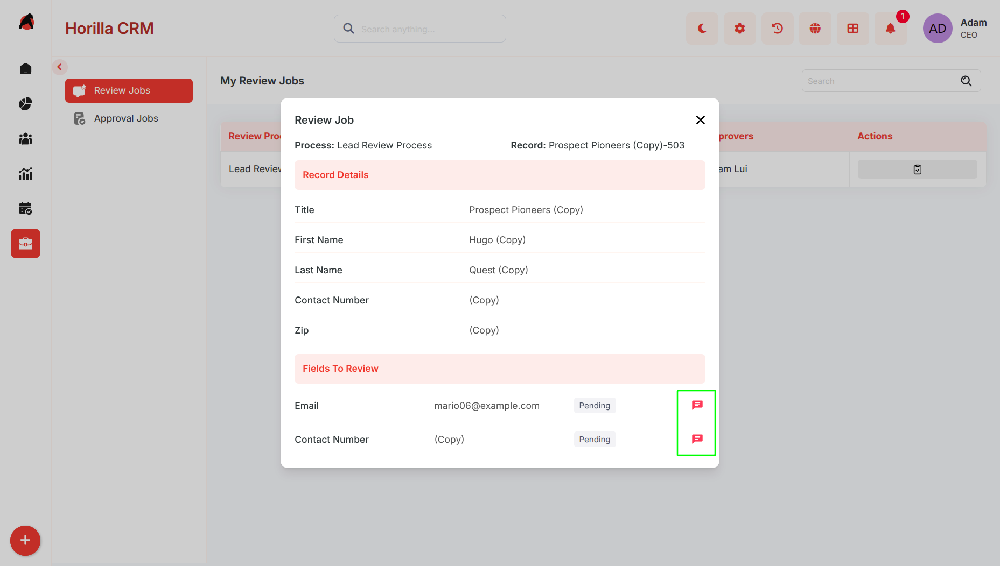

# **Complete Guide to Review Process – Twixio CRM**

## **Overview**

Review Process defines field-level approval workflows for module records. Records matching the configured criteria are held from the list view until the assigned approver approves the required fields.

## **Navigation**

**Settings → Process Builder → Review Processes**

## **Review Process List**

Displays all created review processes with Title, Module, Is Active status, and Edit/Delete actions.

## **Create Review Process**

Click **New** to open the creation form.

### **Fields**

**Title** Name of the review process.

**Module** The module this process applies to (e.g. Lead).

**Fields to Review** Fields that require approval (e.g. Email, Contact Number).

**Entry Criteria** *(optional)* Conditions to filter which records enter the process. If empty, the process applies to all records in the module.

**Notify on Resubmission** Notifies the approver when the record owner resubmits.

**Notify on Approval** Notifies the record owner on approval.

**Notify on Rejection** Notifies the record owner on rejection.

**Is Active** Enables or disables the process.

## **Process Detail View**

Click the process title to open its detail view. Displays Entry Criteria, notification settings, and Fields to Review. Review rules are listed below.

Available actions: **Add Rule**, **Edit Process**

## **Review Rules**

Rules assign approvers to records within a process. Multiple rules can be added to a single process.

Click **Add Rule** from the detail view.

### **Fields**

Select **Approver Type** and select **User** or **Role** based on the approver type.

Add optional **Condition** which Defines which records this rule applies to,If left empty, the rule applies to all records entering the process. Multiple conditions can be added using **\+ Add More**.

## **Review Jobs**

When a record satisfies the entry criteria of a review process and matches a rule condition, it is added to the assigned approver's review queue.

**Navigation:** Review Jobs → My Review Jobs

Displays Review Process, Record, Status, and Approver.

To review a record, click the action icon to open the Review Job dialog. It shows Record Details and Fields to Review. Click the comment icon next to a field, add an optional comment, then click **Approve** or **Reject**.

## **Approval, Rejection, and Resubmission**

### **Approved**

When all reviewed fields are approved, the record becomes visible in the module's main list view (e.g. Leads list). The record owner is notified if Notify on Approval is enabled.

### **Rejected**

The record does not appear in the list view. The record owner is notified if Notify on Rejection is enabled. The owner can correct the data and resubmit the record for review.

### **Resubmission**

After the owner updates and resubmits the record, it re-enters the review queue with a Pending status. The approver is notified if Notify on Resubmission is enabled.

## **Expected Behavior**

* Users can create review processes and associate them with a module.  
* Entry criteria control which records enter the process; if no criteria are set, all records are included.  
* Multiple rules can be configured per process, each with its own conditions and approvers.  
* Records matching a process appear in the assigned approver's My Review Jobs queue.  
* Approvers review each configured field individually and approve or reject with an optional comment.  
* Rejected records remain hidden from the list view until resubmitted and approved.  
* A record is visible in the list view only after all required fields are approved.  
* Notifications are sent based on the toggle settings configured in the review process.
