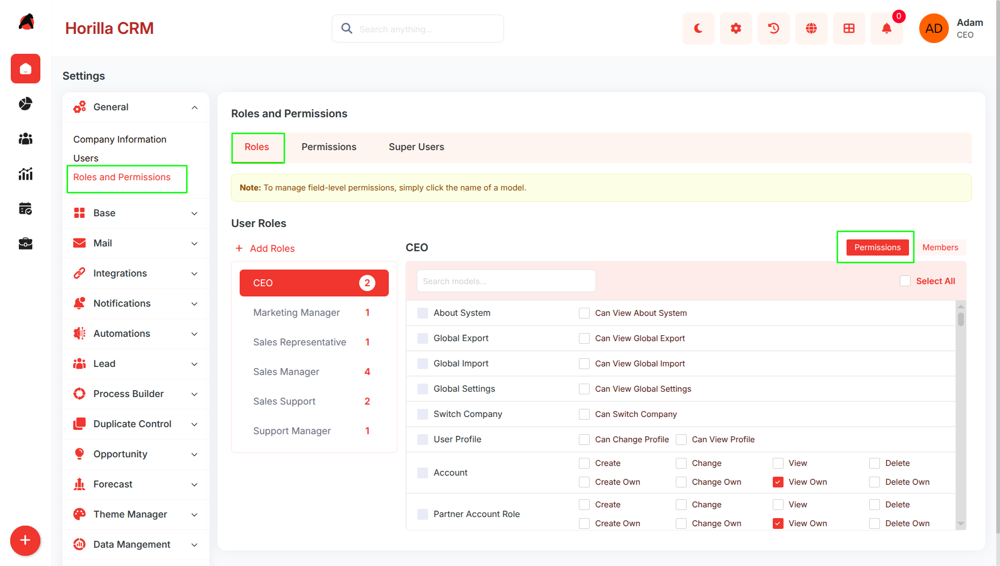
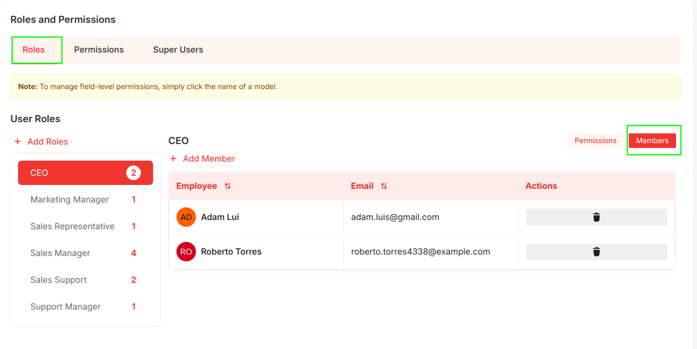
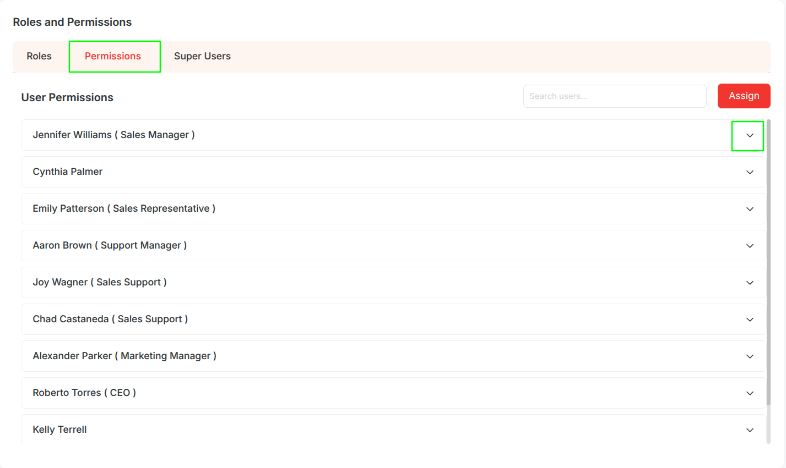
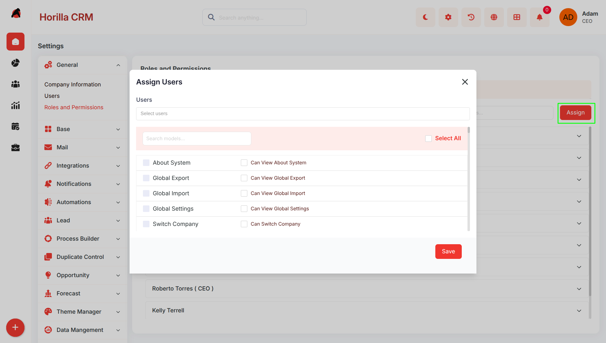
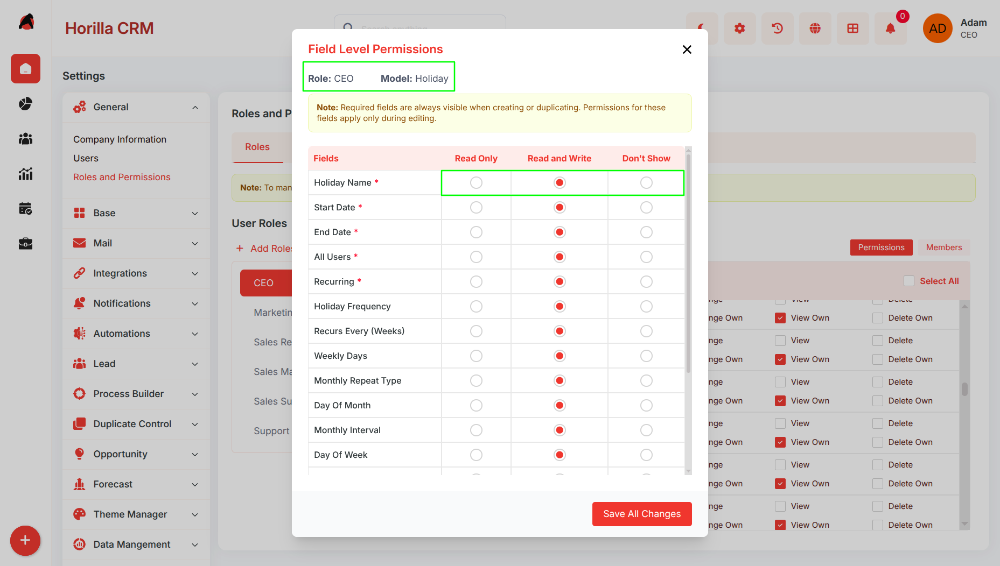
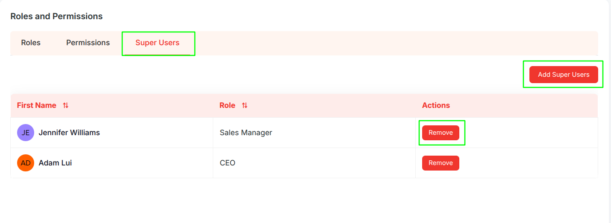

# **Roles and Permissions – Functional Guide**

## **Introduction**

The Twixio CRM Roles and Permissions Module enables administrators to manage organizational roles, assign permissions to users and roles, and maintain system access control. This module supports role-based permissions, individual user permission assignments, field-level access control, and dedicated Super User management to ensure organizational security and continuity.

## **Key Features and Functionalities**

### **2.1 Roles Overview**

**Purpose:** Manage all organizational roles and assign permissions to roles.

**Access:** Settings → Roles and Permissions → Role tab

**Key Features:**

* View all roles with member count  
* Assign permissions to roles using checkboxes (Create, Edit, Delete, View, View Own, Import)  
* Use "Select All" to assign all permissions at once  
* Click "Add Roles \+" to create new roles

### **2.2 Role Members Management**

**Purpose:** Manage users within a role.

**Access:** Role tab → Members button

**Key Features:**

* View all members in the selected role  
* "+ Add Member" button to add users to the role  
* Delete icon to remove members from the role

### **2.3 Permissions Overview**

**Purpose:** Assign permissions to individual users.

**Access:** Settings → Roles and Permissions → Permissions tab

**Key Features:**

* View all users with their roles  
* Search bar to find users quickly  
* Click on user to expand and configure individual permissions  
* Same permission options as roles (Create, Edit, Delete, View, View Own, Import)

### **2.4 Bulk Permission Assignment**

**Purpose:** Assign permissions to multiple users simultaneously.

**Access:** Permissions tab → Assign button

**Key Features:**

* Select multiple users using the dropdown  
* Configure permissions for selected users  
* Click "Save" to apply permissions to all selected users at once

### **2.5 Field Level Permissions**

**Purpose:**  
 Control visibility and edit access for individual fields within CRM forms and detail views.

### **Access**

* **Roles**  
  * Settings → Roles and Permissions → Role tab  
  * Click a model name in the permission panel  
* **Users**  
  * Settings → Roles and Permissions → Permissions tab  
  * Expand a user  
  * Click a model name in the permission panel

### **Permission Types**

* **Read and Write**  
  * Field is visible and editable  
* **Read Only**  
  * Field is visible but cannot be edited  
* **Don’t Show**  
  * Field is completely hidden

### **Field Permission Modal**

The modal includes:

* Context header showing:  
  * Role, User, or Bulk User mode  
  * Model name  
* Field list with:  
  * Field names  
  * Permission options:  
    * Read Only  
    * Read and Write  
    * Don’t Show  
* Save All Changes button

Required fields are always visible during record creation and duplication.

### **Permission Priority**

Permissions are applied in the following order:

1. User-specific permission  
2. Role permission  
3. Model default permission  
4. Read and Write (fallback default)

### **Form Behavior**

* Hidden fields are removed from the form  
* Readonly fields are visible but locked  
* Required fields remain visible during create and duplicate actions

### **Bulk Assignment**

* Multiple users can be selected from the Permissions tab  
* The same field permissions can be applied to all selected users at once

### **Superuser Access**

* Superusers bypass all field level restrictions  
* All fields remain visible and editable

### **2.6 Super Users Management**

**Purpose:** Manage and control administrator accounts.

**Access:** Settings → Roles and Permissions → Super Users tab

**Key Features:**

* View all Super Users with their roles  
* Can add additional users as superuser  
* Remove button to remove that user superuser status   
* Constraint: At least one Super User must exist  
* Last Super User's remove button is disabled to prevent removal
