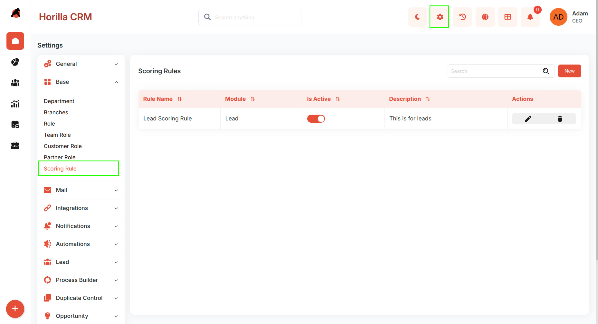
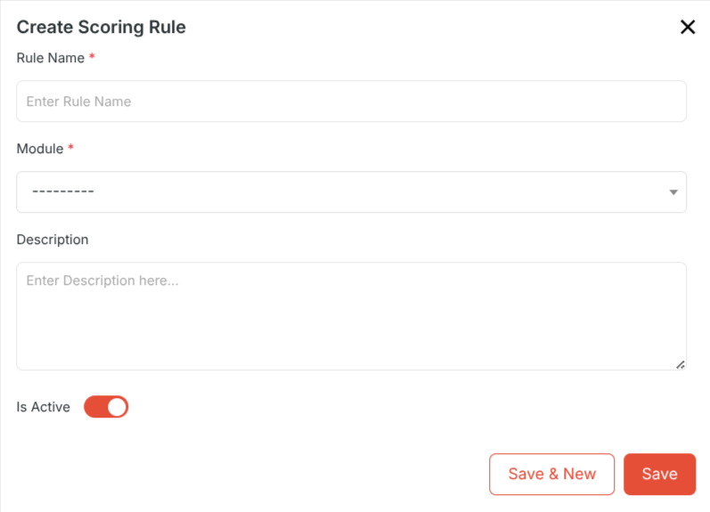
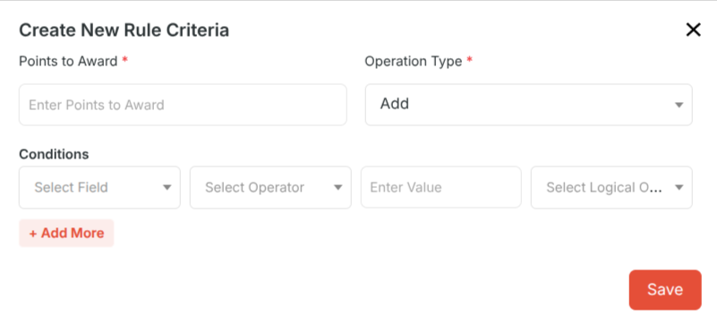
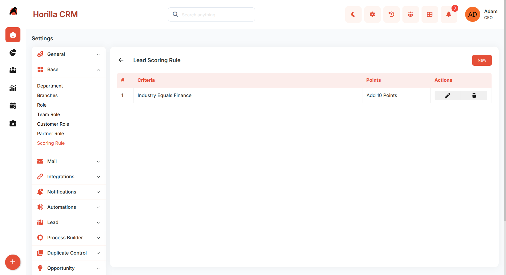

# **Scoring Rules – Complete Functional Guide**

## **Introduction**

The **Scoring Rules** module in Twixio CRM allows organizations to assign weighted points to records in **Leads** and **Opportunities**. By applying rule-based criteria, CRM users can prioritize high-quality leads and focus on opportunities most likely to close. This ensures that sales teams are guided by objective scoring systems aligned with business strategies.

Scoring rules are highly customizable, supporting multiple conditions, logical operators, and both additive and subtractive scoring. This makes them essential for organizations aiming to streamline lead qualification and opportunity management.

## **Key Features and Functionalities**

### **Accessing Scoring Rules**

Navigate to: **Settings → Base → Scoring Rules**  
 Here, administrators can view, create, and manage scoring rules across modules.

### **1\. Scoring Rules List View**

Displays all created scoring rules in a structured table.

**Columns:**

* Rule Name

* Module (Lead/Opportunity)

* Is Active

* Description

* Actions

**Actions Available:**

* **Edit** an existing scoring rule.

* **Delete** a scoring rule.

* **Activate/Deactivate** a rule via toggle.

* **Search and Filter** options allow quick access to rules.

### **2\. Create New Scoring Rule**

Click **New** to open the scoring rule creation form.

**Scoring Rule Form Fields:**

* **Rule Name**: Enter the unique rule name.

* **Module**: Select the module (**Lead** or **Opportunity**).

* **Description**: Provide a meaningful description.

* **Is Active**: Toggle to activate or deactivate the rule.

After entering details → click **Save**.

### **3\. Add Rule Criteria**

Once a scoring rule is created, administrators can define criteria that assign points to records.

Click on the rule to access **Rule Detail View**, then click **New** to add criteria.

**Rule Criteria Form Fields:**

* **Points to Award**: Enter numeric points.

* **Operation Type**: Select **Add** or **Subtract** points.

* **Conditions**:

  * **Field**: Select a module field.

  * **Operator**: Choose a comparison operator (e.g., Equals, Contains, Greater Than).

  * **Value**: Enter the matching value.

  * **Logical Operator**: (Optional) Add AND/OR to combine multiple conditions.

Admins can add multiple conditions by clicking **\+ Add More**.  
 After configuring conditions → click **Save**.

### **4\. Scoring Rule Detail View**

Clicking on a scoring rule opens a detailed view with structured sections:

* **Rule Information**: Rule name, module, status, and description.

* **Criteria List**: Displays all defined criteria with fields, operators, values, and scoring action.

* **Actions**:

  * Edit criteria .

  * Delete criteria .

## **Benefits**

* **Automated Lead Qualification**: Assign points to leads automatically based on business-defined logic.

* **Opportunity Prioritization**: Highlight opportunities most likely to close.

* **Customizable Rules**: Flexible field conditions, operators, and scoring logic.

* **Improved Sales Efficiency**: Focus sales efforts on high-potential records.

* **Data-Driven Decisions**: Rank and filter leads/opportunities objectively.

