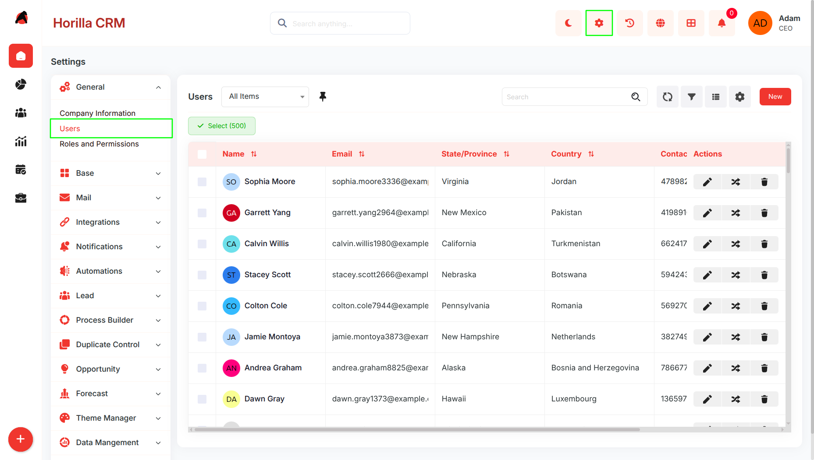
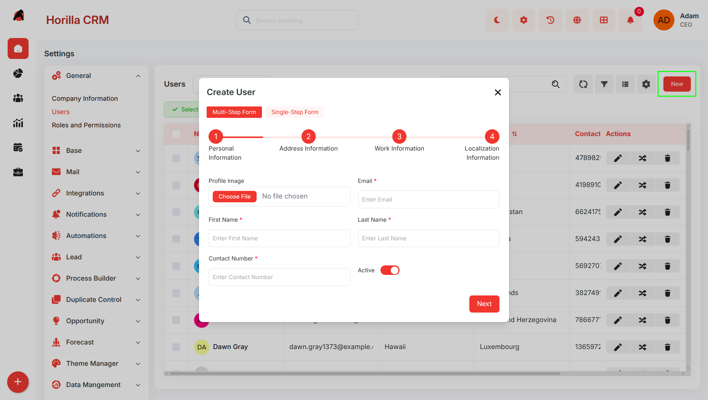
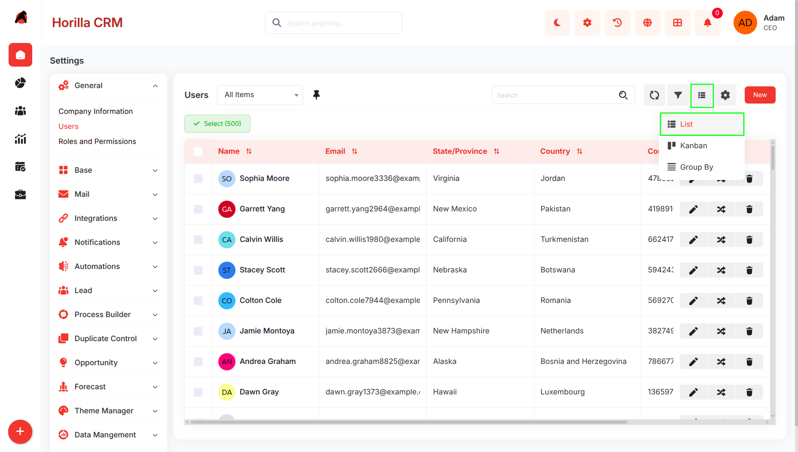
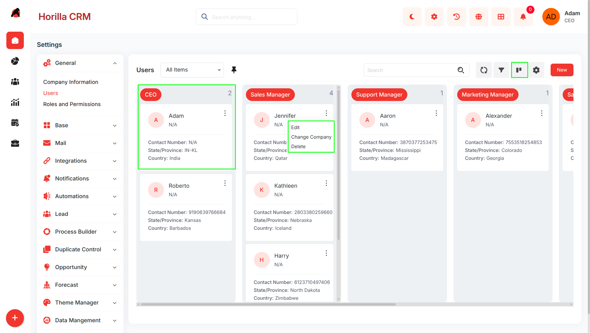
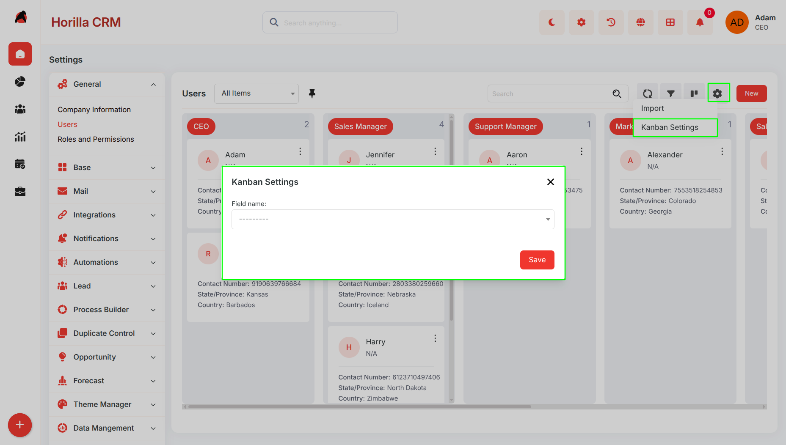
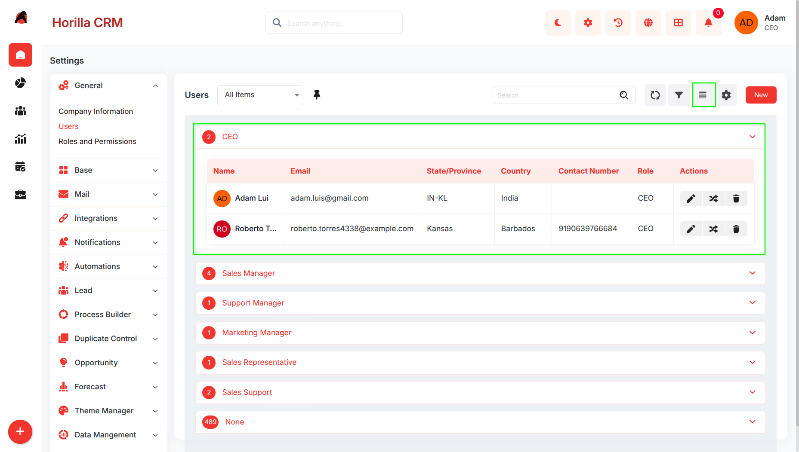
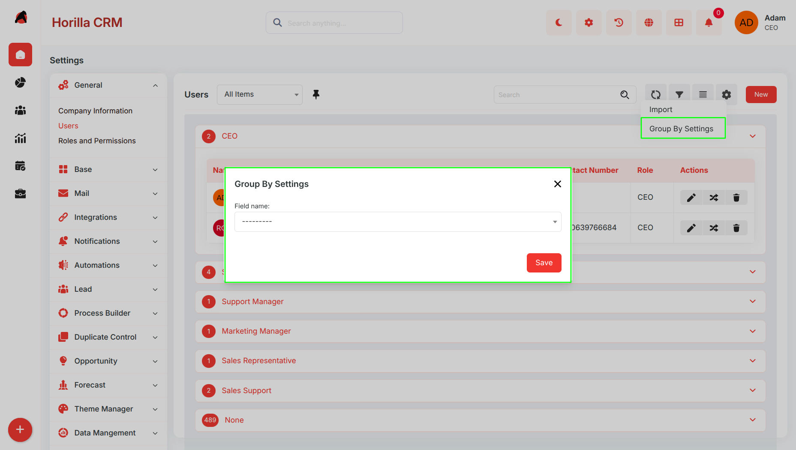
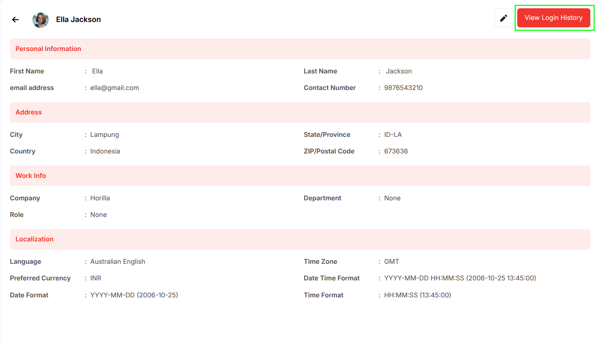
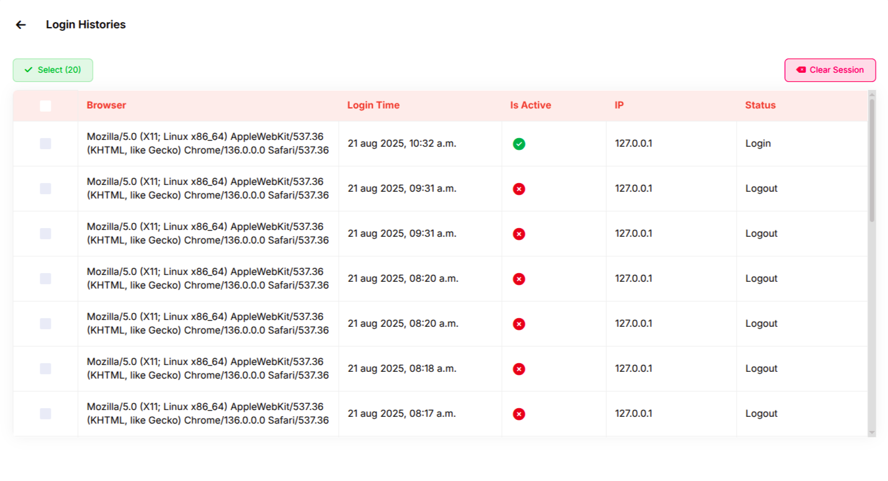

# **Twixio CRM User Management – Functional Guide**

## **Introduction**

The User Management Module in Twixio CRM is designed to streamline the administration of system users within an organization. It provides a centralized interface to manage user accounts, monitor access, and maintain security standards.

With the latest enhancements, the module now includes multiple data visualization options such as **List View, Kanban View, and Group By View**, enabling users to interact with data more efficiently based on their workflow needs.

##  **Key Features and Functionalities**

### **Users Overview** 

**Purpose:** Provide a centralized dashboard to view and manage all users.

**Navigation:** Settings → Users

**Features:**

* Displays user details such as Name, Email, Role, Contact Number, Country, and State/Province  
* Search bar for quick filtering  
* Bulk selection with multi-select checkboxes  
* Action options (Edit, Delete) for each user

### **User Creation Workflow**

**Purpose:** Enable smooth onboarding of new users through a guided setup.

* New users are added via the **“New” button** on the Users page.

* A **multi-step wizard** streamlines the process, covering **personal, address, work, and localization details**.

* Navigation controls allow moving between steps, and validation ensures data accuracy.

* On completion, clicking **Save** creates and activates the user account.  
    

### **View Modes** 

The User Management module now supports multiple view modes for better data visualization and usability.

#### **Available Views:**

* **List View (Default)**  
* **Kanban View**  
* **Group By View**

Users can switch between views using the **View Selector icon** available in the top-right corner of the Users page.

### **List View (Default)**

**Purpose:**  
 Display users in a structured tabular format.

**Features:**

* Default view when opening the Users module  
* Displays users in rows and columns  
* Supports sorting and quick scanning  
* Includes action buttons for each record

### **Kanban View**

**Purpose:**  
 Provide a visual, card-based representation of users.

**Features:**

* Users are displayed as cards  
* Cards grouped by a selected field (e.g., Role, Department)  
* Each card shows key details:  
  * Name  
  * Role  
  * Contact info  
* Supports drag-and-drop interaction (if enabled)

### **Kanban Settings**

**Purpose:**  
 Customize how data is grouped in Kanban View.

**Access:**

* Click the **Settings icon** in the view toolbar  
* Select **Kanban Settings**

**Configuration:**

* Select the field used for grouping (e.g., Role, Department)

### **Group By View**

**Purpose:**  
 Organize users into expandable grouped sections.

**Features:**

* Users grouped based on selected criteria  
* Each group can be expanded or collapsed  
* Displays count of users in each group  
* Maintains structured list format within groups

### **Group By Settings**

**Purpose:**  
 Define grouping logic for Group By View.

**Access:**

* Click the **Settings (⚙️) icon**  
* Select **Group By Settings**

**Configuration:**

* Choose a field to group users (e.g., Role, Department)

### **User Profile Management**

**Purpose:** Provide detailed viewing and editing of individual user profiles.

* Accessing the detailed view is possible by clicking a user's name from either the list or Kanban view.  
* Profiles include **personal, address, work, and localization details**.

* Information is organized into clear sections for easy access.

### **Login History Monitoring**

**Purpose:** Track and review user login activities to enhance **security and compliance**.

* Available in user profile under **“View Login History”**.

* Displays:

  * **Browser & OS Information**

  * **Login Timestamp**

  * **Active/Inactive Status** (green/red indicators)

  * **IP Address**

  * **Session Status** (Login / Logout events)

