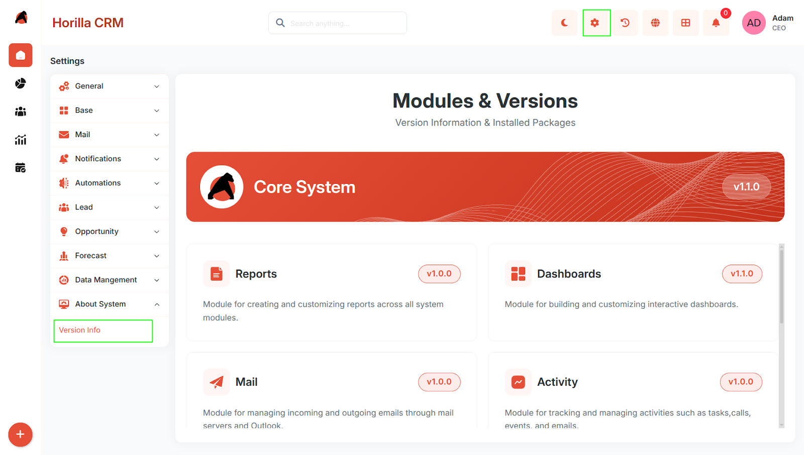
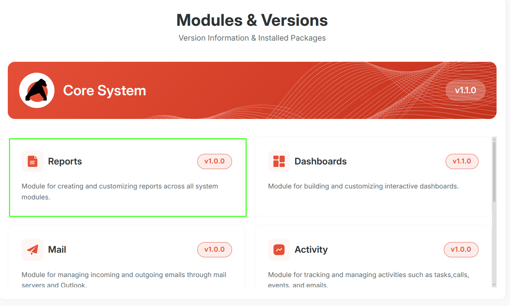
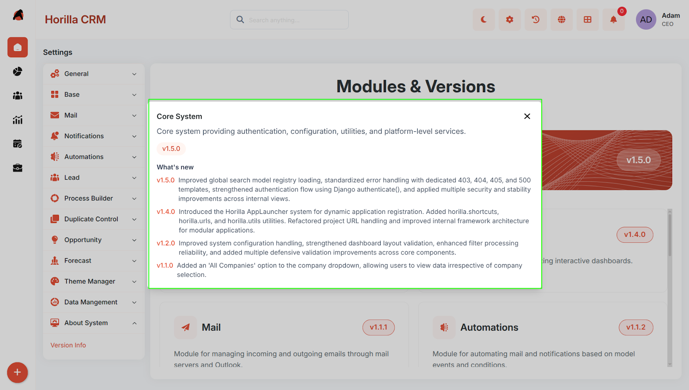

# **Twixio CRM Version Info – Functional Guide**

## **Overview**

The **Version Info** section allows users to view the current version details of the **Core System** and installed modules. It also provides release information for both the latest and previous versions.

This helps users understand the changes introduced in each release, including new features, improvements, and updates.

## **Navigation**

**Settings → About System → Version Info**

## **Functionality**

### **Version Info Page**

The **Version Info** page displays:

* **Core System version card**  
* **Installed module version cards**  
* **Version number** for each item  
* **Short description** of the system/module

### **View Version Details**

Users can click on a version card to open the **Version Details** popup.

The popup displays:

* Name of the system/module  
* Current version  
* Description  
* Version-wise update history

### **Version History**

The **Version Details** popup shows:

* **Current version updates**  
* **Previous version updates**

This allows users to review changes introduced across multiple versions.

## **Purpose**

The **Version Info** section helps users to:

* Identify the currently installed version  
* Review newly added features  
* Understand improvements and updates  
* Check previous version changes

## **Expected Behavior**

* The **Version Info** page should list available version cards.  
* Clicking a card should open detailed version information.  
* Users should be able to understand what has changed in the current and earlier versions.

