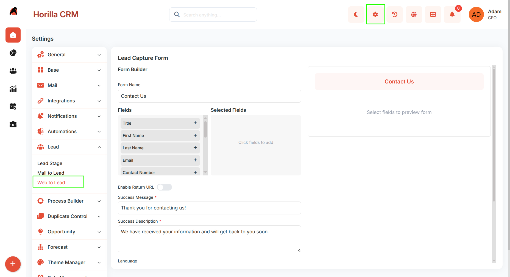
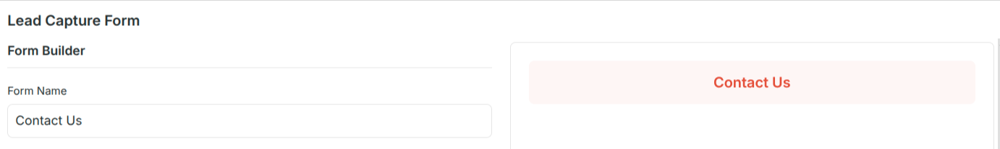
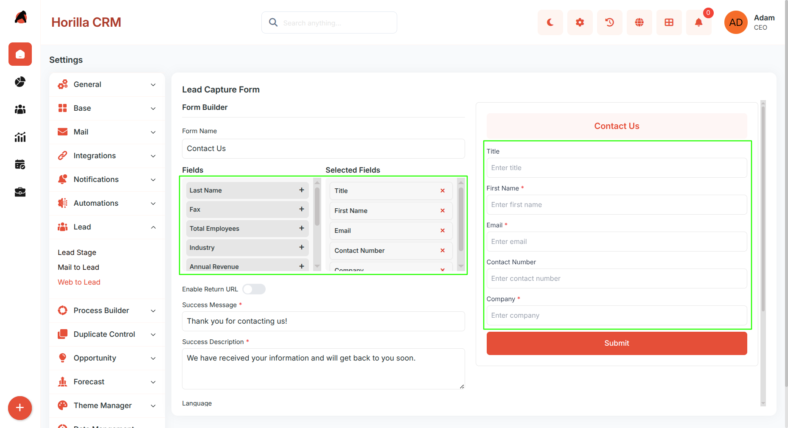
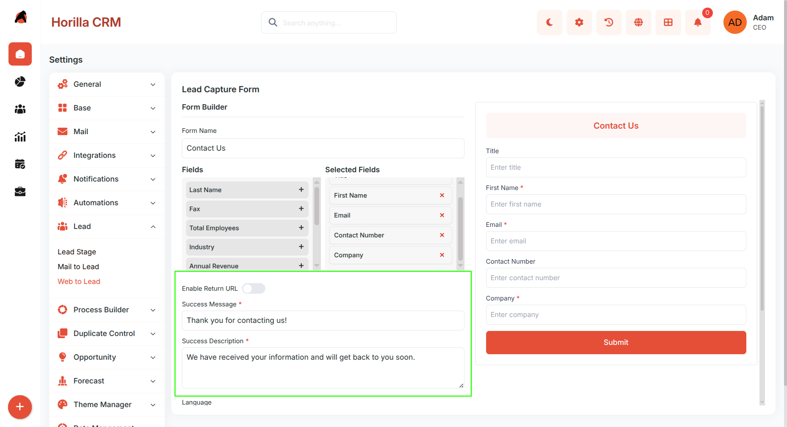
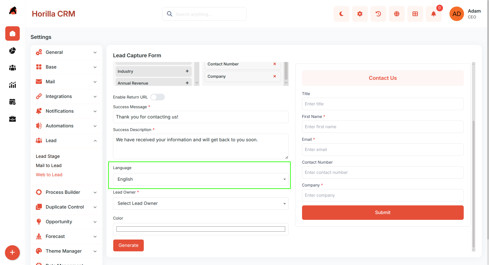
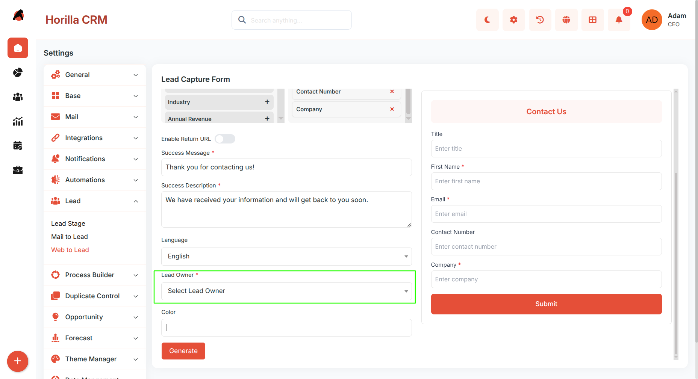
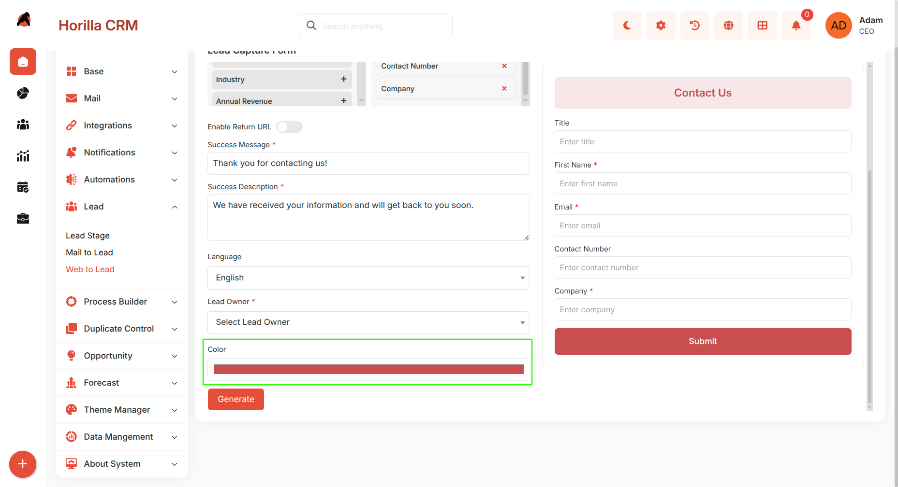
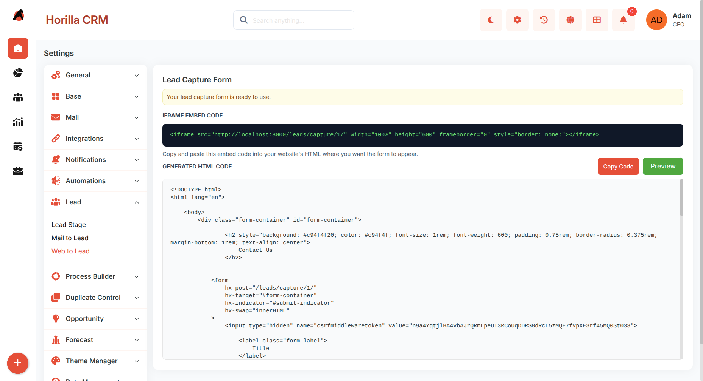
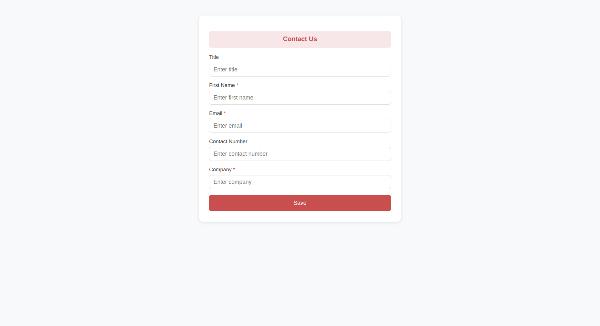

# **Web to Lead — Functional Guide**

1. ## **Introduction**

The Web to Lead feature in Twixio CRM lets you capture leads directly from any external website. You can create a form inside the CRM, embed it on your website, and each submission automatically creates a Lead record — no login required.

2. ## **Access Web to Lead**

   Go to **Settings → Web to Lead** to open the form builder.  
    
   

3. ## **Configure the Form**

   ### **Form Heading**

* Enter a **Form Name** (shown as the form title)  
  

  ### **Select Fields**

* Click fields from the left panel to add them  
* Remove fields using the remove icon  
* The preview updates instantly  
  **Common fields:**  
   First Name, Last Name, Email, Phone,Company Name 

  

	

### **After Submission**

  

Choose what happens after form submission:

* **Success Message** → Show a custom message on the same page  
* **Return URL** → Redirect to another page (like a thank-you page)

  ### **Language**

	

Choose the form language:

* English  
* Arabic  
* German  
* French

  ### **Lead Owner**

	

* Select a user  
* All captured leads will be assigned to this user

 **Form Color**

* Choose a **Header Color** to match your brand 

  

### **Save**

* Click **Generate to** apply the configuration

4. ## **Embed the Form**

   After saving, a public URL is generated:  
   https://yourdomain.com/leads/capture/\<form\_id\>/  
   You can:  
* Share the link directly  
* Embed it using an `<iframe>` on your website

## **How Lead Capture Works**

When a visitor submits the form:

* A new Lead is created in Twixio CRM  
* Lead Source → automatically set to **Website**  
* Lead Status → set to the first active pipeline stage  
* Lead Owner → assigned based on form settings  
* User sees success message or gets redirected

## **Additional Recommendations**

* Keep the form simple; too many fields can reduce submissions  
* Use clear labels and required fields only when necessary  
* Match form design (colors, wording) with your website branding  
* Test the form after embedding to ensure proper lead creation  
* Regularly review captured leads to maintain data quality

