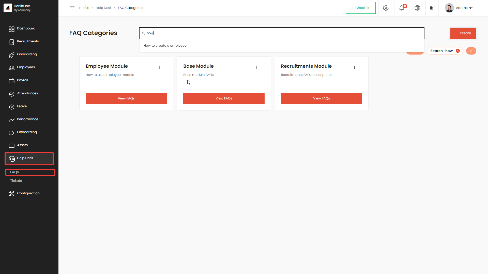
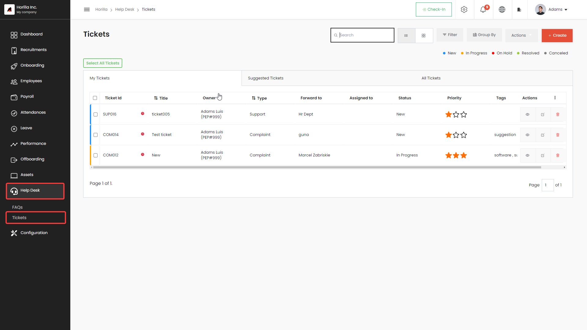
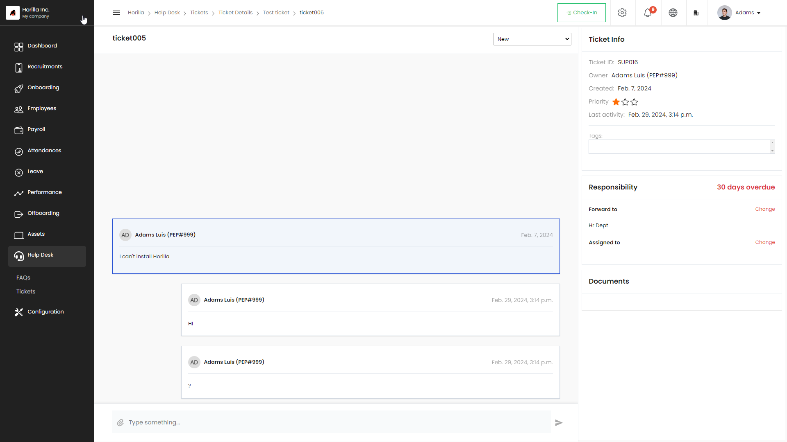

# Help Desk
The Twixio HRMS’s [helpdesk module](https://www.twixio.com/features/helpdesk/) functions as a robust support and communication hub within the system, providing users with access to comprehensive information for each inquiry. This facilitates prompt actions and effective issue resolutions. The module empowers users to create organized Helpdesk FAQs categorized by modules, thereby streamlining the process of addressing specific queries within each section. Additionally, the Helpdesk module introduces the capability to raise various types of tickets, encompassing suggestions, complaints, and anonymous submissions.

## FAQs
Twixio Help Desk provides detailed information for each question to prompt an action within the Twixio HRM system. Users can create Helpdesk FAQs by module, addressing doubts within each module using the Twixio Helpdesk to efficiently resolve employee inquiries.

## Tickets
Twixio Help Desk offers employees the ability to create various types of tickets, including suggestions, complaints, and anonymous submissions. This feature enhances the versatil

