# **Offboarding**

The [offboarding](https://www.twixio.com/features/offboarding/) is the process of managing an employee’s departure from a company. It involves various tasks and procedures aimed at ensuring a smooth transition for both the departing employee and the organization. In the context of HR software, offboarding features facilitate and streamline these tasks.

Twixio helps organizations manage departures more effectively, minimize disruptions, and protect the company’s interests while also ensuring a positive experience for departing employees.
<!--

   
    <iframe   iframe width="1128" height="634" src="https://www.youtube.com/embed/YaSJ08WAhOI" title="How to Manage Employee Offboarding in Twixio HRMS | Free HR Software | Twixio Offboarding Software" frameborder="0" allow="accelerometer; autoplay; clipboard-write; encrypted-media; gyroscope; picture-in-picture; web-share" referrerpolicy="strict-origin-when-cross-origin" allowfullscreen></iframe>

-->

## **Exit Process View**

In the Exit process view, Twixio organizes employees based on their offboarding stage and lists tasks required to be completed during the process giving an easy and effective visualization. Managers can track each employee’s progress and ensure tasks are completed on time. Once the employee has completed the offboarding process, Twixio automatically blocks the employee’s credentials.

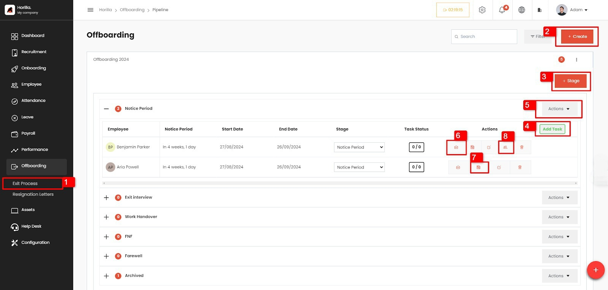

To get Exit process view

- Open the ‘Offboarding’ tab: Navigate to the designated “Offboarding” tab within the Twixio sidebar, providing a central hub for all offboarding-related activities.
- Access “Exit Process”: Within the menu options presented, locate and select the “Exist Process” _(1 from image.1)_ feature, guiding users to the Offboarding view.

- **Offboarding Create Button**

The “Offboarding Create” button on the view allows the HR manager to initiate a new offboarding process. This feature enables HR to view and manage all the details of an offboarding, including the stages and employees involved. By using this button, HR can customize the offboarding process to meet organizational needs, ensuring that every step is accounted for. Additionally, it centralizes all relevant information, making it easier to track the progress of offboarding activities and maintain a streamlined process.

- To create a new offboarding process, click on the create button _(2 from image.1)_
  - Fill out the form, the fields are
    - **Title**: Title of the Offboarding process.
    - **Description**: Description of the offboarding process.
    - **Managers**: Managers for the Offboarding process.
    - **Status**: Status of the Offboarding process.
  - To edit and delete the offboarding process click on the 3 dots under the “Create” button

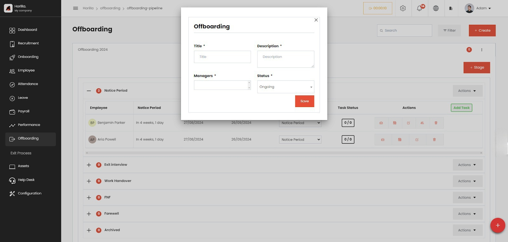

- **Stage Create Button**  
  The “Stage Create” button _(3 from image 1\)_ on the view (marked as 1 on the image) allows the HR manager to create new stages for managing the offboarding process. HR can define each stage and assign a stage manager, customizing the process to their needs. This feature simplifies employee management by enabling tailored organization of stages. Additionally, it centralizes all stages and associated employees in one place, making it easy to track progress.
  - To create a new stage, click on the “Stage” button _(3 from image 1\)_ .
  - Fill out the form, the fields are:
    - **Title**: Title of the stage.
    - **Type**: Type of the stage. Stage types include,
      - Notice period
      - FnF settlement (Full and Final settlement)
      - Other
      - Interview
      - Work Handover
      - Archived
    - **Managers**: Managers for the stage.

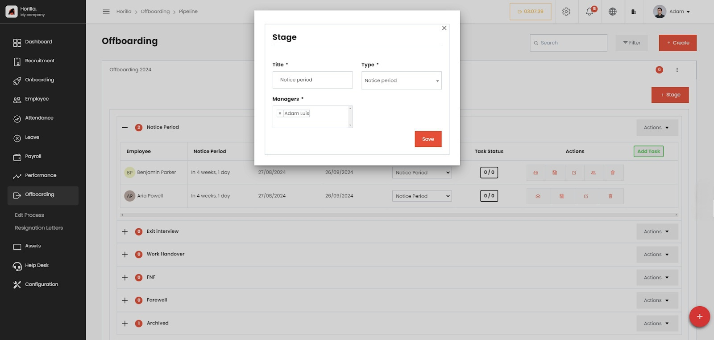

- **Task Create Button**

The offboarding task create button _(4 from image.1)_ is placed on each stage, allowing HR to add new tasks to every stage. They can also specify which employees should follow the task. This ensures that tasks are properly assigned and visible within the stage, monitors the status of the tasks, and updates them according to progress. Twixio centralizes all offboarding tasks, ensuring nothing falls through the cracks. It streamlines the process, preventing delays or missed steps.

- To create new task click on the add task button _(4 from image 1\)_
  - Fill out the form, the fields are:
    - **Title**: Title of the task.
    - **Managers**: Managers for the task.
    - **Stage**: Stage of the task
    - **Task to**: Assign ofboarding employees
  - To edit or delete the task, click on the 3 dots near the task heading on each stages

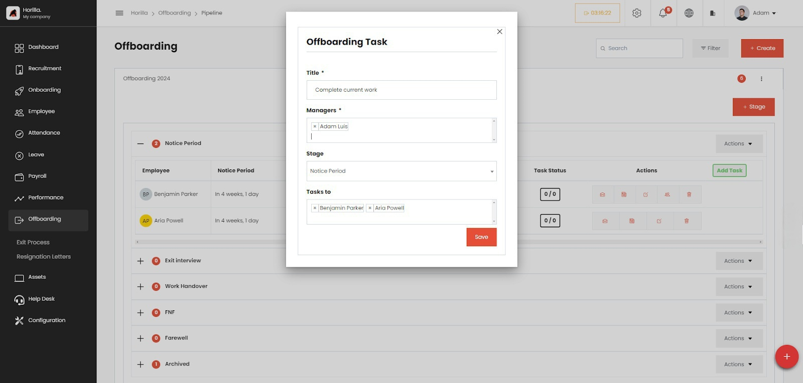

- **“Add Employee” option in ‘Actions’ Dropdown button**

HR can add employees when they are leaving the company, ensuring that they go through all stages and tasks of the offboarding process. This simplifies all offboarding procedures, as the HR person only needs to add the employee in the offboarding system, and Twixio will facilitate a seamless and effective monitoring of the exit procedures.

To access the ‘Add Employee’ option, open the ‘Actions’ dropdown menu _(5 from image 1\)_. There, you can find the ‘Add Employee’ option. Clicking on this option will open a form for adding the employee to the offboarding stage.

- To add employees to an Offboarding stage click on the actions _(5 from image 1\)_ menu.
  - Click on “Add Employee”.
  - Fill out the form, The fields are:
    - **Employee**: Employee to be added to the stage
    - **Stage**: The stage to add the employee
    - **Notice period starts**: Starting date of the notice period.
    - **Notice period ends**: Ending date of notice period. (This field changes its value when changing the start date according to the default notice period or notice period provided in the employee contract)

**Note**: Default notice period value can be set from **Settings** \> **General setting**s \> **Notice period** \> **default notice period**

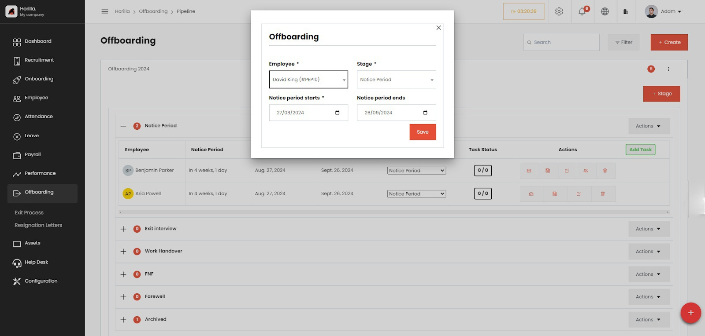

- **Send Mail**  
  By clicking on ‘Send Mail’ _(6 from image.1)_, you can send an email to the employee to officially inform them about the offboarding details. Twixio assists you in creating the email using predefined mail templates. After submitting the mail creation form, Twixio automatically sends the email to the employee.
  - To send mail to an Offboarding Employee click on the ‘Send Mail’ _(6 from image 1\)_ Button.
  - Fill out the form, the fields include:
    - **Also send to** (optional): send the mail to this email also
    - **Subject**: Subject of the mail.
    - **Template** (optional): The mail template to send.
    - **Message Body**: Body of the mail, if not chose any template.
    - **Template as attachment** (optional): sending the template as a pdf attachment.
    - **Other attachments** (optional): to add any other attachments

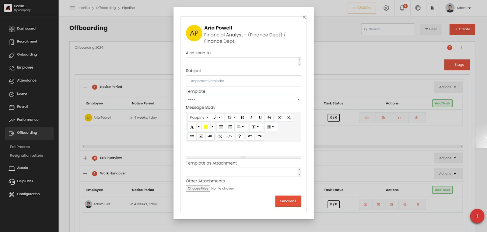

- **Add Note**

By clicking on Note’ _(7 from image.1)_, you can pass messages to the employee. Twixio will notify the employee about the note

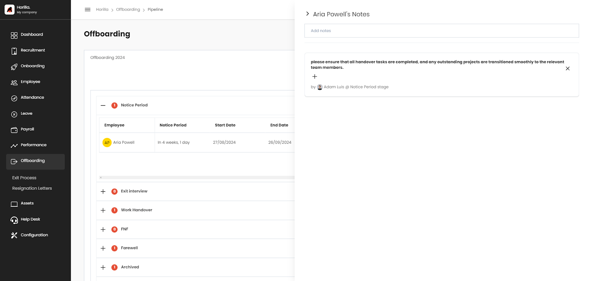

- **Replace the employee’s authorities**

If the employee holds any authority or role within the company, Twixio will display these details during offboarding. HR can then replace the employee’s role with another employee in the company.

An additional button _(8 from image.1)_ will be visible on that particular employee’s button group. By clicking on it, or when the employee changes to the archive stage, a pop-up form will appear, providing information about the employee’s roles. HR can then select another employee to replace them on that form.

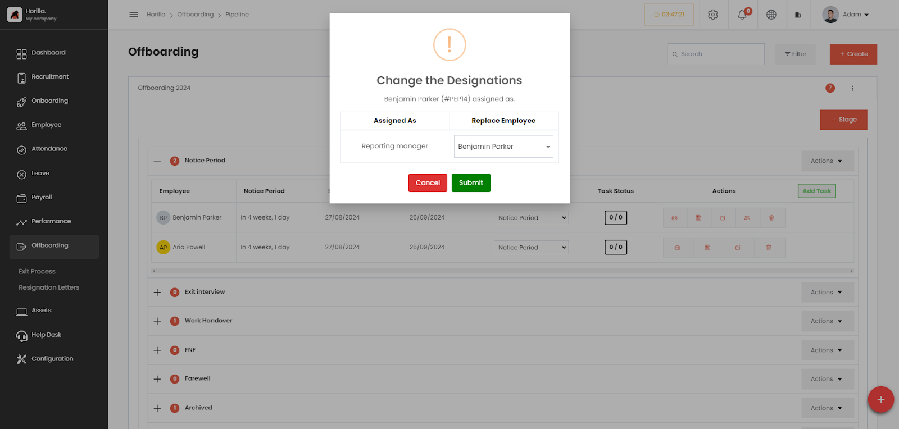

## **Resignation Letters**

To display and manage resignation letters in the sidebar, you need to enable the resignation request feature _( image.7)_ in the settings.

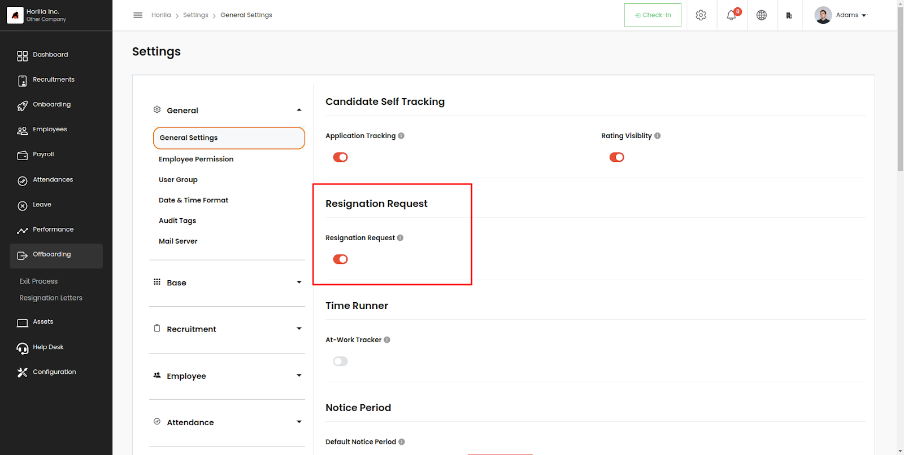

Once enabled, resignation letters will be available under Offboarding, and a ‘Resignation’ tab _(2 from image.8)_ will be added to the profile view of each employee. This allows employees to submit their resignation directly on Twixio by creating a resignation letter.

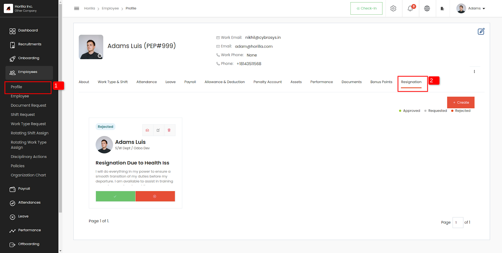

- To create a resignation letter, click on the create button
  - Fill out the form. The fields are:
    - **Employee** (only for admin): The resigning employee.
    - **Title**: Title for the resignation letter.
    - **Description**: Description of the resignation.
    - **Planned to leave on**: notice period start date.
    - **Status** (only for admin): current status of the resignation request.

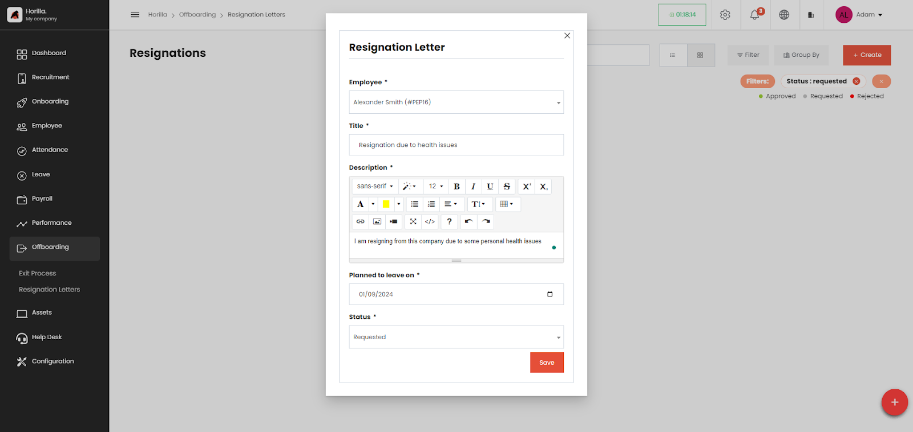

HR personnel can create resignation letters by specifying the employee’s name and the planned last working day. HR can then review and take action on the resignation request by using the ‘Approve’ or ‘Reject’ buttons provided.

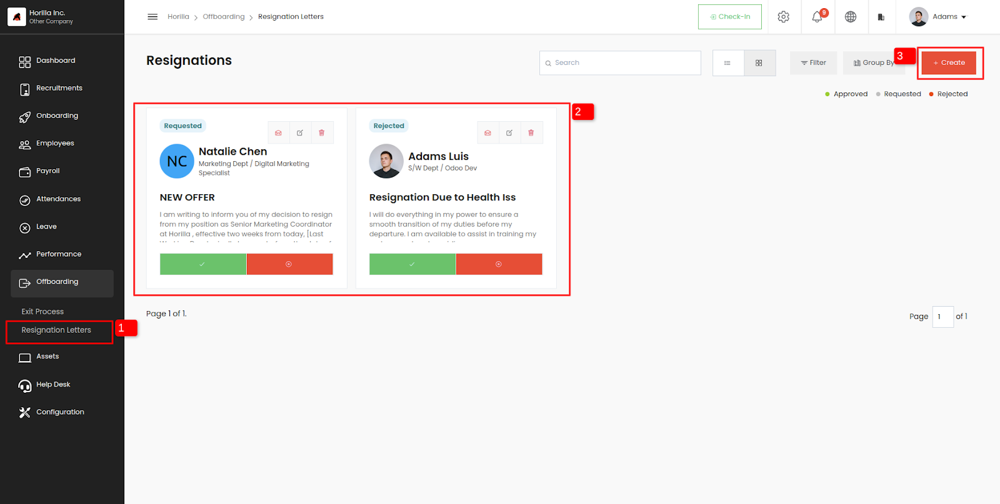

This feature streamlines the resignation process, allowing for easy submission, review, and management of resignation letters directly within Twixio.
