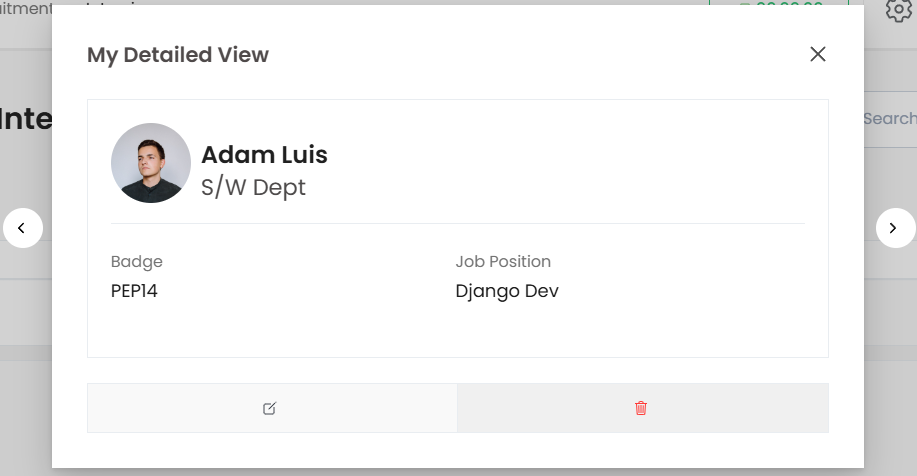

# Twixio Detailed View (HDV)

`TwixioDetailedView` is a Django `DetailView` class that provides a detailed view of an instance with support for navigation, actions, and caching.

## Class Attributes

| Attribute         | Type   | Description                                                                                                                               |
| ----------------- | ------ | ----------------------------------------------------------------------------------------------------------------------------------------- |
| **title**         | `str`  | Title of the view, shown in the template. Default is `"Detailed View"`.                                                                   |
| **template_name** | `str`  | Template used for rendering the view. Default is `"generic/twixio_detailed_view.html"`.                                                  |
| **header**        | `dict` | Dictionary containing `title` and `subtitle` for the view header. Default is `{"title": "Twixio", "subtitle": "Twixio Detailed View"}`. |
| **body**          | `list` | List defining the content of the body section, can be customized with specific content sections.                                          |
| **action_method** | `list` | Custom model method that render actions section for HDV                                                                                   |
| **actions**       | `list` | List of actions available for the view. Each action can include details like name, accessibility, and attributes.                         |
| **ids_key**       | `str`  | Key to retrieve instance IDs from the request's GET parameters. Default is `"instance_ids"`.                                              |

## Usage Example

Here’s how to use `HDV` in Twixio:

```python
from twixio_views.generic.cbv.views import TwixioDetailedView
from employee.models import Employee

class EmployeeDetailedView(TwixioDetailedView):
  """
  EmployeeDetailedView
  """
  model = Employee
  title = "My Detailed View"
  header = {
      "title": "get_full_name",  # model attributes/fields
      "subtitle": "employee_work_info__department_id__department",
      "avatar": "get_avatar",  # model method that returns the full path
  }
  body = [
      ("Badge", "badge_id"),  # cell title and mapping to the model attribute/method
      ("Job Position", "employee_work_info__job_position_id__job_position"),
  ]
  actions = [
      {
          "name": "Edit",
          "icon": "create-outline",  # iconicon support
          "url": "edit_url",  # model method
          "method": "path.to.edit_accessibility",  # method path
          "attrs": "class='oh-btn oh-btn--light-bkg w-100'",
      },
      {
          "name": "Delete",
          "icon": "trash-outline",
          "url": "delete_url",
          "method": "path.to.delete_accessibility",
          "attrs": "class='oh-btn oh-btn--danger-bkg oh-btn--danger-outline w-100'",
      },
  ]
```

### Out put for hdv




## Action Method
Action method in the HDV is used to render custom html section at the bottom of hdv. To do that You need to add a method in model that return the template using `render_template` method from `twixio_views.cbv_methods`

```python
    action_method = "employee_actions"

```

## Custom cell
For additional freedom over the `HDV` cell you can use the custom cell feature by providing 3rd element as boolean in the HDB 
body. So using the mapping method you can map to a method that gives the cell's data.

```python
body = [
  ...
  ("Job Position", "maping_method", True),
  ...
]

```


## Key Features
- **Customizable Headers**
 Allows setting headers with dynamic titles, subtitles, and avatars, which can map to model attributes or methods for personalized display.
 
- **Flexible Body Content**
 The body attribute defines the structure of detailed information, allowing easy mapping to specific model attributes or methods. You can customize each cell, including using model methods to compute or display custom values.

- **Action Support**
 Supports a list of actions, each customizable with icons, URLs, methods, and attributes. Actions are displayed in the view’s action section, enabling tailored interactions with the model instance (e.g., "Edit" or "Delete").

- **Custom Action Methods**
 The action_method feature enables creating custom HTML content at the view's bottom. By specifying a model method that uses render_template, you can add dynamic, instance-specific sections.

- **Custom Cells**
 For enhanced flexibility, you can mark certain cells in the body section as "custom," allowing for more complex data retrieval and rendering by specifying a method to generate the cell content.

- **Caching Support**
 Integrated caching mechanisms improve load times and reduce server load, especially for views with large or frequently accessed data.

- **Instance Identification**
 The ids_key attribute retrieves instance IDs directly from GET parameters, allowing for seamless instance lookups and simplified URL configurations.