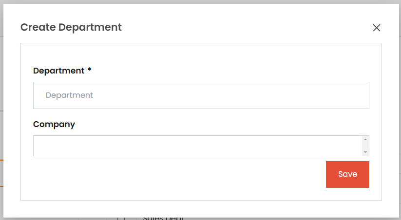

# Twixio Form View (HFV)

`TwixioFormView` is a Django `FormView` class designed to manage and streamline the form submission process with added support for dynamic fields, customized button attributes, and caching.

## Class Attributes

| Attribute                  | Type              | Description                                                                                       |
| -------------------------- | ----------------- | ------------------------------------------------------------------------------------------------- |
| **model**                  | `object`          | Model associated with the form.                                                                   |
| **view_id**                | `str`             | Unique identifier for the view, generated using `get_short_uuid`. Default length is 4 characters. |
| **hx_confirm**             | `str`             | Optional message to confirm before submitting the form.                                           |
| **form_class**             | `forms.ModelForm` | Django ModelForm class to be used for rendering the form.                                         |
| **template_name**          | `str`             | Template used for rendering the view. Default is `"generic/twixio_form.html"`.                   |
| **ids_key**                | `str`             | Key to retrieve instance IDs from the request’s GET parameters. Default is `"instance_ids"`.      |
| **form_disaply_attr**      | `str`             | Field or method on the model to be displayed as the form title.                                   |
| **new_display_title**      | `str`             | Title to display when adding a new record. Default is `"Add New"`.                                |
| **close_button_attrs**     | `str`             | HTML attributes for the close button customization.                                               |
| **submit_button_attrs**    | `str`             | HTML attributes for the submit button customization.                                              |
| **is_dynamic_create_view** | `bool`            | Determines if the form view is a dynamic create view, adding fields dynamically.                  |
| **dynamic_create_fields**  | `list`            | List of fields that can be dynamically created within the form.                                   |


## Usage Example

Here’s how to use `HFV` in Twixio:

```python
class DepartmentCreateForm(TwixioFormView):
    """
    DepartmentCreateForm
    """

    model = Department
    form_class = DepartmentForm
    new_display_title = _trans("Create Department")

    def get_initial(self):
        """
        method where to get/set initials for the form instance
        """
        initial = super().get_initial()
        # initial["department"] = "S/w dept"
        return initial

    def init_form(self, *args, data=..., files=..., instance=None, **kwargs):
        """
        Method wehere form initialized
        """
        # `<int:pk>` urlparams for update
        return super().init_form(
            *args, data=data, files=files, instance=instance, **kwargs
        )

    def form_valid(self, form):
        if form.is_valid():
            form.save()
            messages.success(self.request, "Success")
            # self.HttpResponse() response with attached scripts
            return self.HttpResponse()
        return super().form_valid(form)

```

### Out put for hlv



## Methods

| Method               | Description                                                                                                              |
| -------------------- | ------------------------------------------------------------------------------------------------------------------------ |
| **get_initial**      | Sets initial data for form fields. This method is typically used to prefill form fields with default or predefined data. |
| **init_form**        | Initializes the form with specific data, files, or an instance. Supports URL parameters for updates (e.g., `<int:pk>`).  |
| **form_valid**       | Handles form validation and submission. Saves the form, displays a success message, and returns a custom response.       |
| **get_form**         | Returns an instance of the form to be used in the view. Allows for custom form creation and configuration.               |
| **get_context_data** | Adds custom data to the context dictionary that can be accessed within the template, useful for passing extra data.      |
| **get_success_url**  | Defines the URL to redirect to after the form is successfully processed. Defaults to a success URL if not overridden.    |


### Method Details

1. **`get_initial`**: 
   This method sets initial data for form fields, often used to prefill fields with default values based on specific criteria or user roles. In `TwixioFormView`, `get_initial` can be overridden to provide custom initial values that will display in the form when it loads. 

   **Example**:
   ```python
   def get_initial(self):
       initial = super().get_initial()
       initial["department"] = "Software Development"
       return initial
   ```

2. **`init_form`**:
   The `init_form` method customizes form initialization, particularly useful when handling updates. It initializes the form with given data, files, or an instance, making it easier to populate the form with existing values. This method can also support URL parameters for identifying specific records, such as primary keys for updating records.

   **Example**:
   ```python
   def init_form(self, *args, data={}, files={}, instance=None, initial = {} **kwargs):
       return super().init_form(*args, data=data, files=files, instance=instance, initial = initial, **kwargs)
   ```

3. **`form_valid`**:
   This method handles form submission logic when the form is valid. It can save the form data, show a success message, and return a custom HTTP response. This response may include JavaScript or dynamic elements for updating the frontend interactively. 

   **Example**:
   ```python
   def form_valid(self, form):
       form.save()
       messages.success(self.request, "Form submitted successfully.")
       return self.HttpResponse()
   ```


4. **`get_form`**:
   Returns an instance of the form, enabling custom configurations or field adjustments before it is rendered. In `TwixioFormView`, `get_form` can dynamically modify fields based on request parameters, permissions, or other conditions.

   **Example**:
   ```python
   def get_form(self, form_class=None):
       form = super().get_form(form_class)
       form.fields['name'].widget.attrs.update({'class': 'custom-class'})
       return form
   ```

5. **`get_context_data`**:
   Adds extra data to the template context, allowing additional information to be passed along with the form. Useful for adding variables like form titles, instructions, or other UI elements that need to be accessed in the template.

   **Example**:
   ```python
   def get_context_data(self, **kwargs):
       context = super().get_context_data(**kwargs)
       context['data'] = "Additional Data"
       return context
   ```

6. **`get_success_url`**:
   Specifies the redirect URL after a successful form submission. It returns a URL string and can be customized based on the success criteria or target view, which is helpful for redirecting users to a list view or dashboard upon successful form processing.

   **Example**:
   ```python
   def get_success_url(self):
       return reverse("department_list")
   ```
