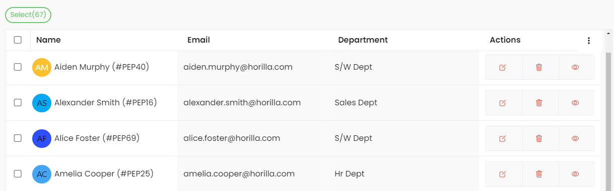

# Twixio List View (HLV)

`TwixioListView` is a class-based view that extends Django's `ListView`. It provides advanced functionalities for managing lists in the Twixio application. This includes filtering, bulk actions, export features, and more.

## Key Attributes

| Attribute                     | Type        | Description                                                                                                                                     |
| ----------------------------- | ----------- | ----------------------------------------------------------------------------------------------------------------------------------------------- |
| **filter_class**              | `FilterSet` | The filter class to be used for filtering queryset.                                                                                             |
| **view_id**                   | `str`       | A unique ID for the view, automatically generated if not provided.                                                                              |
| **export_file_name**          | `str`       | Name of the file to be used for exporting data.                                                                                                 |
| **template_name**             | `str`       | Template used for rendering the view. Default is `"generic/twixio_list.html"`.                                                                 |
| **columns**                   | `list`      | List of columns to display. Each column is a tuple with `("Verbose Name", "model_attribute/field_name", "avatar_mapping")`.                     |
| **search_url**                | `str`       | URL to be used for search/filter functionality.                                                                                                 |
| **header_attrs**              | `dict`      | Additional html attributes to the header columns.                                                                                               |
| **bulk_select_option**        | `bool`      | If `True`, enables bulk selection of records. Default is `True`.                                                                                |
| **actions**                   | `list`      | List of actions available for each row. Each action includes the keys: `action`, `accessibility`, and `attrs`.                                  |
| **action_method**             | `str`       | Custom model method that render actions column for HLV.                                                                                         |
| **options**                   | `list`      | List of options fe available for each row.                                                                                                      |
| **option_method**             | `str`       | Custom model method that render options column for HLV.                                                                                         |
| **row_attrs**                 | `str`       | Attributes to apply to each row element.                                                                                                        |
| **row_status_class**          | `str`       | CSS class to apply based on row status if you need to add class only to the row element.                                                        |
| **row_status_indications**    | `list`      | List of status indicators for rows.                                                                                                             |
| **sortby_key**                | `str`       | QueryDict Key name for sorting. Default is `"sortby"`.                                                                                          |
| **sortby_mapping**            | `list`      | List of mapping with column model_attribute to handle custom sorting.                                                                           |
| **selected_instances_key_id** | `str`       | The key used to identify selected instances element's ID in bulk actions related scripts. Default is `"selectedInstances"`.                     |
| **show_filter_tags**          | `bool`      | If `True`, displays active filter tags in the view. Default is `True`.                                                                          |
| **filter_keys_to_remove**     | `list`      | List of keys to exclude from filter tags.                                                                                                       |
| **records_per_page**          | `int`       | Number of records to display per page. Default is `50`.                                                                                         |
| **export_fields**             | `list`      | List of fields to export when exporting data.                                                                                                   |
| **bulk_update_fields**        | `list`      | List of fields that can be updated in bulk.                                                                                                     |
| **bulk_template**             | `str`       | Template used for rendering the bulk update form. Default is `"generic/bulk_form.html"`.                                                        |
| **toggle_form**               | `Form`      | Form class instance to handle column visibility toggling. Default is `ToggleColumnForm`  instance                                               |
| **visible_column**            | `list`      | List of currently visible columns, after applying toggling.                                                                                     |
| **saved_filters**             | `QueryDict` | QueryDict containing the saved filters applied to the view while reload.                                                                        |
| **bulk_update_accessibility** | `method`    | Method to check if the user has permission to perform bulk updates.                                                                             |
| **get_bulk_form**             | `method`    | Method to generate the form for bulk updates.                                                                                                   |
| **select_all**                | `method`    | Method to return IDs of all records in the queryset for bulk actions.                                                                           |
| **export_data**               | `method`    | Method to export the list view data in the specified format (e.g., Excel).                                                                      |
| **serve_bulk_form**           | `method`    | Method to serve the bulk update form.                                                                                                           |
| **handle_bulk_submission**    | `method`    | Method to handle form submission for bulk updates.                                                                                              |
| **get_queryset**              | `method`    | Method to retrieve the queryset with filters applied.                                                                                           |
| **get_context_data**          | `method`    | Method to pass additional context variables to the template, including columns, actions, options, filters, sorting, pagination, and bulk paths. |

## Methods Overview

- `bulk_update_accessibility`: Checks if the user has permission to perform bulk updates.
- `get_bulk_form`: Generates the bulk update form based on the specified fields.
- `serve_bulk_form`: Serves the bulk update form to the user.
- `handle_bulk_submission`: Handles the bulk update form submission and processes the updates.
- `get_queryset`: Retrieves the queryset and applies filters and sorting.
- `get_context_data`: Passes necessary context variables to the template, including column visibility, filters, sorting, and bulk action paths.
- `select_all`: Returns the IDs of all records in the queryset for bulk selection.
- `export_data`: Exports the data from the visible columns in the current list view.

## Usage Example

Here is an example of how to define a `HLV` with custom columns and actions:

```python

class EmployeeList(TwixioListView):
    """
    EmployeeList HLV
    """
    model = Employee
    filter_class = EmployeeFilter # django_filterset class
    search_url = reverse_lazy("employees-list") # url path to EmployeeList


    columns = [
        ("Name", "get_full_name","get_avatar"),
        ("Email", "email"),
        ("Department", "employee_work_info__department_id__department"),
    ]
    actions = [
        {
            "action": "Edit",
            "icon":"create-outline", # supports ionicons
            "attrs":"""
                class='oh-btn oh-btn--light'
                href="{model_method}"
            """,
            # `model_method` is any method in the model that return the-
            # url path to perform the action for this scenario
            "accessibility": "employee.methods.employee_edit_accessibility", # return True or False
            # only those with the accessibility true will access the actions feature
        },
        {
            "action": "Delete",
            "icon":"trash-outline",
            "attrs":"""
                class='oh-btn oh-btn--light'
            """
        },
        {
            "action": "View",
            "icon":"eye-outline",
            "attrs":"""
                class='oh-btn oh-btn--light'
            """
        },
    ]

```

### Your accessibility method look like 

```python
# employee/methods.py
def employee_edit_accessibility(
    request, instance: object = None, user_perms: PermWrapper = [], *args, **kwargs
) -> bool:
    return request.user.has_perm("employee.change_employee")

```

### Out put for hlv



## Bulk Update
Bulk update functionality is provided through `bulk_update_fields`. Users can select multiple records and update them in bulk. Permissions for bulk updates are controlled through the `bulk_update_accessibility` method.
```python

class EmployeesList(TwixioListView):

  ...

  bulk_update_fields = [
    "employee_work_info__department_id",
    # other fields or any one-to-one related fields
  ]

  # this method already in the parent class
  def bulk_update_accessibility(self) -> bool:
    """
    Accessibility method for bulk update
    """
    return self.request.user.has_perm(
        f"employee.change_employee"
    )


```

Using the above example details, users with the accessibility can bulk update by selecting multple records and can perform bulk update option using the bulk update button comes in the quick selection menu.

## Filtering
The view allows filtering based on a predefined `filter_class`. Filters can be applied via GET parameters or restored from the cache.

## Sorting
Sorting is controlled using the `sortby_key` and `sortby_mapping`, which determine the order in which the data is displayed.

## Exporting Data
Data from the visible columns can be exported to an Excel file. The export filename can be customized using the `export_file_name` attribute.

## Actions
List actions are the sticky right column that are used to perform certain CRUD like actions related to the models.

```python
    # in hlv or child view
    actions = [
            {
                "action": "Edit",
                "icon":"create-outline", # supports ionicons
                "attrs":"""
                    class='oh-btn oh-btn--light'
                    href="{model_method}" 
                """,
                # `model_method` is any method in the model that return the-
                # url path to perform the action
                "accessibility": "path_to.accessibility_method", # return True or False
                # only those with the accessibility true will access the actions feature
            },
    ]

```
You can assign any method in the model inside `attrs` value by adding the method name within braces `{}`

## Action Method
Action method in the HLV is used to render custom html part at the list view action column for each record. To do that You need to add a method in model that return the template using `render_template` method from `twixio_views.cbv_methods`

```python
    # in hlv or child view
    model_name = Employee # assume your model is Employee
    action_method = "employee_actions"

```

Inside `employee/models.py`

```python
from twixio_views.cbv_methods import render_template

class Employee(models.Model):
    ...
    def employee_actions(self):
        return render_template(
            path="cbv/employees_view/employee_actions.html",
            context={"instance": self},
        )
```
Now you can add custom actions inside `"cbv/employees_view/employee_actions.html"` the html

## Options and Option method
Similiarly to the action method and actions options are the same but the main difference is its not sticky one it is the second last column to the actions column

```python
    options: dict = {} # keys -> option, icon, attrs, accessibility
    option_method: str = ""
```


## Key Features

- **Filtering Support**:  
  Filters can be applied via the `filter_class`, and saved filters are cached for later use.

- **Action Accessibility**:  
  Actions can be added to each card, with methods to check whether a user has permission to perform that action.

- **Filter Tag Management**:  
  If `show_filter_tags` is enabled, the view will show tags based on the applied filters, excluding those specified in `filter_keys_to_remove`.

- **Pagination**:  
  The view supports pagination with a default of `50` records per page, adjustable via `records_per_page`.

- **Caching**:  
  Query parameters and filters are cached to allow for easy reapplication of saved filters.

- **Group By**:  
  Group by feature support to any related fields by passing params like `?field=any_related_fields`

- **Bulk Actions**:  
  Bulk action like export, update support!