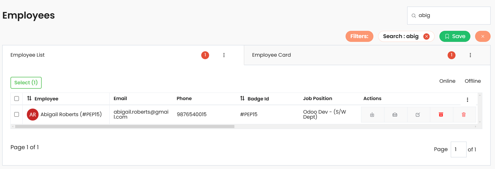

# Twixio Navigation View (HNV)

`TwixioNavView` is a Django `TemplateView` class that enables the creation of a navigation-based interface with search, filtering, grouping, and actions, all with caching support.

## Class Attributes

| Attribute                        | Type        | Description                                                                                                               |
| -------------------------------- | ----------- | ------------------------------------------------------------------------------------------------------------------------- |
| **nav_title**                    | `str`       | Title displayed in the navigation bar.                                                                                    |
| **template_name**                | `str`       | Template used for rendering the view. Default is `"generic/twixio_nav.html"`.                                            |
| **search_url**                   | `str`       | URL to which search requests are sent.                                                                                    |
| **search_swap_target**           | `str`       | Target element ID for displaying search results.                                                                          |
| **search_input_attrs**           | `str`       | HTML attributes for the search input field, allowing customization such as placeholders or classes.                       |
| **search_in**                    | `list`      | List defining search categories or fields to search within.                                                               |
| **actions**                      | `list`      | List of action configurations. Each action can have attributes like name, icon, URL, and method for executing the action. |
| **group_by_fields**              | `list`      | List of fields by which the view can group results.                                                                       |
| **filter_form_context_name**     | `str`       | Context name for the filter form object, used to reference it within the template.                                        |
| **filter_instance**              | `FilterSet` | An instance of `FilterSet` to apply filtering on the view’s queryset.                                                     |
| **filter_instance_context_name** | `str`       | Context name for referencing the filter instance in the `filter_body_template`.                                           |
| **filter_body_template**         | `str`       | Path to a template for rendering the filter body, allowing custom filter UI layouts.                                      |
| **view_types**                   | `list`      | List of different view types supported, such as list or card views, etc.                                                  |
| **create_attrs**                 | `str`       | HTML attributes for the "Create" button, enabling customization like classes or IDs.                                      |

## Usage Example

Here’s how to use `HNV` in Twixio:

```python
from twixio_views.generic.cbv.views import TwixioNavView
from django.urls import reverse_lazy

class EmployeeNavView(TwixioNavView):
    """
    EmployeeNavView
    """

    nav_title = "Employees"
    search_url = reverse_lazy("employee-tab-view") 
    #path to your view where search/filter submited
    search_swap_target = "#tabContainer" # cbv-employee-list view's view_id
```

### Example Output for HNV



## View Types
View types is the attribute for the `hnv` that helps to include multiple views in the navbar. Using the feature can be configured the views like list, card or any other views instead of `htv`.
```python
view_types = [
    {
        "type": "list",
        "icon": "list-outline", # ionicons icon name
        "url": reverse_lazy("hlv"), # path/url to the view
    },
    {
        "type": "card",
        "icon": "grid-outline", # ionicons icon name
        "url": reverse_lazy("hcv"), # path/url to the view
    },
]

```

## Group By Fields
HNV provides dropdown to select the group by fields for the list views. Using the `group_by_fields` all the fields are listed in a drop down feature in the nav view. Supported related field grouping.

```python
group_by_fields = [
    ...
    ("employee_work_info__department_id", "Department"),
    ...
]
```

## Actions
Actions is `HNV` is also a drop down that indicates or list out all the bulk actions. You can add the attributes in the `attr` that complete or support the action.

```python
actions = [
    {
        "action": "Import",
        # "attrs": "", # attrs to support the action
        # "accessibility": "", # accessibility method mapping
    },
    {
        "action": "Export",
        # "attrs": "", # attrs to support the action
        # "accessibility": "", # accessibility method mapping
    },
    
]
```

## Filter Body Template
The `filter_body_template` is the template for the filter form. The form `filter_form_context_name` option is used to mention the form context name that is used in the `filter_body_template`.

```python
filter_body_template = "employee_filters.html"
filter_form_context_name = "filter_form"
```
The custom filter body template
```html
<!-- templates/employee_filters.html -->
{{filter_form}}
```
## Key Features

- **Customizable Navigation Title**  
   The `nav_title` attribute allows setting a title for the navigation bar, enabling a personalized and descriptive heading.

- **Search**  
   Supports search functionality with customizable `search_url`, `search_swap_target`, `search_input_attrs`, and `search_in`, allowing for precise and flexible search configurations.

- **Grouping and Filtering Options**  
   Users can group and filter data based on specified fields (`group_by_fields`) and a `FilterSet` instance (`filter_instance`), enhancing data organization and user experience.

- **Flexible Action Management**  
   The `actions` attribute enables defining action buttons or dropdown within the navigation view

- **Multiple View Types**  
   Allows switching between multiple view formats, such as list or grid views, giving users flexibility in how data is presented.

- **Custom Filter Layout**  
   The `filter_body_template` allows using a custom template for the filter section, enabling unique layouts and complex filter designs.
