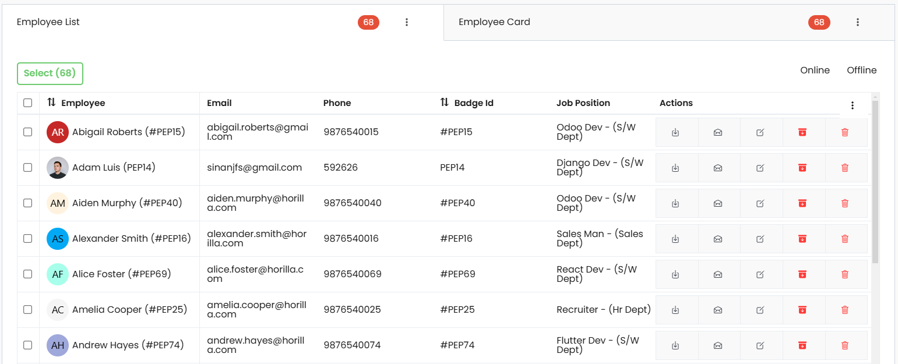

# Twixio Tab View (HTV)

`TwixioTabView` is a Django `TemplateView` class designed to manage a tabbed interface with support for caching, dynamic tabs, and user-specific tab tracking.

## Class Attributes

| Attribute         | Type   | Description                                                                                             |
| ----------------- | ------ | ------------------------------------------------------------------------------------------------------- |
| **view_id**       | `str`  | Unique identifier for the view, generated using `get_short_uuid`. Default prefix is `"htv"`.            |
| **template_name** | `str`  | Template used to render the view. Default is `"generic/twixio_tabs.html"`.                             |
| **tabs**          | `list` | List of tab configurations. Each tab can be customized with attributes such as name, target, and order. |

## Usage Example

Here’s how to use `HTV` in Twixio:

```python
from twixio_views.generic.cbv.views import TwixioTabView
from django.urls import reverse_lazy


class EmployeeTabView(TwixioTabView):
    """
    EmployeeTabView
    """
    view_id = "tabContainer"
    tabs = [
        {
            "title": "Employee List",
            "url": reverse_lazy("cbv-employee-list"),  # path to your view
            "badge_label" : "Employees", # default is records
            "actions": {
                "action":"Add",
                # "accessibility":"path_to.your.accessibility_method",
                # "attrs":"",
            }
        },
        {
            "title": "Employee Card",
            "url": reverse_lazy("cbv-employee-card"), 
            "actions": {
                "action":"Add",
            }
        },
    ]
```

### Example Output for HTV



## Tab Content Caching

To cache tab-specific content for efficient loading, `TwixioTabView` utilizes session-based caching. The cache stores the context based on the user's session key, ensuring personalized tab states.

### User-Specific Active Tab Tracking

`TwixioTabView` supports tracking the last active tab for a user, so when a user revisits the view, the previously active tab is restored. This behavior relies on the `ActiveTab` model, which records the active tab for each user and view path.


## Key Features
- **Dynamic Tab Management**
 Define multiple tabs with customizable attributes, including title, target URL, badges label, and actions.

- **Action Support within Tabs**
 Each tab can include actions, enabling quick operations (e.g., adding new records) specific to the tab's content. Actions are customizable with labels and accessibility paths.

- **Badge Labeling**
 Tabs can display dynamic badges for indicators like item counts, providing real-time context and helping users quickly assess tab contents.

- **User-Specific Tab Persistence**
 Automatically tracks the user’s last active tab, so each user returns to their preferred tab when revisiting the view. This is managed through the ActiveTab model.

- **Efficient Content Caching**
Leverages session-based caching to store each user’s tab states and content. This improves loading times and enhances performance, particularly for content-heavy tabs.

- **Customizable Unique View Identifier**
Generates a unique view_id for each instance, allowing for easier identification of specific tab instances and custom behaviors in complex applications.

- **Configurable Template**
The template_name attribute points to a default template but can be customized to meet specific design requirements for each instance.